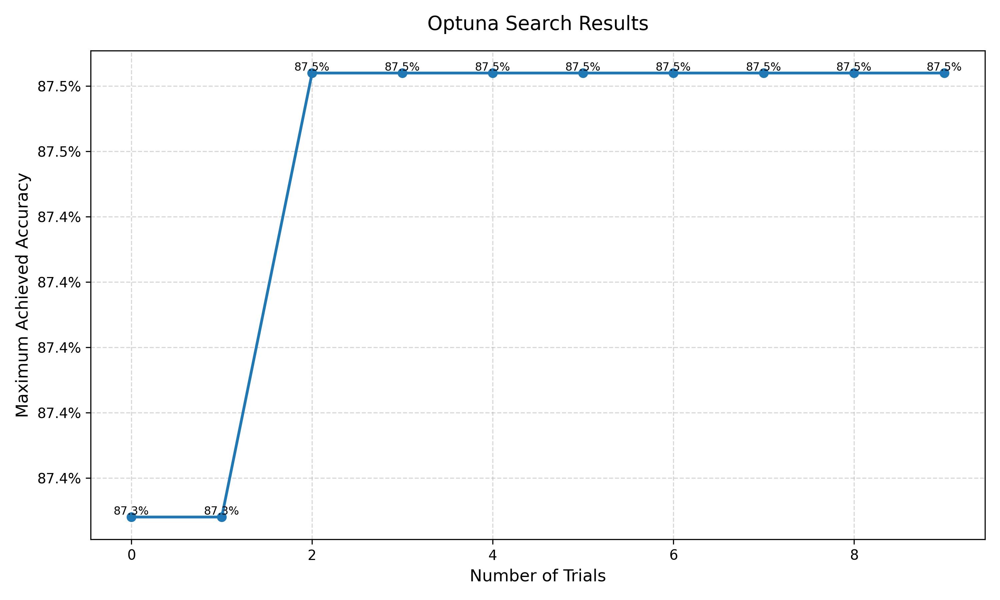
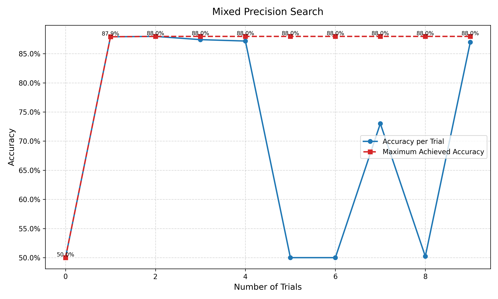
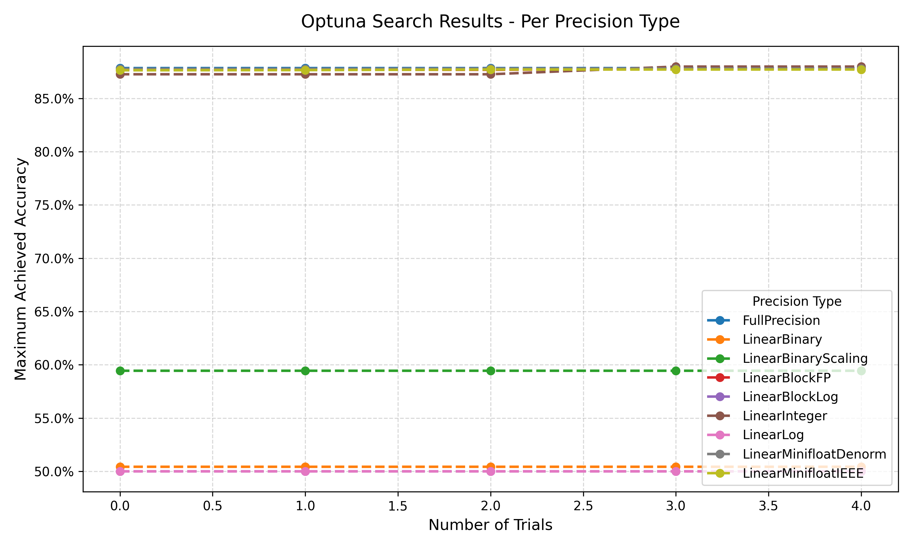
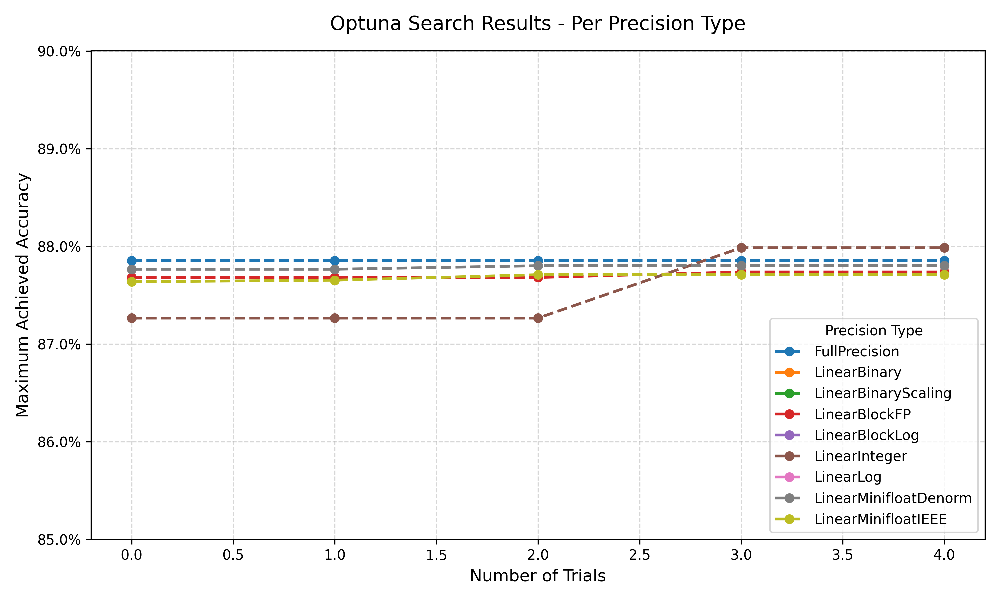

## Tutorial 1 (Lab 0): Introduction

### Run-Time Error
Here is the run-time error encountered during the session:

```plaintext
RuntimeError: Tried to erase Node bert_embeddings_dropout but it still had 6 users in the graph: 
{getattr_2: None, size_4: None, bert_encoder_layer_0_attention_self_query: None, 
bert_encoder_layer_0_attention_self_key: None, bert_encoder_layer_0_attention_self_value: None, 
add_7: None}!
```

## Tutorial 2 (Lab 0): Lora Finetune

### Removing attention_mask, labels from hf_input_names and its effect on the graphs:
The graph was created with and without the extra information and compared.

Firstly, having no labels meant that at the end of the process, there is no cross-entropy calculated and viewed (so 4 blocks are removed). This is becuase the ground truth labels are required for loss calculations and not having them therefore means no losses can be calculated. Secondly, when there is no attention_mask specified, the model calls an extra block called getattr_1 after the input, instead of having a seperate input attention_mask block. When no mask is specified, more information from the model is used as an input to the masking process, implying that the mask is created based on the input information, whilst the external mask would be used for manually choosing which information to mask or not.


## Tutorial 3 (Lab 1): QAT
The following combinations of widths were tested: (4,2) (8,4) (12,8) (16,8) (20,10) (24,12) (28,14) (32,16). 

 
 

It is clear that quantisation-aware training is much more effective in improving accuracy than just quantising after training, as it allows the model to adapt to the lower precision during training, reducing the loss that would otherwise be encoutered when quantisation is applied at the end of the processs.
The model that offered a strong balance between maximising accuracy and amount of quantisation was with fixed width 16 (16,8)

## Tutorial 4 (Lab 1): Pruning
A range of sparisty levels were then applied, ranging from 0.1 to 0.9. Each sparsity level was tested with both the random and the l1-norm method. For each combination, 5 epochs of training were ran to allow the accuracies reached to closely match their potential if many more epochs of training were done.

 
 

L1-norm performed better than random in all cases and allowed for more drastic pruning.

## Tutorial 5 (Lab 2): Nas Optuna
Each sampler was given the same search space, and 10 iterations to find the optimal setup. Each search space setup combination was trained for 3 epochs to allow the accuracies reached to stablise and represent the effectiveness of the search-space input more truly.
 

TPE found the highest accuracy combination the fastest and reached the highest accuracy, therefore was the best search method.
TPE was then used in part b, and compression-aware search ran and tested.

 

No compression eventually performed the best, mainly due to the compression being quite severe, but the compression aware training method reach similar accuracy levels to the non-compressed model with a much smaller model size.

## Tutorial 6 (Lab 3): Mixed Precision Search


TPE Sampler was used to search for the optimal configuration, which was found on the 3rd iteration.
The search was then extended to contain the following quantised configuartions for each layer:

- torch.nn.Linear (no quantisation)
- LinearInteger, 
- LinearMinifloatDenorm
- LinearMinifloatIEEE
- LinearLog
- LinearBlockFP
- LinearBlockLog
- LinearBinary
- LinearBinaryScaling

(I wasn't able to use LinearBlockMinifloat without errors and LinearBinaryResidualSign had not been implemented yet so these were ommited.) I initially used the Optuna sampler (TPE in this case) to search for the optimal layer types which yielded the following results.



Iteration 2 (the highest accuracy iteration) used LinearMinifloatIEEE. After realising seperate curves for each precision were wanted, the code was rewritten to do 5 iterations of 3 epochs for each layer type. Here are these results.


The LinearLog and LinearBlockLog were both found to be completely inneffective (maybe implemented incorrectly), with LinearBinary and LinearBinaryScaling found not much higher in accuracy achieved.

To see the trends in the rest of the results, here is a zoomed in view of these, showing that eventually LinearInteger performed best and even surpassed the full precision version.


## Lab 4: ADLS Software Stream
### Part 1
The pre-compiled model showed a longer processing time of 24.5413s compared to the JIT-compiled model with 15.3287s. This could be down to a few reasons that were tested by modifying the code. 

- Variations in time could be introduced by different backend compilation methods, which are optimised for different purposes. The compilers already available to test were inductor, cudagraphs and eager, with the default compiler being inductor offering a trade-off between efficiency and memory overhead.
- The timing method seemed to change its results quite a lot depending on if the script run was the first time or had been previously done already. This indicates some degree of warming-up was required for the precompiled method, potentially due to memory bottlenecks on the first runthrough. A likely cause of this is that the first run-through includes tracing and graph transformations that later ones do not.
- In addition, the lower number of iterations chosen in the code (n=5) meant that the results were more susceptible to initial memory overhead changes than in consequent iterations, reliability of the timing tests could be improved with more iterations.

To test how much the timings were affected by number of itertaions, CPU/GPU, compiler methods, the following combinations were ran (the Colab environment was reset between every 5 or 20 runs to reset the environment, accomodating for potential warm-up effects). Cudagraphs was ommited from CPU runs since it requires GPU.

5 runs on "cpu":
- Original model: 15.3287 s
- Optimised model: 24.5413 s
- Optimised model (inductor): 10.8946 s
- Optimised model (eager): 14.0508 s

20 runs on "cpu":
- Original model: 15.0116 s
- Optimised model: 14.1991 s
- Optimised model (inductor): 11.3416 s
- Optimised model (eager): 13.3609 s

5 runs on "cuda":
- Original model: 0.2519 s
- Optimised model: 5.0008 s
- Optimised model (inductor): 0.1103 s
- Optimised model (eager): 0.2530 s
- Optimised model (cudagraphs): 0.9695 s

20 runs on "cuda":
- Original model: 0.1099 s
- Optimised model: 0.4991 s
- Optimised model (inductor): 0.1129 s
- Optimised model (eager): 0.1394 s
- Optimised model (cudagraphs): 0.3148 s

20 runs but ignoring first 10 on "cuda":
- Original model: 0.0950 s
- Optimised model: 0.1106 s
- Optimised model (inductor): 0.1106 s
- Optimised model (eager): 0.0952 s
- Optimised model (cudagraphs): 0.1577 s

100 runs but ignoring first 10 on "cuda":
- Original model: 0.0950 s
- Optimised model: 0.1120 s
- Optimised model (inductor): 0.1128 s
- Optimised model (eager): 0.0968 s
- Optimised model (cudagraphs): 0.0990 s

The main takeaways from this is that:
- significant initial overhead in all cases due to tracing and graph transformations
- low number of iterations (n=5) skew results due to this, therefore more needed to stabilise.
- chaning the device from cpu to cuda allowed the GPU to be used much more effectively, showing the biggest improvement in performance.
- overall, the pre-compiled method did not show improvements indicating that the optimisation under the hood was well purposed for the already optimised ResNet18. Potentially for more custom models, this would not be the case.

### Part 2
For 5 iterations:
- Naive SDPA time (cpu): 0.033738 s
- Fused SDPA time (cpu): 0.020238 s
- Naive SDPA time (cuda): 0.000379 s
- Fused SDPA time (cuda): 0.000047 s

For 20 iterations:
- Naive SDPA time (cpu): 0.026931 s
- Fused SDPA time (cpu): 0.020990 s
- Naive SDPA time (cuda): 0.000140 s
- Fused SDPA time (cuda): 0.000022 s

For 100 iterations:
- Naive SDPA time (cpu): 0.025309 s
- Fused SDPA time (cpu): 0.020964 s
- Naive SDPA time (cuda): 0.000202 s
- Fused SDPA time (cuda): 0.000044 s

The fused SDPA kernel outperformed the naive implementation in every case and device type, most significantly on CUDA. On CPU, the fused version showed around 20-25% increase in speed, whilst on GPU, the fused version was 500-10000% faster than the naive version. This shows that the kernel fusion on CPUs was still limited by CPU memory bandwidth and its lack of parallelism, whilst the GPU case was able to take advantage of fused kernels, thanks to the reduced memory overhead removing the memory bottleneck.

### Part 3:
Answer 3a: MXINT8 benefits custom hardware if both activaton and weights are quantised in the same method for a few reasons:
- Consistent data types means that fusing mutliple operations, e.g. matrix multiplication and then an activation layer, can be done more easily without extra data type conversions that woudl otherwise require additional memory reads/writes. If all the data types are consistent, many layers can be fused into one highly optimised kernel which is beneficial for larger GPU based models.
- Using MXINT8 for both also means that there are no intermediate tensors being stored, reducing memory requirements. This is beneficial since memory bandwith is often a limiting factor in custom hardware methods.
- There are also dedicated MXINT8 hardware units that are optimised for certain data types, such as INT8 multiply-accumulate (MAC) units. Consistency then allows these hardwares to be better used and optimised.
- Lastly having more efficient processes means less power consumption overall, reducing costs, hardware weardown and maintencance, increases working life etc.

Answer 3b: The rold of the dont_need_abs variable and bias_variable is to correctly scale the 'value' part of the number, so that when the exponent is then applied to it, it is scaled correctly to represent the desired number. This methodology is required since MXINT has no implicit leading bit for the mantissa. For example, if a 6-bit mantissa number (bit count starts from 0) is SXXX_XXXX, so the left-most X is the 6th bit, this 6th bit determines whether the mantissa is in the range of 0-63 or 64-127. Similar to scientific number format, if the value is smaller than 64, it also contains some scaling information which should be contained already by the exponent. Therefore the value has to be normalised to within the correct range, so that its job is just to represent the value, and then to be scaled by the exponent. If the scaling information (due to too small a value) was retained and then the exponent applied, the resulting number would be some 2^integer out in order of magnitude. To implement this, the 6th bit is checked if its 1 or 0. If its 1, nothing is changed (dont_need_abs = True), if it is 0, this means the values of mantissa need to shifted in position to the left until the 6th bit is 1. This is done by adding a 2^num to the value, depending on the number of position shifts required. The number of shifts required to scale correctly can be calculated by the equation: bias_variable = 2^(exp - 127) * C, where exp is the original MXINT8 exponent value for that group.

Answer 3c: The cta_tiler partitions the data in a memory-efficient way. It allows a large input tensor or data structure to have smaller sub-tensors or components to be extracted and processed in seperate units (such as threads, warps and thread blocks) and then reformed into a new large tensor correctly, retaining the indexing structure. This allows for more efficient parrallelism and more efficient/higher accuracy memory/cache access. 

The cta_tiler dynamically adjusts the block sizes being sent for processing based on the incoming group size. The larger the group size, the larger BLK_M, but the smaller BLK_K is - changing the sub-tensor shape. This helps to maintain a consitent computational workload per tile since roughly the same amount of data is being sent to each thread in the Cooperative Thread Arrays (CTAs). This is how it allows memory requirements stay consistent and stable during processing. 

layout_sX partitions the threads in a threadblock by applying the make_layout command from CuTe. It takes in a shape (e.g. a matrix of 8 by 8) and then creates a layout object, which is essential for mapping from coordinate space(s) to an index space. This is what ensures that the larger tensor can be reconstructed correctly after tiling. The layout object, just like cta_tiler, dynamically changes the shape of the sub-tensor based on the input group size (since the shape input to make_layout is also BLK_M and BLK_K), mainting consistent amounts of data per each tile and therefore processing thread.

Answer 3d: 
Theres a few reasons why the saved GPU memory is not exactly (32 - (4+8/32))/32 = 86.7% The first is that the code actually uses MXINT8 not MXINT4, meaning the above equation is slightly incorrect. The correct theroetical savings should be (32 - (8 + 8/32))/32 = 74.2%, since the mantissa should be 8 bits not 4. Even with this change, the theoretical savings are not reached. This is due to the quantisation process only being applied to certain layer types. The following code block shows that only linear layers are quantised, and any others (such as activation layers) are left in full precision. 

```plaintext
for layer_name, layer in model.named_modules():
    if not isinstance(layer, torch.nn.Linear):
        continue
    if "classifier" in layer_name:
        continue
    layer.cuda()
    layer_q = QLinearPacked.build_from_linear(layer, group_size=mxint8_group_size)
    set_layer_by_name(model, layer_name, layer_q)
    del layer
    torch.cuda.empty_cache()
```

Therefore, even though the quantised weights take up far less space, the overall memory saving is reduced to about 66.4% instead of the upped theoretical bound 74.2% due to non-quantised layers also being used by the GPU. 
