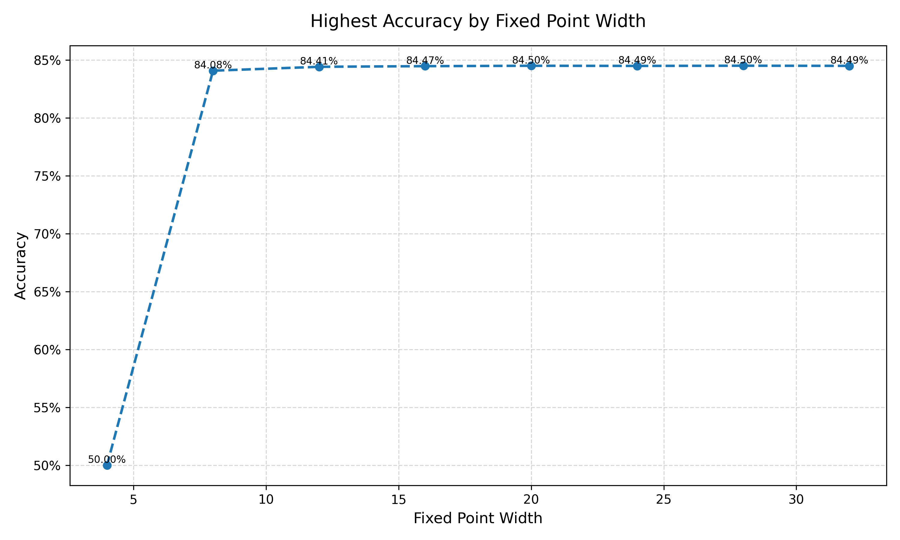
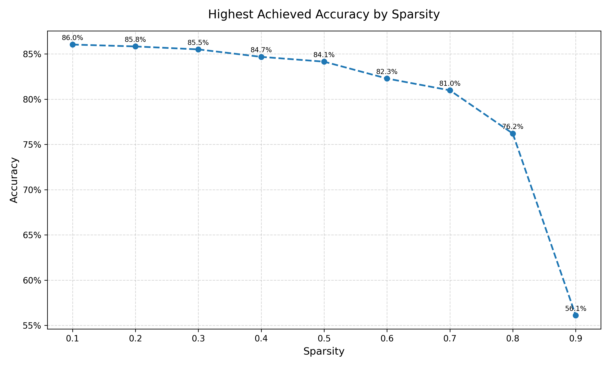
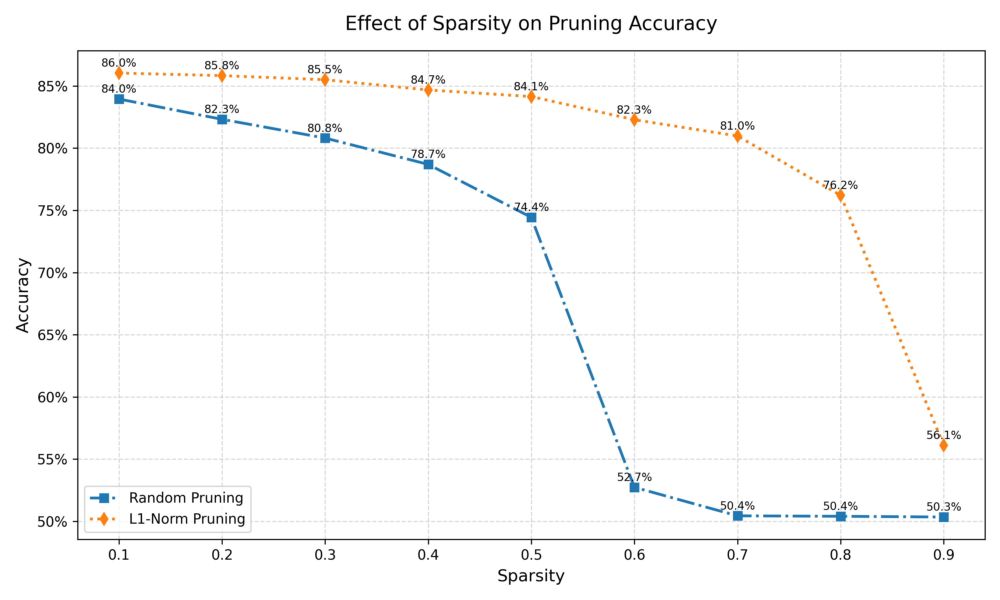
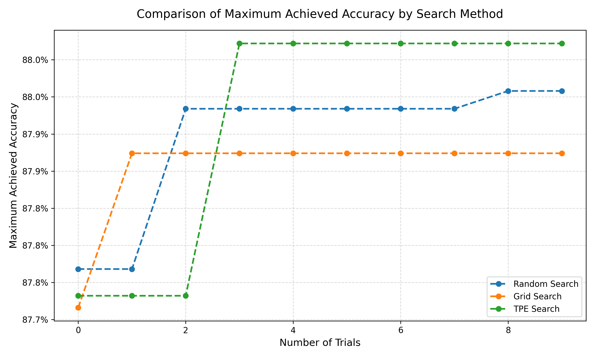
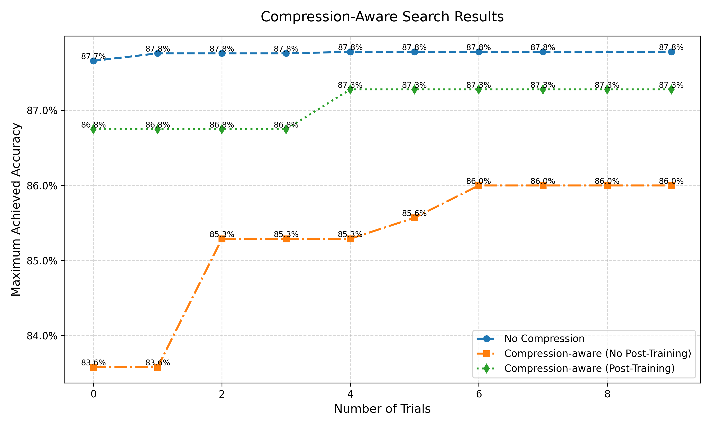

## Tutorial 1 (Lab 0): Introduction

### Run-Time Error
Here is the run-time error encountered during the session:

```plaintext
RuntimeError: Tried to erase Node bert_embeddings_dropout but it still had 6 users in the graph: 
{getattr_2: None, size_4: None, bert_encoder_layer_0_attention_self_query: None, 
bert_encoder_layer_0_attention_self_key: None, bert_encoder_layer_0_attention_self_value: None, 
add_7: None}!
```

## Tutorial 2 (Lab 0): Lora Finetune

### Removing attention_mask, labels from hf_input_names and its effect on the graphs:
The graph was created with and without the extra information and compared.

Firstly, having no labels meant that at the end of the process, there is no cross-entropy calcualted and viewed (so 4 blocks are removed). This is becuase the ground truth labels are required for loss calcualtions and not having them therefore means no losses can be calculated. Secondly, when there is no attention_mask specified, the model calls an extra block called getattr_1 after the input, instead of having a seperate input attention_mask block. When no mask is specified, more information from the model is used as an input to the masking process, implying that the mask is created based on the input information, whilst the external mask would be used for manually choosing which information to mask or not.


## Tutorial 3 (Lab 1): QAT
Insert plots for tutorial 3 (lab 1).
 
 

The best model that was most condensed was fixed width 16 (8,8) which was saved.


## Tutorial 4 (Lab 1): Pruning
 
 

L1-norm performed better than random in all cases and allowed for more drastic pruning.


## Tutorial 5 (Lab 2): Nas Optuna
 

TPE found the highest accuracy combination the fastest and reached the highest accuracy, therefore was the best search method.
TPE was then used in part b, and compression-aware search ran and tested.

 

No compression eventually performed the best, mainly due to the compression being quite severe, but the compression aware training method reach similar accuracy levels to the non-compressed model with a much smaller model size.

## Tutorial 6 (Lab 3): Mixed Precision Search


