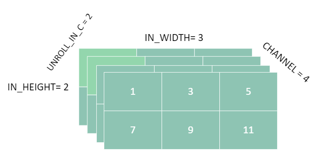
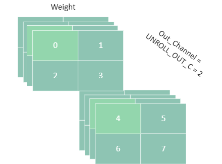
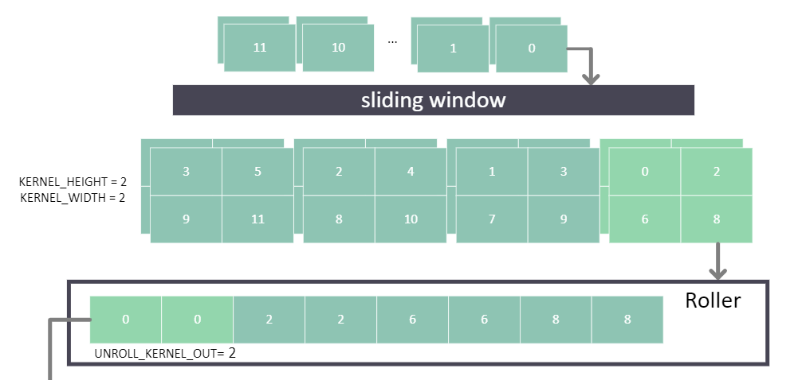
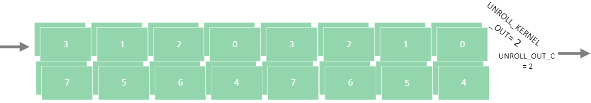

For what the 2d convolution in software does,
1. Input with dimension(Cin, H, W) to sliding window output(Cin, Kh, Kw), where Cin is in channels, H is the height dimension, W is the width dimension, Kh is kernel height, Kw is kernel width.
2. Sliding window output will have multiplication and addition computations with weights. Weights can map all the data in one sliding window to 'Cout' data.

We can put it into the code format as following:
```python
# Dimension: (H, W, Cin, Cout, Kh, Kw)

#sliding window
# for the basic conv, negelect some grammar problem, just to show the basic idea
for h in H:
    for w in W:
        for cin in Cin:
            for kh in Kh:
                for kw in Kw:
                    for cout in Cout:
                        # data_sliding is a function to generate the mapping way,
                        # mapping the data at data_in to data at sliding_window
                        # sliding_depth represent where the sliding_window has slided to
                        dh,dw,sliding_depth = data_sliding(h, w, kh, kw)
                        
                        sliding_window[sliding_depth][cin][kh][kw] = data_in[cin][dh][dw]
                        # multiplication and addition for getting the result. ... negelect some dimension that are not expressed here, these dimensions are all taken into mult_add calculation
                        out[sliding_depth][cout] = mult_add(sliding_window[sliding_depth]..., weight[cout]...)
```
The software dimension can be considered as calculate it step by step. But if we want to map it to hardware, we need to make it faster, so we'll have unroll parameters then. The unroll parameters means how many data we have for parallel calculations.
As the software defined, the whole process can be divided in two 2 parts. Input to sliding window output, sliding window output to Output. So we set the unroll parameters, `unroll_in_c`(unroll in_channels), `unroll_kernel_out`(unroll kernel_out), `unroll_out_c`(unroll out_channels). 
We only unroll channels here, because we do channels first input mode, which means, we will input the data in the same channel first.

To be specific,  we need to have unroll parameter `unroll_in_c`, `unroll_kernel_out`, `unroll_out_c`:
1. `unroll_in_c` is for unrolling in_channels. (not including in height and in width, because of sliding window module requires that input width and height should be one by one, to make sure, sliding window can slide one by one.)
2. `unroll_kernel_out` is for unrolling each sliding window.
3. `unroll_out_c` is for unrolling the out_channels, we cannot make it parallel, when it's really large.
   
Take an example first, set `unroll_in_c = 2`, `unroll_kernel_out = 2`, `unroll_out_c = 2`
### Input Reorder
Assume we'll have input data as  (`in_channels = 4`, `in_width = 3`, `in_height = 2`), the related image can be shown in below, highlighted part represent the hardware input each time. The number in each block can represent as at which clock the data get input. 
`input_tensor =  torch.randint(samples, in_channels, in_height, in_width)`



So becasue we want to do channel first input mode, so we need to permute the in_channels dimension to the first dimension, and then reshape it to `unroll_in_c`, with this operation, we can input number of unroll_in_c data one time. Noted that, this is also the data stored in the shift register which is included in the sliding window module.
```python
# from (samples, C, H, W) to (samples, H, W, C) to (-1, unroll_in_c)
input_tensor = input_tensor.permute(0, 2, 3, 1).reshape(-1, unroll_in_c)
```


### Weight Reorder
Weight can be defined as 
`re_w_tensor =  torch.randint(samples, out_channels=2, in_channels=4, kernel_height=2, kernel_width = 2)`



For the purpose of matching roller_out, we need to know what the hardware module sliding_window and roller out does.

After shift register, we got output kernel by kernel, if set the kernel size(2,2). 
Each kernel will be reshaped again in roller module, which takes multiple data in and less data out. We just set the out data size of roller as (`unroll_kernel_out=2`). So 
1st, sliding window will take each input to `(unroll_in_c, kernel_width, kernel_height)`, channel by channel, and output it in `kernel_width, kernel_height, unroll_in_c` format.
2nd, roller module will roll each input to `(-1,unroll_kernel_out)`.
Combiling the above two information, weight input have to match the roller output.So reorder it to the input format of roller input. Noticed here, output channels also need to be calculate parallel partially, so it should be in higher priority.



Weight input
```python
# from (oc,ic/unroll_in_c,unroll_in_c,h,w) to (ic/unroll_in_c,h*w,unroll_in_c,oc)
reorder_w_tensor = re_w_tensor.reshape(
    samples,
    out_channels,
    int(in_channels / unroll_in_c),
    unroll_in_c,
    kernel_height * kernel_width,
).permute(0,2,4,3,1)
```

Then reorder it as roller output, also including the unroll_out_c tiling parameter.(Noticed here, we put unroll_kernel_out in the lowest dimension just for matching the linear layer calculation)
```python
# from (ic/unroll_in_c,h*w,unroll_in_c,oc) to (-1,unroll_kernel_out, oc/unroll_out_c, unroll_out_c) to (-1,unroll_out_c,unroll_kernel_out)
w_tensor = reorder_w_tensor.reshape(
            samples,
            int(kernel_height * kernel_width * in_channels / unroll_kernel_out),
            unroll_kernel_out,
            int(out_channels/unroll_out_c),
            unroll_out_c,
        ).permute(0,3,1,4,2)
```

So finally we got the reordered weight input



