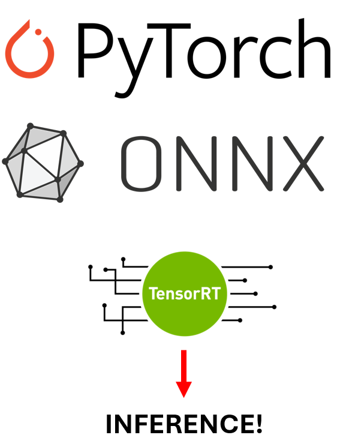

# MaseRT: TensorRT and ONNXRT

## Overview

<table style="width: 100%; table-layout: fixed; margin: 0; padding: 0; border-collapse: collapse;">
<tr style="margin: 0; padding: 0;">
<td style="vertical-align: top; width: 70%; margin: 0; padding: 0;">

This documentation details the rationality, functionality and methodology of TensorRT and ONNXRT integration into the Machop framework.

Continuing the ideology behind MASE to provide a reliable and efficient streaming accelerator system, we have now integrated TensorRT and ONNXRT, two powerful SDKs for optimizing inference using techniques such as quantization, layer and tensor fusion, and kernel tuning.

The integration of both frameworks has shown to produce 2-4x inference speeds with higher energy efficiency whilst not significantly compromising model accuracy.

</td>
<td style="vertical-align: top; width: 30%; margin: 0; padding: 0;">
    
</td>
</tr>
</table>

## Why Should I Care About Runtime Frameworks?

Runtime frameworks such as ONNX Runtime and TensorRT are essential for streamlining deep learning model deployment, offering key benefits:

📈 **Quantization**: Support model quantization, reducing precision to improve speed and reduce size without major accuracy losses.

🚀 **Speed**: They also accelerate model inference via optimization techniques like layer fusion and kernel auto-tuning, enhancing response times and throughput without the need for in-depth knowledge of CUDA.

💾 **Efficiency**: Lowers memory through quantization and further optimizes memory and computational resources, enabling deployment on devices with limited capacity.

🔧 **Flexibility**: With ONNXRT, the model is able to be 

These frameworks transform deep learning models from research prototypes into efficient, production-ready solutions, ensuring practicality and performance in real-world applications.

Quantization is the process of converting a model 

## Key functionality

### Hardware

| Device Type    | ONNXRT | TensorRT      |
|----------------|-----------------------|---------------|
| CPU            | ✅                     | ❌             |
| GPU (Generic)  | ✅                     | ❌             |
| NVIDIA GPU     | ✅                     | ✅             |

### Module Support

## ⚙️ How It Works

### TensorRT
<table style="margin: 0; padding: 0; border-collapse: collapse;">
<tr style="margin: 0; padding: 0;">
<td style="vertical-align: top; margin: 0; padding-right: 20px;">

Fake-quantization is used to perform calibration and fine tuning before actually quantizing. The [Pytorch-Quantization](https://docs.nvidia.com/deeplearning/tensorrt/pytorch-quantization-toolkit/docs/index.html#) libray simply emulates and prepares for quantization - which can then later be converted to ONNX and passed through to TensorRT.  This is only used if we have INT8 calibration as other precisions are not currently supported within  library.

This is acheived through the `tensorrt_fake_quantize_transform_pass` which goes through the model, either by type or by name, replaces each layer appropriately to a fake quantized form if the `quantize` parameter is set in the default config (`passes.tensorrt_quantize.default.config`) or on a per name or type basis. 

</td>
<td style="margin: 0; padding: 0;">
    
</td>
</tr>
</table>

## 🚀 Getting Started

The environment setup during the [MASE installation](../../../README.md) either through Docker or Conda will have you covered, there are no other requirements. 

### Tutorials
We strongly recommend you look through the dedicated tutorials which walk you through the process of utilising MaseRT:
- [TensorRT tutorial](/docs/tutorials/tensorrt/tensorRT_quantization_tutorial.ipynb) 

### Which Runtime Should I Use

- Hardware: ONNXRT supports a wider range of hardware beyond NVIDIA GPUs, including CPUs, AMD GPUs, and other accelerators. If you do not have a NVIDIA GPU, use ONNXRT.
- Cross-Frameworks: ONNXRT allows conversion to other models through their ONNX framework (i.e., from PyTorch to Tensorflow)
- Cross-Platform Deployment: ONNX enables easier deployment across different operating systems and environments.
- Sheer Power: NVIDIA has heavily optimised TensorRT for their devices so their runtime has shown to acheive higher throughput, and lower latency copmared with ONNXRT.