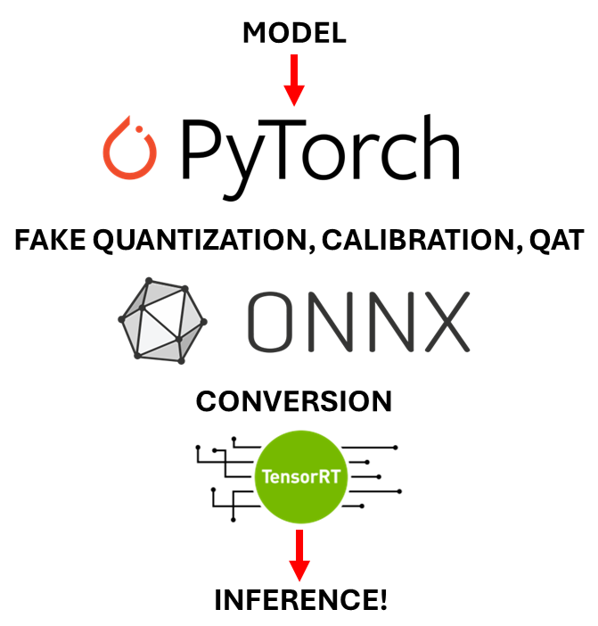

# MaseRT: TensorRT and ONNXRT

## Overview

<div style="max-width: 500px; max-height: 500px; margin: auto; display: flex; align-items: center; justify-content: center; height: 100%;">
  
</div>

This documentation details the rationality, functionality and methodology of TensorRT and ONNXRT integration into the Machop framework.

<p>Continuing the ideology behind MASE to provide a reliable and efficient streaming accelerator system, we have now integrated TensorRT and ONNXRT, two powerful SDKs for optimizing inference using techniques such as quantization, layer and tensor fusion, and kernel tuning.

<p>The integration of both frameworks has shown to produce 2-4x inference speeds with higher energy efficiency whilst not significantly compromising model accuracy.

## Setup

The TensorRT pass in MASE is not enabled by default. As it requires NVIDIA GPUs. To enable it, you need to

- install the following CUDA/TensorRT packages via pip:

  ```bash
  # ensure this is mase pip
  pip install onnxruntime-gpu tensorrt pynvml pycuda cuda-python
  ```

- build and install TensorRT's pytorch-quantization package (**not via pip**):

  ```bash
  git clone https://github.com/NVIDIA/TensorRT.git
  cd tools/pytorch-quantization
  python setup.py install # ensure this is mase python
  ```

## Why Should I Care About Runtime Frameworks?

Runtime frameworks such as ONNX (Open Neural Network Exchange) Runtime and Nvidia's TensorRT are essential for streamlining deep learning model deployment, offering key benefits:

📈 **Quantization**: Quantization is the process of converting a model
. Both runtime frameworks support model quantization, improving speed and reduce size without major accuracy losses.

🚀 **Speed**: They also accelerate model inference via optimization techniques like layer fusion and kernel auto-tuning, enhancing response times and throughput without the need for in-depth knowledge of CUDA.

💾 **Efficiency**: Lowers memory through model size reduction during quantization and further optimizes memory and computational resources, enabling deployment on devices with limited capacity.

🔧 **Interoperability**: With ONNX support, the Pytorch MaseGraph model is able to be converted to other frameworks such as TensorFlow, Optimum and Keras, and [many others](https://onnx.ai/supported-tools.html).

## 🛠️ Key functionality

### 💻 Hardware

| Device Type    | ONNXRT | TensorRT      |
|----------------|-----------------------|---------------|
| CPU            | ✅                     | ❌             |
| GPU (Generic)  | ✅                     | ❌             |
| NVIDIA GPU     | ✅                     | ✅             |

ONNXRT offers  extensive hardware support, accommodating not just NVIDIA GPUs but also CPUs, AMD GPUs, and other accelerators, thus it is an ideal choice if you're working without a NVIDIA GPU. Additionally, ONNXRT has high interoperability, allowing for model conversions through the ONNX framework, such as from PyTorch to TensorFlow. However, NVIDIA has significantly optimized TensorRT specifically for their devices, achieving higher throughput and lower latency compared to ONNXRT.

### Precision Support

| Precision Type | ONNXRT | TensorRT |
|----------------|:------:|:--------:|
| int8           | ✅     | ✅       |
| uint8          | ✅     | ❌       |
| int16          | ✅     | ❌       |
| uint16         | ✅     | ❌       |
| fp16           | ✅     | ✅       |
| fp32           | ✅     | ✅       |

ONNXRT supports a wider range of precisions, including unsigned data types which can be beneficial for certain models and applications that rely on non-negative data values. This inclusivity enhances ONNXRT's flexibility across various computational tasks. TensorRT, while not supporting unsigned integers, focuses on optimizing the most commonly used precisions in deep learning (FP32, FP16, BF16, FP8, INT4, INT8, INT32, INT64, UINT8, and BOOL data types) for NVIDIA GPUs. However, currently NVIDIA's Pytorch-Quantization library only supports int8, fp16 and fp32 thus limits versatility compared to ONNXRT for pytorch models.

##  TensorRT

**Module Support**
| Layer       | Modules                      |
|--------------|-------------------------------|
| Linear       | Linear                        |
| Convolution  | Conv1d, Conv2d, Conv3d        |
| Transpose Convolution | ConvTranspose1d, ConvTranspose2d, ConvTranspose3d |
| Pooling (Max) | MaxPool1d, MaxPool2d, MaxPool3d |
| Pooling (Average) | AvgPool1d, AvgPool2d, AvgPool3d |
| LSTM         | LSTM, LSTMCell                |

Currently, Pytorch-Quantization only supports the modules above, however custom quantized module can be made, find out more [here](https://docs.nvidia.com/deeplearning/tensorrt/pytorch-quantization-toolkit/docs/index.html#document-tutorials/creating_custom_quantized_modules).

### Mixed Precision

Mixed precision quantization is also supported, and this can be set on a layerwise or typewise basis to utilise a mixture of the [supported precisions](#precision-support) mentioned above. See the [TensorRT Quantization tutorial](https://deepwok.github.io/mase/modules/documentation/tutorials.html) in the MASE documentation for more information.

##  ONNXRT

For more detailed information on model quantization and optimization with ONNX Runtime, visit the [ONNX Runtime documentation](https://onnxruntime.ai/docs/).

## Module Support

| Layer       | Modules                      |
|-------------|------------------------------|
| Linear      | Linear                       |
| Convolution | Conv1d, Conv2d, Conv3d       |
| Transpose Convolution | ConvTranspose1d, ConvTranspose2d, ConvTranspose3d |
| Pooling (Max) | MaxPool1d, MaxPool2d, MaxPool3d |
| Pooling (Average) | AvgPool1d, AvgPool2d, AvgPool3d |
| LSTM        | LSTM, LSTMCell               |
| RNN         | RNN, GRU, RNNCell, GRUCell   |
| Activation  | ReLU, Sigmoid, Tanh          |
| Normalization | BatchNorm1d, BatchNorm2d, BatchNorm3d |
| Embedding   | Embedding, EmbeddingBag      |

ONNX Runtime supports a comprehensive array of modules for constructing neural networks, including linear transformations, various types of convolutions and pooling, recurrent neural network modules, activation functions, normalization layers, and embeddings. Custom operators can also be defined for specialized or unsupported operations.

> However, some nodes or modules may only be compatible on certain hardware i.e. supported on CPU and not on GPU or vice versa.

### Mixed Precision

Mixed precision quantization is also supported, however it is an automatic procedure and cannot currently be controlled layerwise or typewise. See the [How it Works ONNX Section](#onnxrt) to find out more.

## ⚙️ How It Works

### TensorRT

<div align="center">
    
</div>

**Fake Quantization**

To minimise losses during quantization, we first utilise Nvidia's Pytorch-Quantization framework to convert the model to a fake-quantized form.Fake quantization is used to perform calibration and fine tuning (QAT) before actually quantizing. The [Pytorch-Quantization](https://docs.nvidia.com/deeplearning/tensorrt/pytorch-quantization-toolkit/docs/index.html#) libray simply emulates and prepares for quantization - which can then later be converted to ONNX and passed through to TensorRT.

*Note:* This is only used if we have int8 quantized modules, as other precisions are not currently supported within the library.

This is acheived through the `tensorrt_fake_quantize_transform_pass` which goes through the model, either by type or by name, replaces each layer appropriately to a fake quantized form if the `quantize` parameter is set in the default config (`passes.tensorrt.default.config`) or on a per name or type basis.

**Calibration**
Calibration is the TensorRT terminology of passing data samples to the quantizer and deciding the best amax for activations.

Calibrators can be added as a search space parameter to examine the best performing calibrator. These include `max`, `entropy`, `percentile` and `mse`.

**Quantization-aware Training**

Quantization-aware training (QAT) achieves the highest accuracy compared to dynamic quantization (whereby the quantization occurs just before doing compute), and Post Training Static Quantization or (PTQ) (whereby the model is statically calibrated).

In QAT, during both forward and backward training passes, weights and activations undergo "fake quantization" (although they are rounded to simulate int8 values, computations continue to utilize floating point numbers). Consequently, adjustments to the weights throughout the training process take into account the eventual quantization of the model. As a result, this method often leads to higher accuracy post-quantization compared to the other two techniques.

Since float quantization does not require calibration, nor is it supported by `pytorch-quantization`, models that do not contain int8 modules will not undergo fake quantization, unfortunately, for the time being this means QAT is unavailable and only udergoes Post Training Quantization (PTQ).

The `tensorrt_fine_tune_transform_pass` is used to fine tune the quantized model.

For QAT it is typical to employ 10% of the original training epochs, starting at 1% of the initial training learning rate, and a cosine annealing learning rate schedule that follows the decreasing half of a cosine period, down to 1% of the initial fine tuning learning rate (0.01% of the initial training learning rate). However this default can be overidden by setting the `epochs`, `initial_learning_rate` and `final_learning_rate` in `passes.tensorrt.fine_tune`.

The fine tuned checkpoints are stored in the ckpts/fine_tuning folder:

```
mase_output
└── tensorrt
    └── quantization
        └── model_task_dataset_date
          ├── cache
          ├── ckpts
          │   └── fine_tuning
          ├── json
          ├── onnx
          └── trt
```

**TensorRT Quantization**

After QAT, the next step is to convert the model to a tensorRT engine so that it can be run with the superior inference speeds. To do so, we use the `tensorrt_engine_interface_pass` which converts the `MaseGraph`'s model from a Pytorch one to an ONNX format as an intermediate stage of the conversion.

During the conversion process, the `.onnx` and `.trt` files are stored to their respective folders shown above. This means that the `.onnx` files can be utilised for other model types and does not need to be just an unutilized, intermediary step.

This interface pass returns a dictionary containing the `onnx_path` and `trt_engine_path`.

### ONNXRT

Basic ONNXRuntime functionality allows to reap the benefits brought by the inherent model optimizations, aimed at minimizing architectural redundancies, executed by ONNX. ONNXRuntime execution providers often allow to appreciate consistent latency improvements over basic PyTorch models; notably, differently than TensorRT this is not limited to NVIDIA GPUs, but can run on a wide range of hardware, including CPUs.

Further optimizations can be achieved with the quantization functionality supported by ONNXRuntime. We may quantize either using INT8, UINT8, INT16, UINT16 or FP16 or INT8 by setting the `precision` parameter in `passes.onnxruntime.default.config` to `'int8'`, `'uint8'`, `'int16'`, `'uint16'` or `'FP16'` respectively.

> N.B. Some modules may not be supported for some quantization types above. Please refer [here](https://onnxruntime.ai/docs/) for more information.

There are three types of quantization for ONNXRT and can be set in `onnxruntime.default.config` under `quantization_types`. The differences of the first two are for how they calibrate i.e. set the scale and zero points which are only relevant for integer based quantization:

- **Static Quantization**:
  - The scale and zero point of activations are calculated in advance (offline) using a calibration data set.
  - The activations have the same scale and zero point during each forward pass.
  - The `num_calibration_batches` parameter must also be set to ensure calibration is tested on a subset of the training dataset. A larger subset will be beneficial for calibrating the amaxes and may improve accuracy, however it will result in a longer calibration time.
- **Dynamic Quantization**:
  - The scale and zero point of activations are calculated on-the-fly (online) and are specific for each forward pass.
  - This approach is more accurate but introduces extra computational overhead

The `onnx_runtime_interface_pass` pass also supports mixed precision. This is an automatic only procedure, where ONNXRT finds a minimal set of ops to skip while retaining a certain level of accuracy, converting most of the ops to float16 but leaving some in float32.

- **Auto Mixed Precision Quantization**:
  - Automatically adjusts between FP16 and FP32 precisions to retain certain level of accuracy
  - The `precision` parameter does not need to be set in the config since the whole process is automatic.
  - Unfortunately, this process is currently only supported on GPU.
  - This approach is most beneficial when INT8 or FP16 exclusive quantizations (static or dynamic) are giving poor results.

All three methodolgies first pre-procsses the model before quantization adding further optimizations. This intermidate model is stored to the `pre-processed` directory. The methodologies can be used as a search space in the config.

The models are stored in the directory:

```
mase_output
└── onnxrt
    └── model_task_dataset_date
        ├── optimized
        ├── pre_processed
        ├── static_quantized
        └── dynamic_quantized
```

### RUNTIME Performance Analysis

To showcase the improved inference speeds and to evaluate accuracy, latency, power consumption and other performance metrics, the `runtime_analysis_pass` can be used. The pass can take a MaseGraph as an input, as well as a path to a TensorRT Engine or ONNX model. Inference will occur on the selected model either on the cpu or gpu depending on the config.

## 🚀 Getting Started

The environment setup during the [MASE installation](../../README.md) either through Docker or Conda will have you covered, there are no other requirements.

The procedure in the [How It Works Section](#⚙️-how-it-works) can be acomplished by the machop's transform action.

```python
./ch transform --config {config_file} --load {model_checkpoint} --load-type pl
```

> N.B. Some GPUs, particularly older hardware, may not be well optimized for INT datatypes and thus quantization may not always be beneficial.

### 📚 Tutorials
>
>We strongly recommend you look through the dedicated tutorials which walk you through the process of utilising MaseRT:
>
>- [TensorRT Tutorial](/docs/tutorials/tensorrt/tensorRT_quantization_tutorial.ipynb)
>- [ONNXRT Tutorial](/docs/tutorials/onnxrt/onnxrt_quantization_tutorial.ipynb)

## Open Source Contribution

### Passes

To integrate the functionality mentioned in this document we have developed **SIX** new Chop passes.

- Transform Passes:
  - `tensorrt_fake_quantize_transform_pass`
  - `tensorrt_calibrate_transform_pass`
  - `tensorrt_fine_tune_transform_pass`
- Interface Passes:
  - `tensorrt_engine_interface_pass`
  - `onnx_runtime_interface_pass`
- Analyis Passes:
  - `runtime_analysis_pass`

These passes and their respective tutorials demonstrating their capability are thoroughly documented in the MASE Documentation under the [Machop API Passes](https://deepwok.github.io/mase/modules/api/passes.html) and [Tutorials](https://deepwok.github.io/mase/modules/documentation/tutorials.html) sections.

### Scheduler Args in `chop.actions.train`

For the cosine annealing functionality integrated into the QAT `tensorrt_fine_tune_transform_pass`, the `WrapperBase` class that inherits PytorchLightning's `pl.LightningModule` was extended to support customized inputs for the `CosineAnnealingLR` scheduler for the optimizers. This therefore required a `scheduler_args` dictionary to be added to `chop.actions.train` as an additional input argument. This dictionary can thus contain the pass arguments `t_max` and `eta_min`, which dictate the maximum number of iterations (or epochs) before the learning rate restarts its cycle (t_max), and the minimum learning rate value (eta_min) that the scheduler can assign.

### Added input channel pre-processing to enable vision models functioning on MNIST

An issue was opened in which errors in processing MNIST dataset with vision models were brought to attention. This was traceable to MNIST dataset being grayscale, hence providing only one channel, whilst MASE convolutional models expect 3 channels. The proposed fix applies a series of checks to ascertain that the model-dataset combination requires intervention (since some feedforward neural network models are able to run on MNIST without further action), then, if needed, overrides the model architecture when using MNIST by including a single Conv2d, mapping the single input channel to 3 output channels, before the first convolutional layer. A check is further added in the machop/chop/tools/get_input.py file that constructs the dummy_input accordingly, in case the first model layer was overridden.
