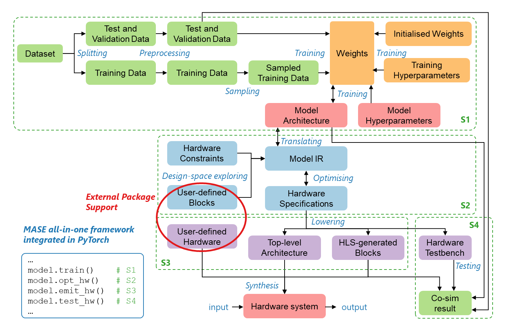

.. Mase documentation master file, created by
   sphinx-quickstart on Fri Nov 17 22:30:33 2023.
   You can adapt this file completely to your liking, but it should at least
   contain the root `toctree` directive.

Machine-Learning Accelerator System Exploration Tools
================================

Machine learning accelerators have been used extensively to compute models with high performance and low power. Unfortunately, the development pace of ML models is much faster than the accelerator design cycle, leading to frequent changes in the hardware architecture requirements, rendering many accelerators obsolete. Existing design tools and frameworks can provide quick accelerator prototyping, but only for a limited range of models that fit into a single hardware device. With the emergence of large language models such as GPT-3, there is an increased need for hardware prototyping of large models within a many-accelerator system to ensure the hardware can scale with ever-growing model sizes.

MASE provides an efficient and scalable approach for exploring accelerator systems to compute large ML models by directly mapping onto an efficient streaming accelerator system. Over a set of ML models, MASE can achieve better energy efficiency to GPUs when computing inference for recent transformer models.

.. toctree::
   :maxdepth: 1
   :caption: Documentation

   modules/documentation/getting_started
   modules/documentation/tutorials
   modules/documentation/health
   modules/documentation/specifications

.. toctree::
   :maxdepth: 2
   :caption: Machop API

   modules/machop

.. toctree::
   :maxdepth: 1
   :caption: Mase Components

   modules/hardware/hardware_documentation

.. toctree::
   :maxdepth: 1
   :caption: Advanced Deep Learning Systems

   modules/adls_2024
   modules/adls_2023