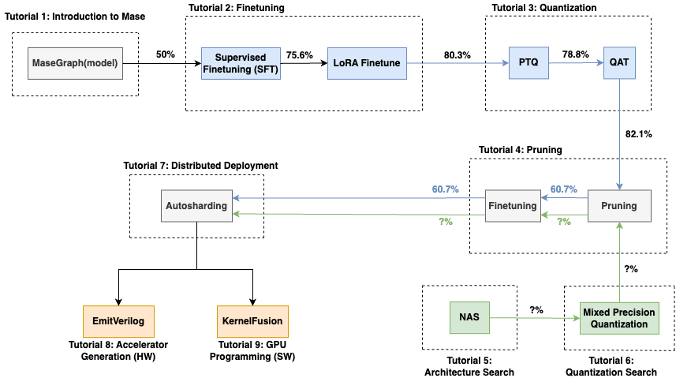

Tutorials
=============================

The following tutorials walk through the main flows of MASE, from model training to deployment.

.. hint::

   For a quick introduction, see the Quickstart page. The tutorials on this page dive deeper into various features and use cases.

See below a summary of the main tutorials:

   Overview of the main Mase tutorials.

Core Tutorials
---------------------

The following tutorials show how to use Mase for standard model compression and optimization flows, such as Finetuning, Quantization and Pruning.

.. toctree::
   :maxdepth: 1

   tutorials/tutorial_1_introduction_to_mase
   tutorials/tutorial_2_lora_finetune
   tutorials/tutorial_3_qat
   tutorials/tutorial_4_pruning

Architecture Search
---------------------

The following show how to effectively run Neural Architecture Search (NAS) and mixed-precision search to find optimal architecture configurations for a given task or dataset.

.. toctree::
   :maxdepth: 1

   tutorials/tutorial_5_nas_optuna
   tutorials/tutorial_6_mixed_precision_search

Inference Deployment
---------------------

The following tutorials show how to deploy an optimized model to a range of platforms, including FPGA and GPU clusters.

.. toctree::
   :maxdepth: 1

   tutorials/tutorial_7_distributed_deployment
   tutorials/tutorial_8_emit_verilog
   tutorials/tutorial_9_kernel_fusion

Advanced Topics
---------------

.. toctree::
   :titlesonly:

   tutorials/advanced/tensorRT_quantization_tutorial
   tutorials/advanced/onnxrt_quantization_tutorial
   tutorials/advanced/cli

Developer Guide
---------------

If you'd like to contribute to Mase, you may find the following resources useful.

.. toctree::
   :titlesonly:

   tutorials/developer/Add-model-to-machop
   tutorials/developer/doc_writing
   tutorials/developer/how_to_extend_search

