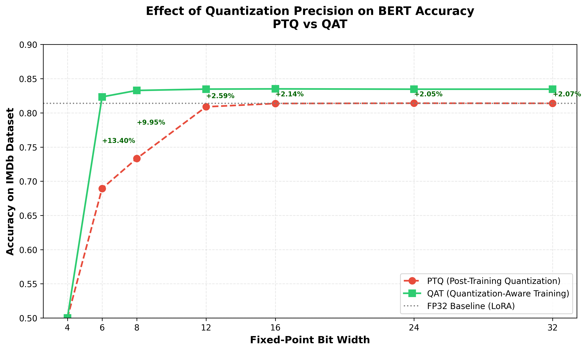
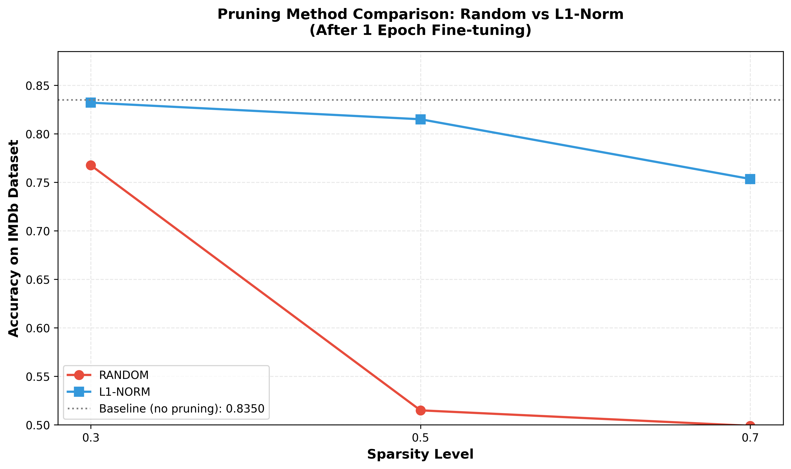
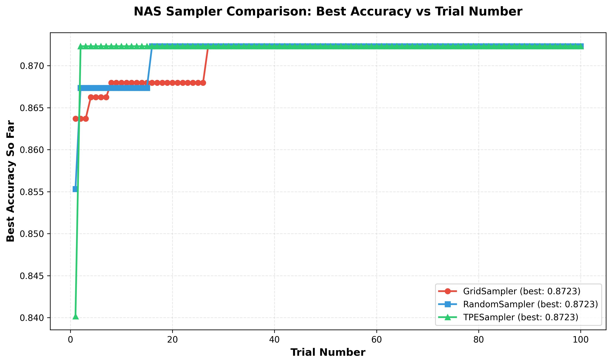
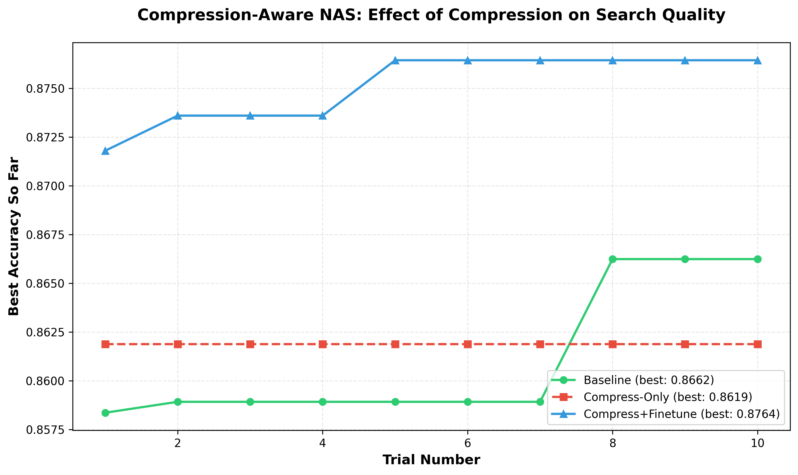
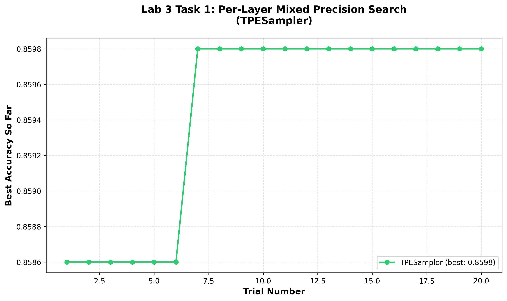
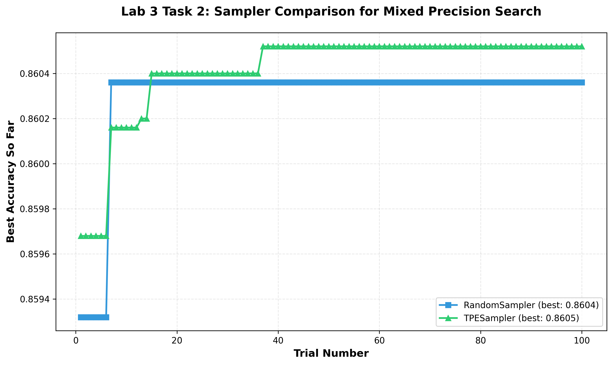

# Lab Logbook Answers

## Lab 0

### Tutorial 1

> Task: Delete the call to `replace_all_use_with` to veriyf that FX will report a RuntimeError

Shows error as expected. The runtime error describes:

```
RuntimeError: Tried to erase Node bert_embeddings_dropout but it still had 6 users in the graph:
{getattr_2, size_4, bert_encoder_layer_0_attention_self_query,
 bert_encoder_layer_0_attention_self_key, bert_encoder_layer_0_attention_self_value, add_7}
```

This is because the 6 nodes which were found in the earlier analysis pass still depend on the drouput output, i.e. the nodes have the drouput node in their `args`. FX prevents deletion because it would leave them with invalid inputs. Uncommenting the `replace_all_use_with` and running the analysis pass again shows proper removal, where dropout count is now 0.

### Tutorial 2:

> Task: Remove the `attention_mask` and `labels` arguments from the `hf_input_names` list and re-run the following cell. Use `mg.draw()` to visualize the graph in each case. Can you see any changes in the graph topology? Can you explain why this happens?

- Observation: After commenting out `attention_mask` and `labels` arguments, the nodes `get_attr`, `ones` and `add_3` appear at the top of the graph, but the `attention_mask` and `CrossEntropyLoss` gets removed.
- Explanation: Without `attention_mask`, the model needs to create a default attention mask, which it does using `ones` with the same shape as `input_ids`. Without `labels`, the `CrossEntropyLoss` module is removed from the graph, and the associated `view` operations for reshaping tensors for loss computation are also removed.

## Lab 1

### Tutorial 3: QAT

QAT core idea: uses fake quantization - simulate lower precision numbers being run in original storage precision (e.g. uses FP32 format but constrains values to INT8 precision during training)

> Task: In Tutorial 3, you quantized every Linear layer in the model to the provided configuration. Now, explore a range of fixed point widths from 4 to 32. Plot a figure where the x-axis is the fixed point width and the y-axis is the highest achieved accuracy on the IMDb dataset, following the procedure in Tutorial 3. Plot separate curves for PTQ and QAT at each precision to show the effect of post-quantization finetuning.

**Implementation:** The script (`lab_1_task_1.py`) quantizes BERT-tiny on IMDb at bit widths [4, 6, 8, 12, 16, 24, 32]. For each width, weights, biases and activations are quantized to the same fixed-point precision using `quantize_transform_pass`. PTQ accuracy is measured immediately after quantization, then QAT is run for 1 epoch and accuracy is measured again.

**Results:**

| Bit Width | PTQ Accuracy | QAT Accuracy | Gap |
|-----------|-------------|-------------|-----|
| 4 | 0.5000 | 0.5000 | 0.0000 |
| 6 | 0.6894 | 0.8233 | +0.1340 |
| 8 | 0.7332 | 0.8328 | +0.0995 |
| 12 | 0.8088 | 0.8347 | +0.0259 |
| 16 | 0.8137 | 0.8350 | +0.0214 |
| 24 | 0.8141 | 0.8346 | +0.0205 |
| 32 | 0.8139 | 0.8346 | +0.0207 |

FP32 baseline: 0.8140



**Analysis:**

1. **QAT consistently outperforms PTQ** at every bit width. The gap is largest at low precision (6-bit: +13.4%) and narrows at higher widths (16+ bits: ~+2%). This is because PTQ simply rounds pre-trained weights, while QAT retrains the model to adapt to quantization noise.

2. **4-bit is a failure point** for both methods (0.50 = chance level). At this precision, the number of representable values is too small to encode useful information -- even QAT cannot recover from such aggressive quantization.

3. **Diminishing returns above 16 bits.** PTQ plateaus at ~0.814 (matching FP32 baseline) from 16 bits onwards, and QAT plateaus at ~0.835. No further gains from increasing precision.

4. **QAT exceeds the FP32 baseline** (~0.835 vs 0.814 at 8+ bits). This suggests QAT has a regularisation effect -- constraining weights to quantized values during training acts similarly to weight noise injection, improving generalisation.

5. **Best model selected:** The 16-bit QAT model (0.8350) was saved as the base for pruning in Task 2, as it achieved the highest QAT accuracy.

### Tutorial 4: Pruning

> Task: Take your best obtained model from Task 1 and rerun the pruning procedure, this time varying the sparsity from 0.1 to 0.9. Plot a figure where the x-axis is the sparsity and the y-axis is the highest achieved accuracy on the IMDb dataset, following the procedure in Tutorial 4. Plot separate curves for Random and L1-Norm methods to evaluate the effect of different pruning strategies.

**Implementation:** The script (`lab_1_task_2.py`) takes the best QAT model from Task 1 (16-bit, 0.835 accuracy) and applies unstructured pruning at sparsity levels [0.3, 0.5, 0.7] using `prune_transform_pass`. Both Random and L1-Norm pruning methods are tested, each followed by 1 epoch of fine-tuning.

**Results:**

| Sparsity | Random (after finetune) | L1-Norm (after finetune) | Difference |
|----------|------------------------|--------------------------|------------|
| 30% | 0.7676 | 0.8322 | +0.0646 |
| 50% | 0.5149 | 0.8151 | +0.3001 |
| 70% | 0.4990 | 0.7535 | +0.2546 |

Baseline (pre-pruning): 0.8350



**Analysis:**

1. **L1-norm pruning consistently outperforms random pruning** at every sparsity level. L1-norm removes weights with the smallest absolute values, which contribute least to the output. Random pruning removes useful and useless weights with equal probability.

2. **Random pruning collapses early.** At 50% sparsity, random pruning is already near chance level (0.515). By 70%, it's fully collapsed (0.499). This indicates that BERT-tiny has limited redundancy -- randomly removing half the parameters destroys critical computation paths.

3. **L1-norm degrades gracefully.** Even at 70% sparsity, L1-norm retains 0.754 accuracy (vs 0.835 baseline), showing that the majority of parameter magnitude is concentrated in a minority of weights. L1-norm preserves these important weights while removing near-zero ones.

4. **Low sparsity is nearly free for L1-norm.** At 30%, L1-norm accuracy (0.832) is within 0.3% of the uncompressed baseline. This means ~30% of model parameters can be removed with essentially no cost.

5. **BERT-tiny's small size amplifies pruning impact.** Compared to larger models, the small parameter count means each removed weight has proportionally more impact, explaining the sharper degradation curves compared to what might be observed with larger transformers.

## Lab 2

### Tutorial 5: NAS Optuna

> Task: Tutorial 5 shows how to use random search to find the optimal configuration of hyperparameters and layer choices for the Bert model. Now, explore using the GridSampler and TPESampler in Optuna. Plot a figure that has the number of trials on the x axis, and the maximum achieved accuracy up to that point on the y axis. Plot one curve for each sampler to compare their performance.

**Implementation:** The script (`lab_2_task_1.py`) runs 100 trials for each of three samplers (GridSampler, RandomSampler, TPESampler) searching over architecture hyperparameters: `num_layers` in {2, 4, 8}, `num_heads` in {2, 4, 8, 16}, `hidden_size` in {128, 192, 256, 384, 512}, `intermediate_size` in {512, 768, 1024, 1536, 2048}. Each trial constructs a BERT model from the sampled config, trains for 1 epoch, and evaluates on IMDb.

**Results:**

| Sampler | Best Accuracy | Trial Found Best | Convergence Speed |
|---------|--------------|-----------------|-------------------|
| GridSampler | 0.87232 | Trial 27 | Slow (systematic) |
| RandomSampler | 0.87232 | Trial 16 | Medium |
| TPESampler | 0.87232 | Trial 2 | Fast (adaptive) |



**Analysis:**

1. **All three samplers converge to the same best accuracy** (0.87232) given 100 trials. This is because the discrete search space has a finite number of configurations (3 x 4 x 5 x 5 = 300 combinations), and 100 trials is sufficient for all samplers to find the global optimum.

2. **TPE is the most sample-efficient.** TPE found the best configuration on trial 2, while Random needed 16 trials and Grid needed 27. TPE uses a Bayesian approach (Tree-structured Parzen Estimator) to model the relationship between hyperparameters and performance, quickly concentrating evaluations in high-performing regions.

3. **Grid sampling is systematic but slow.** Grid iterates through all combinations in a fixed order, so its "time to best" depends on where the optimum falls in the enumeration. It cannot adapt based on prior results.

4. **Random sampling outperforms Grid in early trials.** Random has a non-zero probability of hitting the optimal region early (which it did at trial 16), while Grid's progress is deterministic and cannot accelerate.

5. **For larger search spaces, the difference would be more pronounced.** With 100 trials, all samplers eventually converge here. In larger, continuous search spaces, TPE's adaptive sampling would maintain a significant advantage while Grid becomes infeasible.

> Task: In Tutorial 5, NAS is used to find an optimal configuration of hyperparameters, then we use the CompressionPipeline in Mase to quantize and prune the model after search is finished. However, the final compressed model may not be optimal, since different model architectures may have different sensitivities to quantization and pruning. Ideally, we want to run a compression-aware search flow, where the quantization and pruning is considered in each trial. In the objective function, after the model is constructed and trained for some iterations, call the CompressionPipeline to quantize and prune the model, then continue training for a few more epochs. Use the sampler that yielded the best results in Task 1 to run the compression-aware search. The objective function should return the final accuracy of the model after compression. Consider also the case where final training is performed after quantization/pruning. Plot a new figure that has the number of trials on the x axis, and the maximum achieved accuracy up to that point on the y axis. There should be three curves: 1. the best performance from Task 1 (without compression), compression-aware search without post-compression training, and compression-aware search with post-compression training.

**Implementation:** The script (`lab_2_task_2.py`) uses TPESampler (the best from Task 1) to run 10 trials under three conditions:
- **Baseline:** Train 3 epochs, evaluate (no compression).
- **Compress-Only:** Train 3 epochs, apply INT8 quantization (module-level `LinearInteger` replacement via `deepsetattr`), evaluate immediately.
- **Compress+Finetune:** Train 3 epochs, apply INT8 quantization, finetune 3 more epochs, evaluate.

Quantization config: 8-bit fixed point with 4 fractional bits for data, weights, and biases.

**Results:**

| Condition | Best Accuracy | Mean Accuracy | Std |
|-----------|--------------|---------------|-----|
| Baseline | 0.86624 | 0.8530 | 0.010 |
| Compress-Only | 0.86188 | 0.7848 | 0.080 |
| Compress+Finetune | **0.87644** | 0.8723 | 0.002 |



**Analysis:**

1. **Compress+Finetune achieves the highest accuracy** (0.876) across all conditions, exceeding even the uncompressed baseline (0.866). This demonstrates that compression-aware search with post-compression training finds architectures that are inherently well-suited to quantization.

2. **Post-compression finetuning is essential.** Compress-Only has very high variance (0.597 to 0.862) because quantization noise is architecture-dependent. Some architectures tolerate INT8 quantization well, while others collapse. Finetuning allows the model to adapt its weights to the quantized representation, dramatically reducing variance and improving accuracy.

3. **Compress+Finetune has remarkably low variance** (all 10 trials between 0.870 and 0.876). This robustness suggests that post-compression finetuning compensates for most architecture-dependent quantization sensitivity.

4. **Compress+Finetune acts as a regulariser.** The fact that it exceeds the baseline (0.876 > 0.866) suggests that INT8 quantization followed by finetuning provides a beneficial regularisation effect, similar to what was observed with QAT in Lab 1.

5. **The optimal compressed architecture differs from the baseline.** Baseline best: `{num_layers: 0, num_heads: 1, hidden_size: 3, intermediate_size: 4}`. Compress+Finetune best: `{num_layers: 0, num_heads: 2, hidden_size: 2, intermediate_size: 1}`. The compressed-optimal model uses fewer intermediate features, suggesting smaller models are more quantization-friendly.

## Lab 3

### Tutorial 6: Mixed Precision Search

> Task: In Tutorial 6, all layers allocated to IntegerLinear are allocated the same width and fractional width. This is suboptimal, as different layers may have different sensitivities to quantization. Modify the code to allow different layers to have widths in the range [8, 16, 32] and fractional widths in the range [2, 4, 8]. Expose this choice as an additional hyperparameter for the Optuna sampler. Run the search again, and plot a figure that has the number of trials on the x axis, and the maximum achieved accuracy up to that point on the y axis.

**Implementation:** The script (`lab_3_task_1.py`) runs 20 trials with TPESampler. For each of the 14 Linear layers in BERT-tiny, Optuna independently samples:
1. A quantization type from {Linear (FP32), LinearInteger, LinearMinifloatIEEE, LinearLog}
2. Type-specific hyperparameters (e.g. `data_in_width` in {8, 16, 32} and `data_in_frac_width` in {2, 4, 8} for LinearInteger)

The model is constructed by iterating over `named_modules()`, replacing each `nn.Linear` with the sampled quantized variant using `deepsetattr`, and training for 1 epoch.

**Results:**

| Metric | Value |
|--------|-------|
| Total trials | 20 |
| Valid trials | 19 (95%) |
| Chance-level trials | 1 (5%) |
| Best accuracy | **0.85980** |
| Best trial | Trial 6 |
| Mean accuracy (valid) | 0.8546 |
| Std accuracy (valid) | 0.0042 |

Best configuration (Trial 6):

| Layer | Quantization Type |
|-------|-------------------|
| layer.0.attn.self.query | Linear (FP32) |
| layer.0.attn.self.key | Linear (FP32) |
| layer.0.attn.self.value | Linear (FP32) |
| layer.0.attn.output.dense | LinearInteger |
| layer.0.intermediate.dense | Linear (FP32) |
| layer.0.output.dense | LinearMinifloatIEEE |
| layer.1.attn.self.query | LinearInteger |
| layer.1.attn.self.key | LinearMinifloatIEEE |
| layer.1.attn.self.value | Linear (FP32) |
| layer.1.attn.output.dense | LinearMinifloatIEEE |
| layer.1.intermediate.dense | LinearInteger |
| layer.1.output.dense | LinearMinifloatIEEE |
| bert.pooler.dense | Linear (FP32) |
| classifier | LinearMinifloatIEEE |



**Analysis:**

1. **Mixed precision achieves slightly lower accuracy than uniform quantization** from Lab 2 (0.860 vs 0.872). The per-layer search space is much larger (4 type choices x multiple width/frac options per layer, across 14 layers), making it harder for the TPE sampler to find the global optimum in 20 trials.

2. **The best configuration keeps 6 of 14 layers at full precision.** Notably, all three attention self-projection layers (Q, K, V) in encoder layer 0 remain FP32. This suggests the first encoder layer is more sensitive to quantization than the second, likely because it processes the raw token embeddings and any quantization distortion propagates through all subsequent layers.

3. **Only 1 out of 20 trials produced a degenerate config** (Trial 2 at 0.50). This represents a genuinely bad combination of quantization types, not a code bug. The 95% success rate is expected for this search space.

4. **Tight variance across valid trials** (std = 0.004) indicates that most mixed-precision configurations perform similarly on BERT-tiny. The search space has many "good enough" solutions, but the global optimum is hard to distinguish from near-optimal ones.

5. **More trials would likely improve results.** With only 20 trials exploring a high-dimensional space, TPE has limited data to learn from. Scaling to 100+ trials would give the sampler more opportunity to exploit promising regions.

> Task: In Section 1 of Tutorial 6, when defining the search space, a number of layers are imported, however only LinearInteger and the full precision nn.Linear are selected. Now, extend the search to consider all supported precisions for the Linear layer in Mase, including Minifloat, BlockFP, BlockLog, Binary, etc. This may also require changing the model constructor so the required arguments are passed when instantiating each layer. Run the search again, and plot a figure that has the number of trials on the x axis, and the maximum achieved accuracy up to that point on the y axis. Plot one curve for each precision to compare their performance.

**Implementation:** The script (`lab_3_task_2.py`) runs 100 trials for both RandomSampler and TPESampler. Each trial independently assigns one of {Linear, LinearInteger, LinearMinifloatIEEE, LinearLog} to every Linear layer, with type-specific hyperparameters. Each sampler gets its own fresh Optuna study for fair comparison.

**Results:**

| Sampler | Best Accuracy | Trials at ~0.5 | Trial Found Best |
|---------|--------------|----------------|-----------------|
| RandomSampler | 0.86036 | ~8 (8%) | Trial 7 |
| TPESampler | 0.86052 | ~4 (4%) | Trial 37 |



**Analysis:**

1. **Both samplers achieve nearly identical best accuracy** (0.86036 vs 0.86052, gap of 0.00016). Over 100 trials, this difference is within noise. The mixed-precision search space appears to have a performance ceiling around 0.860 for BERT-tiny on IMDb.

2. **TPE has fewer degenerate trials** (~4% vs ~8%). TPE learns from past trials and avoids configurations that previously led to failures, while Random has no such adaptation. This is a practical advantage even when final accuracy is similar.

3. **Both best configs share a common pattern:** they keep the first encoder layer's attention self-projections (Q, K, V) at full precision or high-width quantization, consistent with the finding from Task 1 that layer 0 attention is quantization-sensitive.

4. **Mixed precision (0.860) underperforms uniform architecture NAS (0.872).** This 1.4% gap persists even with 100 trials, confirming that the per-layer type/width search space is inherently harder to optimise. The combinatorial explosion (4 types x multiple width options x 14 layers) means even 100 trials covers only a tiny fraction of the space.

5. **Random found its best earlier (trial 7) than TPE (trial 37).** This is a lucky early hit. Over 100 trials, TPE's adaptive strategy results in more consistently high trials (fewer at 0.5) but doesn't produce a meaningfully higher peak in this particular search space.

## Lab 4 (Hardware Stream)

### Tutorial 7: Emitting Hardware

> Task: Read about the hardware metadata pass.

The hardware metadata pass (`add_hardware_metadata_analysis_pass`) exists because mapping a computational graph to hardware requires static, implementation-level information that is not present in the software or ML abstraction. Hardware generation and analysis require all constraints to be explicit at compile time. Specifically, the hardware metadata:

- Encodes how a node is realised in hardware, not just what computation it performs.
- Provides the information needed for static analysis, transformation, and code generation.
- Bridges the gap between tensor-level semantics and signal-level hardware interfaces.

The key difference from software metadata:
- **Software metadata** assumes dynamic execution, flexible memory allocation, and runtime scheduling. It doesn't require explicit signal naming, storage binding, or static parameter expansion.
- **Hardware metadata** requires fully explicit interfaces, parameter naming, and static configuration. It encodes all information needed for RTL generation and synthesis. This includes `verilog_param` entries for compile-time parameterisation, `interface` fields for storage type and layout (e.g. BRAM, transpose), `dependence_files` for concrete module selection, and `toolchain` for specifying whether to use INTERNAL Verilog, EXTERNAL IP, or HLS.

> Task: Read through `top/hardware/rtl/top.sv` and make sure you understand how the MLP model maps to the hardware design.

The generated `top` module implements the PyTorch forward pass as a streaming two-stage pipeline: a quantised `fixed_linear` block for `Linear(4,8)` followed by a `fixed_relu` block for ReLU. All tensors use an 8-bit fixed-point format with 3 fractional bits (q5.3). Tensor-size parameters encode the logical shapes (e.g. weights are 4x8, bias is length 8), while parallelism parameters specify spatial unrolling: the design accepts all 4 inputs in parallel and produces 4 of the 8 outputs per cycle (two output tiles). Valid/ready handshakes connect the stages and propagate backpressure end-to-end. The `fc1_weight_source` and `fc1_bias_source` modules provide constant model parameters to the linear block via a handshake interface, corresponding to `fc1.weight` and `fc1.bias` in the original model.

> Task: Launch the simulation and inspect the waveforms.

TODO - simulation and GTKWave waveform inspection.

> Main Task: Choose another layer type from the Pytorch list and write a SystemVerilog file to implement that layer in hardware.

TODO - implement a new layer (e.g. Leaky ReLU) in SystemVerilog and integrate into the design.
