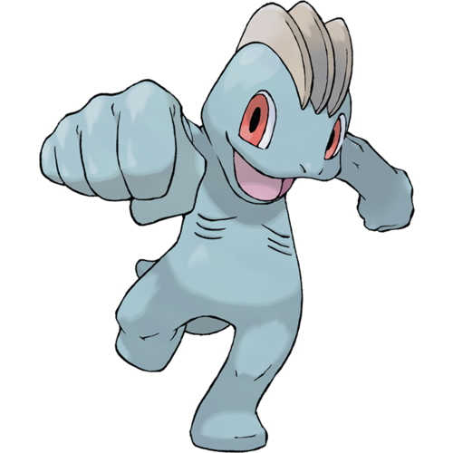

Machop Documentation
================================

Machop is the software stack of Mase.

`Machop <https://bulbapedia.bulbagarden.net/wiki/Machop_(Pok%C3%A9mon)>`_
is a humanoid, bipedal Pokémon that has blue-gray skin. 
It has three brown ridges on top of its head, 
large red eyes, and a relatively flat face. 
On either side of its chest are three, thin, rib-like stripes. 
Its feet appear to have no toes, while its hands have five fingers. Machop also has a short, stubby tail.

Why is it called Machop? Because Machop is the most common pokemon you can find in the 
`Final Maze <https://bulbapedia.bulbagarden.net/wiki/Final_Maze>`_!
For more, you can watch this 
`video <https://www.youtube.com/watch?v=JEUsN_KlDy8&ab_channel=Mah-Dry-Bread-Gameplay%26Streams%21>`_.

.. toctree::
   :maxdepth: 2
   :caption: Machop API

   chop/actions
   chop/datasets
   chop/distributed
   chop/ir
   chop/models
   chop/nn
   chop/nn_quantized
   chop/passes
   chop/pipelines
   chop/tools