# FlexAttention Integration into MASE

> **Project:** Hardware-Aware Transformer Optimisation: Integrating Programmable Attention, Triton Kernel Fusion, and Multi-Objective NAS
> **Component:** FlexAttention Integration Pass
> **Hardware:** NVIDIA L40S (48 GB), PyTorch 2.6, bfloat16
> **Date:** March 2026

---

## 1. Overview

FlexAttention (`torch.nn.attention.flex_attention`) is PyTorch's newest attention API (v2.5+). The idea is simple: you write a small Python function that describes your attention pattern, and `torch.compile` fuses it into a Triton CUDA kernel — with performance on par with FlashAttention-2, but for *any* pattern, not just causal.

The real win is **block-sparse masking**. FlexAttention divides the attention matrix into 128x128 blocks and skips any block that's entirely masked out. For patterns like sliding-window attention, that means most of the matrix gets skipped at long sequences.

We built a MASE transform pass that swaps out SDPA attention modules for FlexAttention across Llama, Mistral, and BERT. The pass includes a library of 5 composable score modifications (causal, sliding window, ALiBi, ALiBi+SWA, document masking) and handles the various edge cases that come with integrating a fairly new API into an existing compiler framework.

| Component | Specification |
|-----------|---------------|
| GPU | NVIDIA L40S (48 GB VRAM) |
| PyTorch | 2.6.0 |
| Precision | bfloat16 (except Exp 2: float32) |
| Model | Medium LLaMA (~1.3B params) |
| Config | hidden=2048, layers=16, heads=16, kv_heads=4 |

---

## 2. Implementation

The core implementation lives in three files:

- **`flex_attention_transform.py`** (~720 LOC) — the main pass. Walks the model, identifies attention modules, and replaces them with FlexAttention subclasses. Weights are transferred via `load_state_dict` so everything (projections, RoPE, KV cache) is preserved. Only the kernel dispatch changes.
- **`score_mods.py`** (~250 LOC) — the score/mask modification library.
- **`test_flex_attention.py`** (~800 LOC) — 40 tests (26 CPU, 14 CUDA) covering score_mod logic, module replacement, forward/backward correctness, and bfloat16 support.

Usage is straightforward:
```python
model, stats = flex_attention_transform_pass(model, {
    "score_mod": "sliding_window",
    "score_mod_kwargs": {"window_size": 256},
    "use_block_mask": True,
})
```

The kernel is compiled once per process with `torch.compile(flex_attention, dynamic=False, mode="max-autotune-no-cudagraphs")`. We use `dynamic=False` because of a known symbolic-shape bug in PyTorch 2.6's `flex_decoding` kernel — this isn't a limitation of our work, it's a documented upstream issue. The trade-off is that the kernel specialises per sequence length, but block mask caching makes this a non-issue during fixed-length training.

### Score Modifications

Each score_mod follows the `(score, b, h, q_idx, kv_idx) -> score` signature. When `use_block_mask=True`, the pass auto-pairs each score_mod with a corresponding mask_mod for block-level sparsity.

| Name | Type | Description |
|------|------|-------------|
| `causal` | Direct | Standard autoregressive: `q_idx >= kv_idx` |
| `sliding_window` | Factory(`window_size`) | Causal + distance limit |
| `alibi` | Factory(`num_heads`) | Attention with Linear Biases |
| `alibi_sliding_window` | Factory(`num_heads`, `window_size`) | ALiBi + sliding window composed |
| `document_mask` | Factory(`doc_len`) | Attend only within same document (for sequence packing) |

---

## 3. Challenges

Getting FlexAttention to work reliably inside MASE involved several non-trivial issues:

- **ALiBi slopes on CUDA** — This was probably the most confusing bug. ALiBi computes per-head slope tensors, and if those live on CPU, TorchInductor crashes during Triton codegen with an unhelpful error. The fix is to materialise them on CUDA at construction time.

- **`dynamic=False` workaround** — PyTorch 2.6 has a known bug where `torch.compile` with `dynamic=True` fails on the `flex_decoding` kernel's `get_split_k` specialisation. We compile with `dynamic=False` to sidestep this. It's not ideal, but block mask caching means the recompilation cost is amortised in practice.

- **Block mask caching** — `create_block_mask()` is surprisingly expensive if called every forward pass. We cache by `(Q_LEN, KV_LEN, device)` and reuse across training steps with fixed sequence lengths.

- **Native GQA** — FlexAttention supports Grouped Query Attention directly via `enable_gqa=True`, so we don't need the `repeat_kv` head expansion that SDPA requires. This saves memory and bandwidth.

- **Short sequences** — Below 128 tokens there's only one block, so block masking can't help. We skip it and the kernel still runs fine.

- **Contiguity** — After the reshape and transpose for multi-head layout, Q/K/V aren't always contiguous. We add `.contiguous()` calls before the kernel.

- **Graceful fallbacks** — Some configs (e.g., `output_attentions=True`, BERT cross-attention) aren't compatible with FlexAttention. The subclasses detect these and fall back to the parent class's eager path.

---

## 4. Experiments

All experiments use the medium LLaMA config (hidden=2048, 16 layers, 16 heads, 4 KV heads, batch=2, bfloat16) on an NVIDIA L40S unless noted otherwise.

---

### Exp 1a: Inference Latency

Baseline comparison — how does FlexAttention compare to SDPA for causal and sliding-window inference?

| Method | 256 | 512 | 1024 | 2048 | 4096 |
|--------|-----|-----|------|------|------|
| SDPA causal | 11.78 ms | 13.15 ms | 22.02 ms | 44.58 ms | 106.31 ms |
| SDPA SWA(256) | 11.63 ms | 13.51 ms | 24.01 ms | 52.39 ms | 137.77 ms |
| Flex causal | 12.30 ms | 13.24 ms | 22.11 ms | 44.49 ms | 104.45 ms |
| Flex SWA(256) | 12.24 ms | 13.21 ms | 21.61 ms | 42.15 ms | **94.65 ms** |

Flex matches SDPA on causal (1.02x) and is **1.46x faster** on SWA at seq=4096. Memory usage is essentially identical.

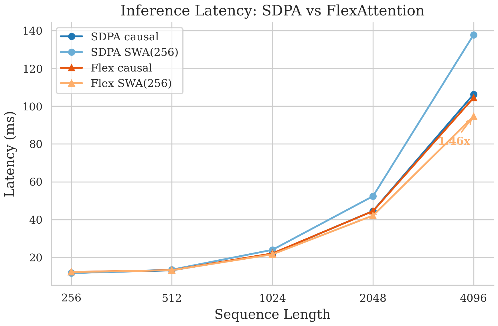

---

### Exp 1b: Training Latency

Same comparison but for full training steps (forward + backward).

| Method | 256 | 512 | 1024 | 2048 | 4096 |
|--------|-----|-----|------|------|------|
| SDPA causal | 37.96 ms | 42.55 ms | 75.08 ms | 156.08 ms | 370.57 ms |
| SDPA SWA(256) | 37.47 ms | 45.76 ms | 87.33 ms | 207.70 ms | 563.90 ms |
| Flex causal | 37.82 ms | 43.85 ms | 76.31 ms | 159.32 ms | 377.06 ms |
| Flex SWA(256) | 37.95 ms | 43.72 ms | 73.38 ms | 147.52 ms | **328.78 ms** |

The SWA speedup is even larger during training: **1.72x** at seq=4096. This makes sense — backprop through SDPA SWA still processes the full causal triangle.

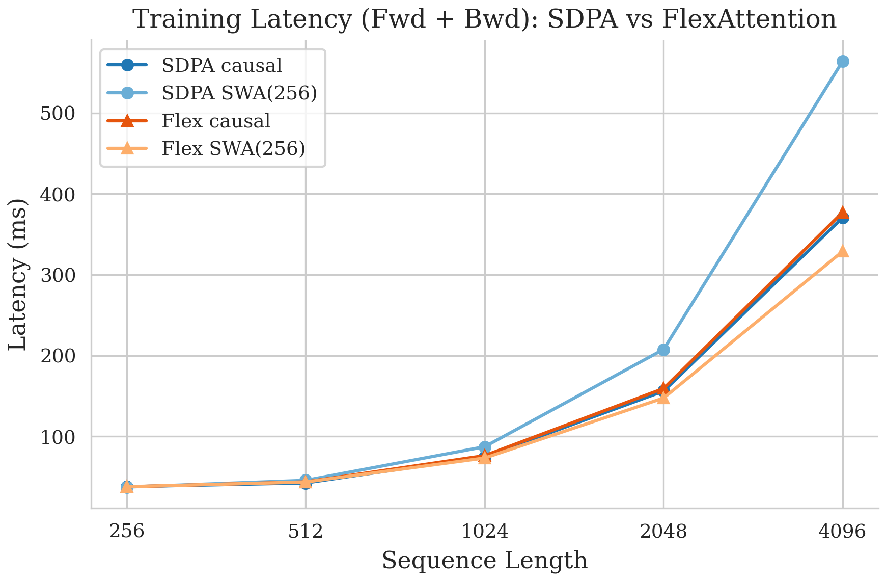

---

### Exp 2: Training Equivalence

Before benchmarking performance, we needed to verify that FlexAttention actually produces the same results as SDPA. We ran 50 training steps on a tiny LLaMA (hidden=256, 4 layers, float32, seed=42) and compared the loss and gradient norms at every step.

- **Max loss difference:** 1.43 x 10^-6
- **Max gradient norm difference:** 2.96 x 10^-7

The two backends are numerically indistinguishable. The bottom panel shows the per-step absolute difference on a log scale — it's all noise-level.

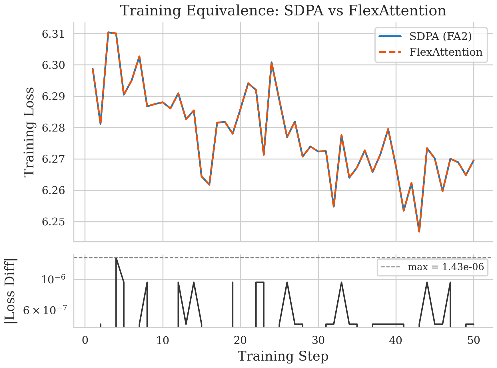

---

### Exp 3: Block Mask Ablation

How much does block-level sparsity actually matter? We ran FlexAttention with and without `block_mask` for both causal and SWA.

| Method | 256 | 512 | 1024 | 2048 | 4096 |
|--------|-----|-----|------|------|------|
| Causal + block_mask | 12.47 ms | 13.24 ms | 22.05 ms | 44.24 ms | 104.22 ms |
| Causal (no block_mask) | 12.96 ms | 13.56 ms | 22.26 ms | 46.21 ms | 113.00 ms |
| SWA + block_mask | 12.58 ms | 13.23 ms | 21.44 ms | 42.11 ms | **94.01 ms** |
| SWA (no block_mask) | 13.02 ms | 13.50 ms | 22.17 ms | 46.41 ms | 113.05 ms |

Block masking gives a 1.08x speedup for causal and **1.20x for SWA** at seq=4096. Without it, SWA degrades to causal-level performance because the kernel evaluates every block regardless.

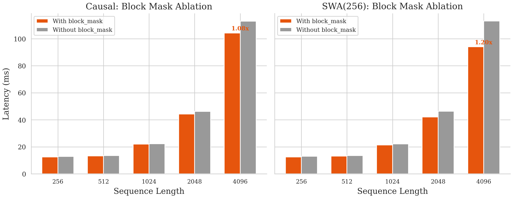

---

### Exp 4: Mistral Sliding Window

We also tested on Mistral to confirm the speedup isn't Llama-specific.

| Method | 256 | 512 | 1024 | 2048 | 4096 |
|--------|-----|-----|------|------|------|
| Native Mistral SWA (SDPA) | 11.96 ms | 14.03 ms | 24.35 ms | 54.02 ms | 141.98 ms |
| Flex Mistral SWA | 12.53 ms | 13.45 ms | 21.84 ms | 42.58 ms | **94.68 ms** |

**1.50x speedup** at seq=4096 — consistent with the Llama numbers. The benefit is architecture-independent.

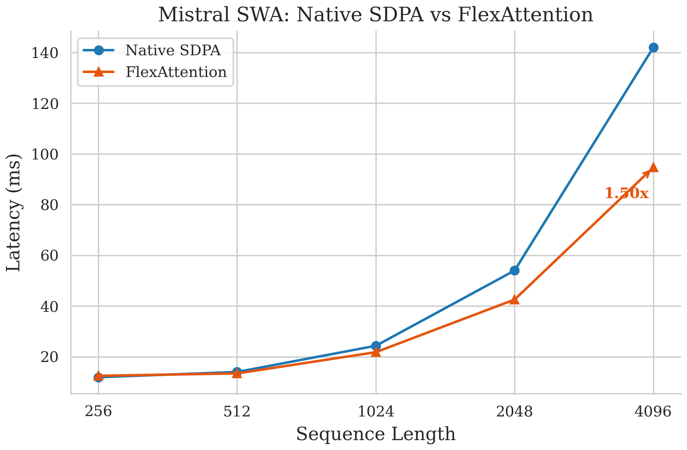

---

### Exp 6: Compound Masks (ALiBi + Sliding Window)

Can we compose ALiBi bias with sliding-window sparsity without paying extra? The idea is that `torch.compile` should fuse both into one kernel.

| Method | 256 | 1024 | 4096 |
|--------|-----|------|------|
| Flex Causal | 38.72 ms | 74.46 ms | 370.92 ms |
| Flex Sliding Window | 38.65 ms | 71.96 ms | 324.57 ms |
| Flex ALiBi + SWA | 39.25 ms | 72.15 ms | **324.55 ms** |

ALiBi + SWA (324.55 ms) matches plain SWA (324.57 ms) within noise. Composition is genuinely free — the compiler fuses both operations into one Triton kernel.

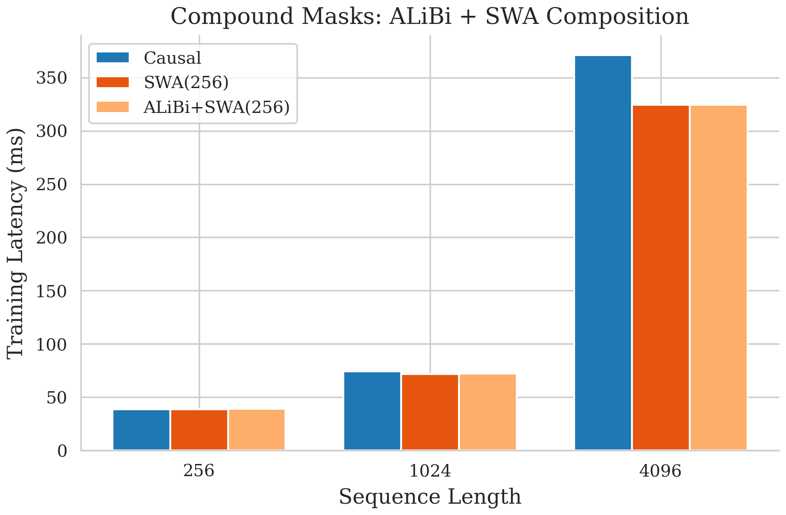

---

### Exp 7: Kernel Profiling

We generated PyTorch trace files for Chrome DevTools / Perfetto analysis. Output in `results/traces/` — useful for inspecting kernel launch counts, memory traffic, and fusion boundaries, but not something that fits in a static figure.

---

### Exp 8: Document Masking (Sequence Packing)

This is arguably FlexAttention's best use case. When you pack multiple documents into one sequence for training, you need to prevent attention across document boundaries. SDPA can't express this natively — you have to materialise a full N x N mask. FlexAttention handles it with block sparsity.

| Method | 1024 | 4096 | 8192 |
|--------|------|------|------|
| SDPA Causal (FA2 Baseline) | 74.57 ms | 369.12 ms | 895.22 ms |
| SDPA Document Mask | 87.10 ms | 561.89 ms | 1687.26 ms |
| Flex Document Mask | 75.89 ms | 333.77 ms | **748.31 ms** |

At seq=8192, Flex is **2.25x faster** than SDPA's manual document mask, and actually **1.20x faster than SDPA's causal baseline** — because the block mask prunes cross-document blocks.

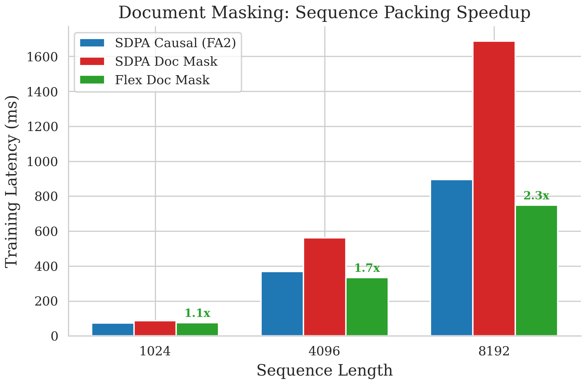

---

### Exp 9: Batch Sensitivity

A quick sanity check — does FlexAttention hold up across batch sizes?

| Batch Size | SDPA causal | Flex causal | Ratio |
|-----------|------------|------------|-------|
| 1 | 13.44 ms | 13.76 ms | 0.98x |
| 2 | 22.45 ms | 22.68 ms | 0.99x |
| 4 | 43.22 ms | 43.13 ms | 1.00x |
| 8 | 97.73 ms | 96.41 ms | 1.01x |

Parity across the board. No surprises here.

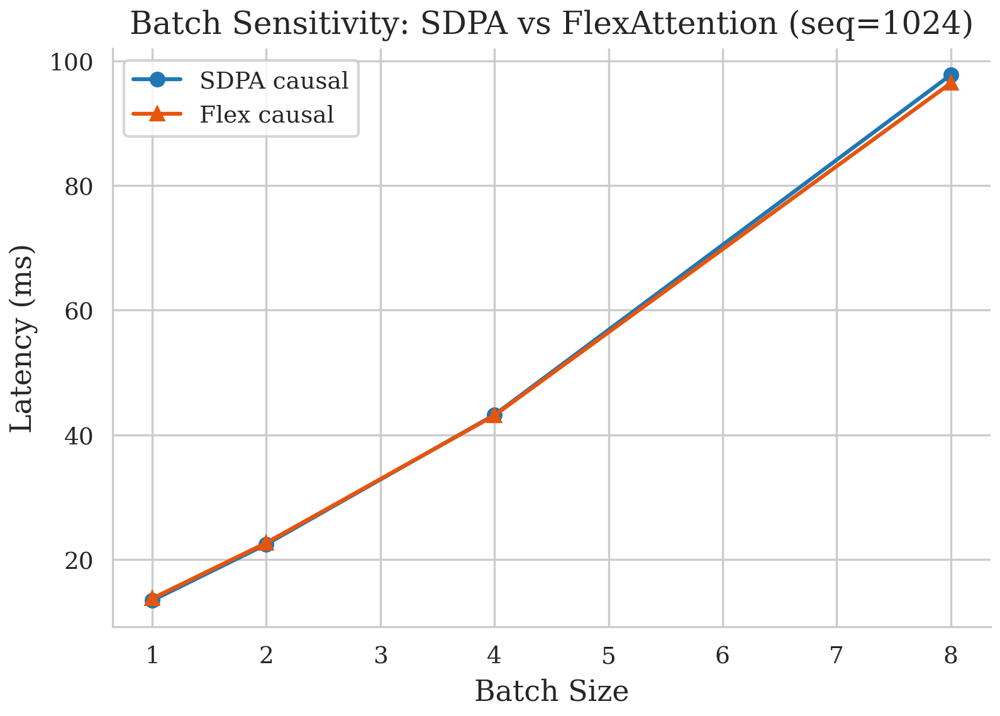

---

### Exp 10: Decode Generation

This is where FlexAttention struggles. During autoregressive generation, each decode step has Q_LEN=1 — a single token. There's no block sparsity to exploit, and `torch.compile` overhead dominates.

| Method | Prompt=128 | Prompt=512 | Prompt=1024 |
|--------|-----------|-----------|------------|
| SDPA causal (per-token ms) | 11.51 | 11.47 | 11.46 |
| Flex causal (per-token ms) | 13.65 | 49.85 | 49.91 |
| Flex SWA (per-token ms) | 50.75 | 50.53 | 50.61 |

Flex is **4.3-4.4x slower** per token at decode. SDPA's hand-optimised CUDA kernels are much better here. This only affects token-by-token generation — prefill and training are unaffected. Future PyTorch releases with optimised `flex_decoding` kernels should help.

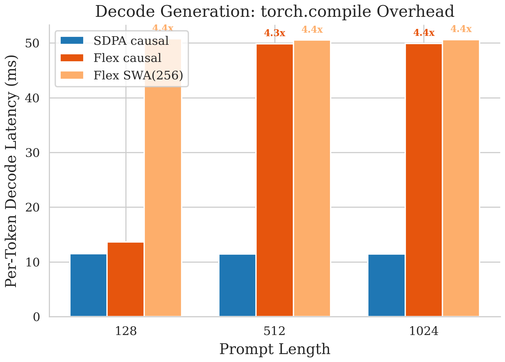

---

### Exp 11: Throughput

Translating latency into tokens/sec makes the scaling story clearer.

#### Training Throughput (tok/sec)

| Method | 256 | 512 | 1024 | 2048 | 4096 |
|--------|-----|-----|------|------|------|
| SDPA causal | 13,386 | 24,353 | 27,246 | 26,346 | 22,127 |
| SDPA SWA(256) | 13,461 | 22,362 | 23,469 | 19,782 | 14,498 |
| Flex causal | 13,219 | 23,296 | 26,936 | 25,744 | 21,808 |
| Flex SWA(256) | 13,330 | 23,428 | 28,061 | 27,903 | **25,070** |

This is the headline number: Flex SWA achieves **1.73x higher training throughput** than SDPA SWA at seq=4096 (25,070 vs 14,498 tok/sec). The key insight is that SDPA SWA throughput *collapses* beyond seq=1024 because it falls back to the full attention matrix, while Flex maintains near-causal throughput thanks to block sparsity.

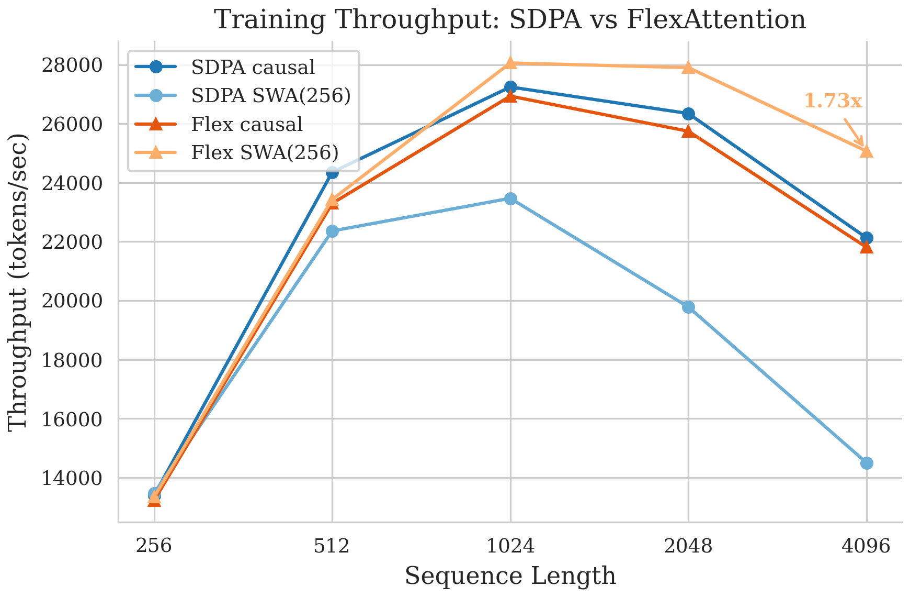

---

### Exp 12: GQA Isolation

Finally, we tested whether the FlexAttention advantage depends on the head configuration. We swept across MHA, GQA-4, and MQA with three attention patterns.

#### Speedup Matrix (SDPA / Flex) at seq_len=4096

| Head Config | Causal | SWA(256) | ALiBi+SWA(256) |
|------------|--------|----------|----------------|
| MHA (16/16) | 0.98x | **1.63x** | **1.63x** |
| GQA-4 (16/4) | 0.99x | **1.72x** | **1.72x** |
| MQA (16/1) | 0.95x | **1.74x** | **1.73x** |

Three things stand out: (1) causal shows no regression; (2) SWA gives 1.63-1.74x regardless of head grouping; (3) ALiBi+SWA matches plain SWA exactly, confirming the free composition result from Exp 6 holds across all configs.

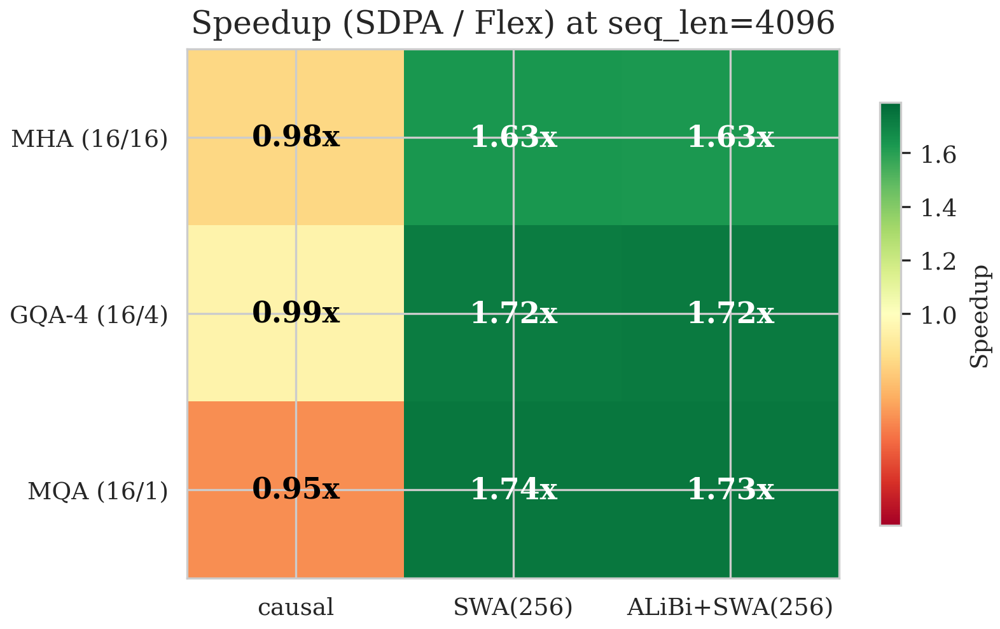

---

## 5. Summary

| Finding | Value |
|---------|-------|
| Causal attention parity | 1.02x |
| SWA inference speedup (seq=4096) | **1.46x** |
| SWA training speedup (seq=4096) | **1.72x** |
| SWA training throughput (seq=4096) | **1.73x** (25,070 vs 14,498 tok/sec) |
| Document masking speedup (seq=8192) | **2.25x** |
| ALiBi+SWA composition overhead | Zero |
| Decode generation slowdown | 4.3-4.4x |

**The bottom line:** FlexAttention is a safe drop-in for causal attention and a significant win for anything sparse. Sliding window gets 1.46-1.74x depending on the workload, document masking gets 2.25x, and composing patterns like ALiBi+SWA is genuinely free. The one caveat is decode generation, where `torch.compile` overhead makes it 4.3x slower — but that's a known PyTorch limitation that only affects token-by-token generation, not training or prefill.
