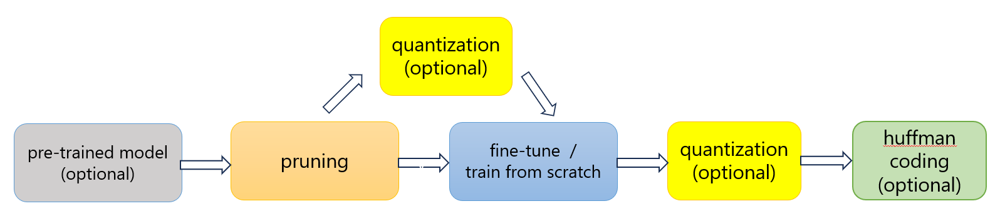
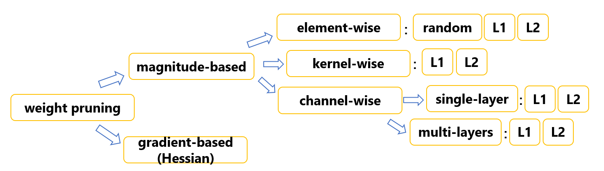
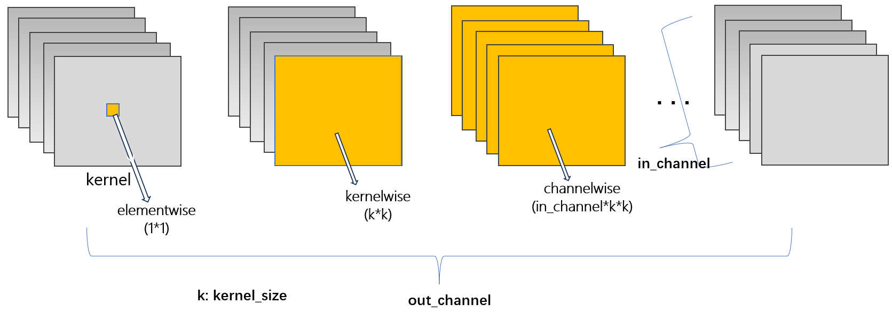
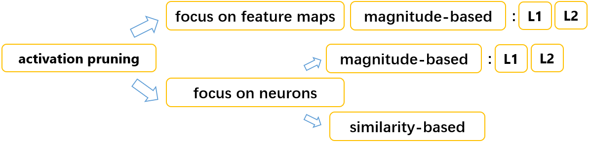
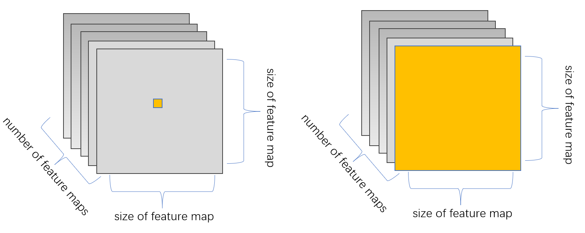

# Pruning and Training for MASE - Group 3 

# Functionality 
## Basic Elements:
* Implement a pruning pass that automatically prunes parameters for any given granularities
* Add support so that pruned networks can be re-trained
* Evaluate its performance and sparsity in terms of different design parameters

## Extenstions:
* Implement a comprehensive pipeline consisting of **Pruning, Quantization, Training, and Huffman Coding**, capable of autonomously pruning and compressing networks while preserving comparable performance post-training, achieving efficient sparsity encoding.
* Execute a wide array of pruning methods, specifically, 9 of weight pruning (across different granularities), and 5 of activation pruning (focusing on neurons/feature maps and similarity-based approaches)
* Investigate the model's ability to train from scratch.
* Examine the transferability of methodologies to alternative models (ResNet18) and datasets (colored-MNIST).

# Getting started

## How to run

Please execute all of our programs in the <code>machop("mase/machop")</code> directory.

Our test function is <code>test_group3.py</code> inside the existing testing framework, run in command line using:
```yaml
python test/passes/graph/transforms/prune/test_group3.py
```

You can also execute the transform function via the command line using 
```yaml
./ch transform --config configs/examples/group3.toml
```

You might change configuration as you wish. 

As there are too many configurations, we kept them inside a toml file at <code>configs/example/prune_retrain_group3.toml</code>
Please refer to the file for default parameter values and to change them.

## Example output

Below is a demonstration of an actual output under certain pruning prerequisites:
```yaml
# Pruning:
pass_config:
{'weight': {'sparsity': 0.2, 'scope': 'local', 'granularity': 'elementwise', 'method': 'l1-norm'}, 'activation': {'sparsity': 0.1, 'scope': 'local', 'granularity': 'elementwise', 'method': 'l1-norm'}}
-------------------------------------
number of Conv2d parameters before pruning:  4576384
model size before pruning:  18320936.0
flop of Conv2d layers before pruning:  1215037440
-------------------------------------
number of Conv2d parameters after pruning:  3659670
model size after pruning:  14661248.0
flop of Conv2d layers after pruning:  541312576
-------------------------------------
reduced percentage of Conv2d parameters:  0.20031404707297285
reduced percentage of model size:  0.19975442302729507
reduced percentage of Conv2d flops:  0.5544889744302859
-------------------------------------
INFO     model is successfully pruned and saved!

# Quantization:
There is quantization at feature_layers_0, mase_op: conv2d
There is quantization at feature_layers_3, mase_op: conv2d
There is quantization at feature_layers_7, mase_op: conv2d
There is quantization at feature_layers_10, mase_op: conv2d
There is quantization at feature_layers_14, mase_op: conv2d
There is quantization at feature_layers_17, mase_op: conv2d
model size after quantization:  3665312.0
INFO     model is successfully quantized and saved

# Fine-tuning:
INFO     Loaded pytorch checkpoint from ../mase_output/vgg_cifar10_prune/software/transforms/prune/state_dict.pt
Epoch 0: 100% 98/98 [00:43<00:00,  2.28it/s, v_num=0, train_acc_step=0.878]
# continue to train ......
Epoch 9: 100% 98/98 [00:47<00:00,  2.08it/s, v_num=0, train_acc_step=0.875, val_acc_epoch=0.934, val_loss_epoch=0.216]

# Huffman coding
huffman used bytes:  1344395.25

INFO     Transformation is completed
```

| Metric                                     |Post-Reduction Size (compared to original)| Details                                                                         |
|--------------------------------------------|---------------------------|---------------------------------------------------------------------------------|
| **Model Size Reduction**                   |                           |                                                                                 |
| After Pruning                              | 80% (1 - 20%)             | Model size and Conv2d parameters reduced to 80% of original sizes.              |
| After Post-Prune Quantization              | 20% (80% * 25%)           | Further reduced to a quarter of its original size with 8-bit storage.           |
| After Huffman Encoding                     | 7.34% (20% * 36.7%)       | Further reduced to 36.7% of its post-quantization size.                         |
| **Number of Conv2d Parameters & FLOPs Reduction**    |                 |                                                                                 |
| Conv2d Parameters (After Pruning)      | 80% (1 - 20%)                         | Precisely reduced to 20% of their original sizes.                               |
| Conv2d FLOPs (After Pruning)           | 44.6% (1 - 55.4%)                     | Reduction can far exceed 10%, due to zeroed weights.                            |
| **Validation Accuracy**                    |                           |                                                                                 |
| Post Fine-Tuning                           | 93.34%                    | Slightly higher than the pre-trained model's 93.32% validation accuracy.        |


In summary, it is evident that the model can maintain or even slightly improve its validation accuracy while undergoing significant model compression, achieving the desired outcome.

Note: Actual model size reduction on hardware requires compiler-level modifications. Theoretical strategies still signify a major advancement, with potential drastic reductions upon compiler adjustments. Please refer to the detailed discussion in the report.


## Model Storage

Note that we save the model for all passes.

For prune, quantization, train:

If you run the test, find the saved models at:
<code>mase_output/group3_test</code>

Or if you run the transform command, find the saved models at:
<code>mase_output/{project}/software/transforms</code>

For Huffman encoding, find the saved model at:
 <code>machop/chop/huffman_model.ckpt</code>

&nbsp;

# Implementation Overview

Please refer to the **Methodology part of the report** for detailed illustration and visualization.

## Overall Pipeline



Each component within the pipeline is executed through an autonomous pass within <code>transform.py</code>, allowing for the **flexible** selection and combination of passes to suit specific requirements.

&nbsp;&nbsp;

## Pruning Methods

Specifically, below are all the pruning methods that we've implemented:

Weight pruning:



Different granualarities of weight pruning:



&nbsp;

Activation pruning:



Different focus of activation pruning:



Please refer to <code>pruning_methods.py</code> for their specific names. 

For the detailed analysis on their principles and performance, as well as the multiple evaluating metrics, please refer to the **report**.

&nbsp;&nbsp;

## Training

We use PyTorch Lightning for model training. 

The model is constructed with the specified architecture and loaded with pre-pruned weights.

&nbsp;&nbsp;

## Post-prune Quantization & Huffman Coding

Additionally, inspired by the methodology from[DEEP COMPRESSION: COMPRESSING DEEP NEURAL NETWORKS WITH PRUNING, TRAINED QUANTIZATION AND HUFFMAN CODING](https://arxiv.org/pdf/1510.00149.pdf), we've implemented **post-prune quantization** and **Huffman Coding**. 

The post-prune quantization convert the 32-bit float data into an 8-bit format with 4 bits allocated for the fractional part.

Huffman Encoding takes the advantage of the newly quantized data, it uses variable-length encoding to encode more common weight values with shorter bits,
effectively compressing the model further.

By default, these two further model compression techniques are enabled, but you can choose to disable them by commenting all <code>passes.quantize</code> and set <code>is_huffman = false</code>

Note that quantization must be valid for Huffman encoding.

&nbsp;&nbsp;

## Train from scratch && Transferability to other models and datasets

By default, the model loads the **pre-trained VGG7 model** for pruning and training.

If desired, you can opt to **train from scratch** by setting <code>load_name = None</code>.

Moreover, you are free to select different datasets and models. The **ResNet18** network and **colored-MNIST** are fully compatible with our pipeline and yield satisfactory results. To utilize these, please modify the toml configuration as follows:
```yaml
model = "resnet18"  # ResNet18
dataset = "mnist"  # colored-MNIST
```

&nbsp;&nbsp;


## Contact

Feel free to contact us at ruiqi.shen23@imperial.ac.uk if you have encountered any problems.


