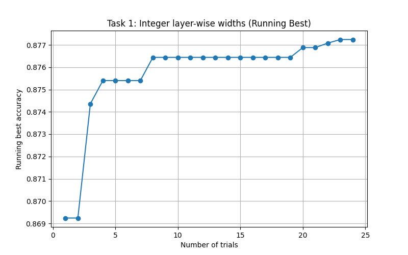

# ADLS Labs – Group 15

---

## Introduction

---

## Lab 0 – Introduction and Environment Setup

### Setup

### Results

### Observations

### Conclusion

---

## Lab 1 – Quantisation and Pruning Fundamentals

### Setup

### Results

### Observations

### Conclusion

---

## Lab 2 – Neural Architecture Search (NAS) and Compression-Aware Optimisation

### Overview

This lab constructs the NAS workfow for BERT, then shows how to train, evaluate and then finally compress the (best) discovered architecture. <br>
1. We start by initializing training pipeline (tokenization into input IDs and attention masks).
2. Next define a dictionary of search hyperparameters that BERT is allowed to change, such as number of transfomer layers, or even the type of layer.
3. A `construct_model` function is defined which samples the hyperparametrs from Optuna and constructs a BERT model using those settings. The evaluation of the sampling strategy from Optuna is the implementation focus of this lab.
4. An `objective` function is defined which essentially just evaluates the validation accuracy.
5. Finally, run multiple trials of each sampler and measure the accuracy across trials for each one.
6. Using the model from the sampler that yielded the best results, we finally compress the model using MASE. We may also fine-tune this model. We check how much the performance changed after the compression.

### Task 1

### Task 2
---

## Lab 3 – Mixed-Precision Quantisation Search

In this lab, we use Optuna which allows us to perform neural architecture search, building upon tutorial 6 which shows us how to quantize the `LinearInteger` using a low-precision config
```python
kwargs["config"] = {
    "data_in_width" : 8,
    "data_in_frac_width": 4,
    "weight_width": 8,
    "weight_frac_width": 4,
    "bias_width": 8,
    "bias_frac_width": 4,
}
```

This config specifies a *Q4.4* fixed-point format. 4 bits for the whole number, 4 bits for the fractional part. 
- `data_in`: quantize activations coming in from previous layer
- `weight_width`: quantize weight vector
- `bias_width`: quantize bias vector

1. Because different layers in the model have different senstivity to quantization schemes, it is more optimal to search over different bit widths when finding the best model. 

2. Additionally, we only considered the `LinearLayer` in tutorial 6. We also extend the search to consider all supported precision formats in MASE.

For both these extensions, we plot a graph showing how increasing the number of trials changes with the highest value of the obhjective function at the end of each set of trials.

### Setup

We add code to allow easy setup of configs for ranges and different layer choices in the following way

1. Set global dicts for the variables we will later pass Optuna's search space. We organise the layers by precision to allow setting up different studies for each precision.
```py
SEARCH_RANGES = {
    "width": [8, 16, 32],
    "frac_width": [2, 4, 8],
    "exponent_width": [2, 3, 4],
    "exponent_bias": [3, 7, 15],
    "block_size": [16, 32],
}

PRECISION_MAP = {
    "Integer": [LinearInteger],
    "Minifloat": [LinearMinifloatDenorm, LinearMinifloatIEEE],
    "Block": [LinearBlockFP, LinearBlockMinifloat, LinearBlockLog],
    "Binary": [LinearBinary],
    "Log": [LinearLog],
    "Full": [torch.nn.Linear],
}
```

2. We then have a function which receives a given precision layer, and configures its parameters, using the `SEARCH_RANGES` dict. 
```py
def configure_layer_params(
    trial: optuna.Trial, 
    layer_name: str, 
    layer_cls: Type, 
    base_kwargs: Dict[str, Any]
) -> Dict[str, Any]:
    """
    Populates the 'config' dictionary for a quantized layer based on Optuna suggestions.
    """
```

Different layers need different parameters, and that is handled within this function. Here is an example for `LinearInteger` and `LinearMinifloatDenorm`, `LinearMinifloatIEEE` layers. 

```python
    if layer_cls == LinearInteger:
        for comp in components:
            w = trial.suggest_categorical(f"{layer_name}_{comp}_width", SEARCH_RANGES["width"])
            fw = trial.suggest_categorical(f"{layer_name}_{comp}_frac_width", SEARCH_RANGES["frac_width"])
            config[f"{comp}_width"] = w
            config[f"{comp}_frac_width"] = fw

    elif layer_cls in [LinearMinifloatDenorm, LinearMinifloatIEEE]:
        for comp in components:
            w = trial.suggest_categorical(f"{layer_name}_{comp}_width", SEARCH_RANGES["width"])
            ew = trial.suggest_categorical(f"{layer_name}_{comp}_exp_width", SEARCH_RANGES["exponent_width"])
            config[f"{comp}_width"] = w
            config[f"{comp}_exponent_width"] = ew
            
            if layer_cls == LinearMinifloatDenorm:
                eb = trial.suggest_categorical(f"{layer_name}_{comp}_exp_bias", SEARCH_RANGES["exponent_bias"])
                config[f"{comp}_exponent_bias"] = eb
            else:
                # IEEE bias: 2^(k-1) - 1
                config[f"{comp}_exponent_bias"] = (2 ** (ew - 1)) - 1
```

3. We then define a `construct_model` function which with the `trial` also receives the specific `layer_choices` list for Optuna to use, replaces the `nn.torch.Linear` layer with the new layer after copying over weight and bias data from the old layer.
```python
def construct_model(trial: optuna.Trial, layer_choices) -> Any:
    trial_model = deepcopy(BASE_MODEL)

    for name, layer in trial_model.named_modules():
        if isinstance(layer, torch.nn.Linear):
            choice_idx = trial.suggest_int(f"{name}_type_idx", 0, len(layer_choices) - 1)
            new_layer_cls = layer_choices[choice_idx]

            if new_layer_cls == torch.nn.Linear:
                continue

            kwargs = {
                "in_features": layer.in_features,
                "out_features": layer.out_features,
                "bias": layer.bias is not None
            }

            kwargs = configure_layer_params(trial, name, new_layer_cls, kwargs)

            try:
                new_layer = new_layer_cls(**kwargs)
                new_layer.weight.data = layer.weight.data
                if layer.bias is not None and new_layer.bias is not None:
                    new_layer.bias.data = layer.bias.data
                
                deepsetattr(trial_model, name, new_layer)
                
            except Exception as e:
                print(f"Failed to construct {name} with {new_layer_cls}: {e}")
                raise e

    return trial_model
```

4. We then need an objective function which receives the `layer_choices` and constructs the objective function from that.
```py
def get_objective(layer_choices):
    def objective(trial):
        model = construct_model(trial, layer_choices)

        trainer = get_trainer(
            model=model,
            tokenized_dataset=dataset,
            tokenizer=tokenizer,
            evaluate_metric="accuracy",
            num_train_epochs=1,
        )
        
        if (LinearBlockMinifloat not in layer_choices) and (LinearBinaryResidualSign not in layer_choices):
            trainer.train()
        
        
        metrics = trainer.evaluate()
        accuracy = metrics.get("eval_accuracy")
        
        return accuracy
    
    return objective
```

`LinearBlockMinifloat` and `LinearBinaryResidualSign` do not define a backward pass so we cannot retrain the model if any of those layers are present.

The final stage is to loop through a set of trials and record the best value from each study.
```py
N_TRIALS = 24

def run_comparison():
    plt.figure(figsize=(10, 6))
    
    # Iterate over each precision type (Integer, Minifloat, etc.)
    for name, layer_choices in PRECISION_MAP.items():
        print(f"--- Running Search for {name} Precision ---")
        
        sampler = RandomSampler()
        study = optuna.create_study(direction="maximize", sampler=sampler)
        
        best_values = []

        for n in range(1, N_TRIALS+1):
            study.optimize(get_objective(layer_choices), n_trials=n)
            best_values.append(study.best_value)
            
        plt.plot(range(1, len(best_values) + 1), best_values, label=name, marker='o')

    plt.xlabel("Number of Trials")
    plt.ylabel("Best Accuracy Achieved")
    plt.title("Mixed Precision Search Comparison")
    plt.legend()
    plt.grid(True)
    plt.show()
```

### Results


*Increasing number of trials per study for parameter search over `LinearInteger` layer*


*Increasing number of trials per study for parameter search over multiple precision layers*

### Observations

In task 1, we see an increase in the study's best value as we increase the number of trials per study. Another thing to note is that there is no added benefit in more trials between 8 - 18 trials, and 4-7 trials. 

In task 2, we compare different precisions as shown. We see that the `LinearBlockMinifloat` and `LinearBinaryResidualSign` layers started off with the lowest with 1 trial. This is explainable by the fact that with these layers, the model does not get retrained, and therefore does not adapt well to the change of precision. With more trials the `LinearBinaryResidualSign` layer does not improve, whereas the `LinearBlockMinifloat` does, going from a best accuracy of 0.50 to one of 0.84 at 12 trials. This is still underperforming in comparison to the models that were retrained.

The improvement in `LinearBlockMinifloat` is explainable by the fact that it has tunable hyperparameters that control information loss
```py
blk = trial.suggest_categorical(f"{layer_name}_block_size", SEARCH_RANGES["block_size"])

for comp in components:
    if layer_cls == LinearBlockMinifloat:
        config[f"{comp}_width"] = trial.suggest_categorical(f"{layer_name}_{comp}_width", SEARCH_RANGES["width"])
        config[f"{comp}_block_size"] = [blk] # block size made a list here to circumvent errors
        
        config[f"{comp}_exponent_width"] = 4
        config[f"{comp}_exponent_bias_width"] = 4
```

Here, we control the `data_in`, `weight`, and `bias` width and block size. With lower trials, Optuna might pick a configuration which destroys the model accuracy, but with higher trials, it has a chance to optimise for better configurations.

`LinearBinaryResidualSign` does not have such parameters, so Optuna has nothing to feedback loop to optimise over.

```py
    elif layer_cls == LinearBinaryResidualSign:
        config["data_in_stochastic"] = False
        config["weight_stochastic"] = False

        config["data_in_bipolar"] = True
        config["weight_bipolar"] = True

        config["binary_training"] = True
```


The next best performers are the `LinearBinaryScaling` and `LinearBinary` layers which have similar performance over the studies. 

With these precisions, we perform Quantization-aware training, allowing the model to adapt to the weights being only within the [-1,1] range.

The best performers are the `LinearBlockLog`, `LinearBlockFP`, `LinearLog`, `LinearMinifloatDenorm`, `LinearMinifloatIEEE` and `LinearInteger` layers. 

### Conclusion

The fact that `LinearBinaryScaling` and `LinearBinary` outperform `LinearBLockMinifloat` could indicate that Optuna chose a configuration for `LinearBLockMinifloat` that is problematic. For instance, if the exponent width is too large, then the there's less mantissa bits, hence less precision, so very small weights in the block vanish to 0, whereas if the exponent width is too small, then very large weights in the block get clipped.

We also see the importance of hyperparameter tuning in choosing the optimal model as seen with results for `LinearBlockMinifloat` vs `LinearBinaryResidualSign`.

The best performers are so, even with `n_trials = 1`, because my search includes width = `[8, 16, 32]`. Most models lose little accuracy when quantized to 8-bit formats, and we give Optuna the opportunity to even go high precision than that. These precisions are still high enough to match the distribution of weights in the entire model. 

Moreover, these precisions preserve the algebraic properties of the original model, and preserve sign and magnitude. In comparison with the `LinearBinary` layer, a weight of 0.0001 and 5.0 both become 1.0 post quantization. The magnitude information has been lost.

### Key Takeaways

Quantization is a process that allows model sizes to reduce, allowing for more efficient inference. The tradeoff is accuracy, but through principled techniques like QAT, we can regain the lost information, sometimes even  surpursing the accuracy of the base model. Additinally, the hyperparameters chosen for any layer affect the performace, because they relate to how well the layer retains information. One can also pick precisions such that we effectively get a compression that doesn't loose much of the information compared to the full-precision model.

---

## Lab 4 – System Performance and torch.compile

### Setup

### Results

### Observations

### Conclusion

### Key Takeaways


---
