# Lab 1: #

## Task 1: QAT vs. PTQ

### 1. Experiment Overview ###

In this experiment, we evaluated the sensitivity of the `BERT-tiny` model to quantization precision by sweeping across a range of fixed-point `bit-widths: 4, 8, 16, and 32 bits.`

For each bit-width, we compared two quantization strategies:

- __Post-Training Quantization (PTQ):__ Direct quantization without further training (just evaluation).

- __Quantization-Aware Training (QAT):__ Fine-tuning the quantized model for `1 epoch` to allow weights to adapt to the quantization noise.

The goal was to determine the "sweet spot" where model size is minimized without significant degradation in accuracy, and to quantify the specific benefit of QAT at different precision levels.

### 2. Implementation ###

We extended the `Tutorial 3` workflow to iterate through the target `widths [4, 8, 16, 32]`. For each width $w$, we configured the quantization parameters as follows:

- __Format:__ Integer (Fixed Point)
- __Total Width:__ $w$
- __Fractional Width:__ $w // 2$ (Allocating half the bits to the fractional part)

We utilized the MaseGraph to apply the pass transform. For the QAT phase, we re-instantiated the Trainer with the quantized model and ran a single epoch of fine-tuning before final evaluation.


### 3. Results ###

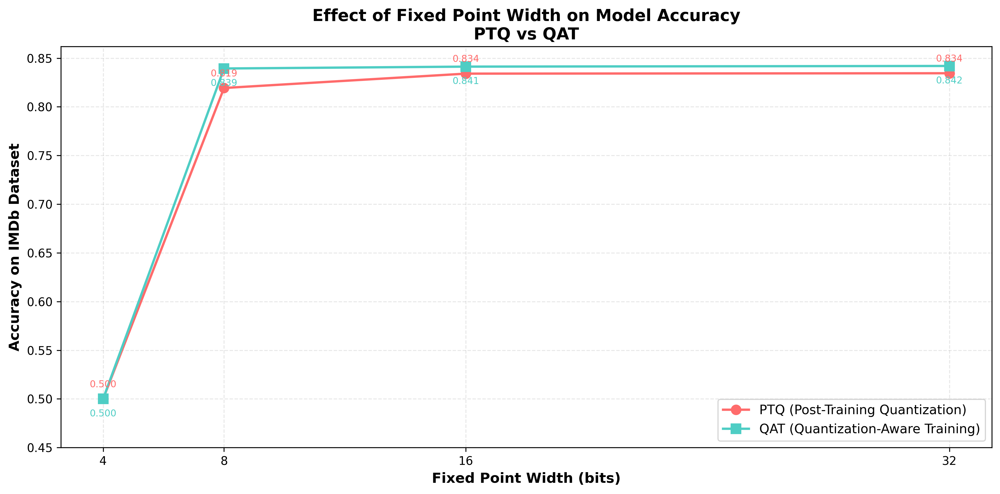

Figure 1: Accuracy comparison between PTQ and QAT across different fixed-point widths.


| Width (bits) | PTQ Accuracy | QAT Accuracy | Improvement (QAT - PTQ) |
|--------------|-------------:|-------------:|--------------------------:|
| 4            |      50.00%  |      50.00%  |     +0.00%               |
| 8            |      81.93%  |      83.94%  |     +2.00%               |
| 16           |      83.41%  |      84.13%  |     +0.72%               |
| 32           |      83.45%  |      84.20%  |     +0.75%               |


1. __4-Bit Capacity Collapse:__ At 4-bit precision, accuracy dropped to 50.00% (random guessing) for both methods. The limited range of a 4-bit grid (only 16 distinct values) is evidently too coarse to capture the model's weights, and a single epoch of fine-tuning was insufficient to recover any meaningful representation.

2. __8-Bit is the Sweet Spot:__ 8-bit precision offered the best trade-off. While PTQ caused a noticeable drop to ~81.9%, QAT successfully recovered accuracy to 83.94%. This ~2% gain demonstrates that the model can effectively adapt to 8-bit quantization noise with minimal training, achieving 4x compression with almost no performance penalty.

3. __Diminishing Returns at High Precision:__ At 16 and 32 bits, the performance gap between PTQ and QAT vanished ($< 0.8\%$). The model is naturally robust to the minor rounding errors at these precisions, meaning the computational cost of QAT is unnecessary for widths above 8 bits.

## Task 2: Pruning

Now, we take our best obtained model from Task 1 and rerun the pruning procedure, this time varying the sparsity from 0.1 to 0.9, to obtain and evaluate the effect of different pruning strategies.

We obtain the following results:

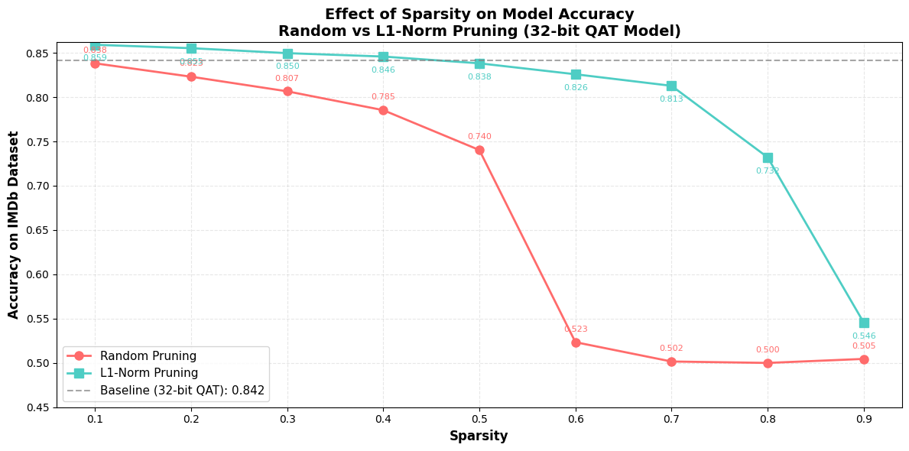

x-axis is the sparsity and the y-axis is the highest achieved accuracy on the IMDb dataset.

### Summary Table

| Sparsity | Random  | L1-Norm | Difference |
|---------:|--------:|--------:|-----------:|
| 0.1 | 0.83820 | 0.85912 | 0.02092 |
| 0.2 | 0.82308 | 0.85528 | 0.03220 |
| 0.3 | 0.80660 | 0.84968 | 0.04308 |
| 0.4 | 0.78532 | 0.84584 | 0.06052 |
| 0.5 | 0.74032 | 0.83820 | 0.09788 |
| 0.6 | 0.52340 | 0.82584 | 0.30244 |
| 0.7 | 0.50160 | 0.81280 | 0.31120 |
| 0.8 | 0.50000 | 0.73212 | 0.23212 |
| 0.9 | 0.50452 | 0.54560 | 0.04108 |

We notice a sharp elbow point for the random pruning method at sparsity = 0.5, validating our existing belief that random pruning would not perform well around the 0.5 mark, as important features start getting pruned. L1-Norm pruning, on the other hand, shows resistance to pruning and performs decently well until sparsity = 0.8. Overall, as expected, L1-Norm pruning outperforms Random pruning, specially for higher sparsity levels, where pruning becomes critical.

# Lab 3: #

## Task 1: Mixed Integer Widths Search Analysis ##

### 1. Experiment Overview ###

- For this task, we conducted a `100 trials (1 epoch training)` mixed-precision NAS search on the BERT model for IMDB classification using the Optuna's TPE sampler, which exhibited the best performance in Lab 2 (NAS Search). 

- Each of the 23 linear layers could independently be assigned full precision (FP32) or integer quantization with configurable bit-widths `[8, 16, 32]` and fractional widths `[2, 4, 8]`. We have also included a comparison between fixed integer widths for all layers from `tutorial 6` and the mixed widths search of this task.

- We initialised the search using the best model from Lab 2 (`tutorial_5_best_model.pkl`) achieved by the `TPE Sampler` in our case.

#### Summary Results ####

- __Best accuracy:__ 88.00% achieved at Trial 83
- __Optimal configuration:__ 8 of 23 layers quantized (34.8%)
- __Failing Trials:__ 5 trials collapsed to 50% accuracy (random guessing for IMDB binary classification)


### 2. Implementation Approach: ###

Rather than working directly in the provided Jupyter notebook, we converted the code to a standalone Python script to enable job submission on Imperial's HPC cluster. This allowed us to run longer experiments (100 trials) without worrying about notebook timeouts or disconnections.

The key modifications from the original tutorial notebook were:

1. __Per-layer width/frac_width selection:__ The tutorial used fixed quantization parameters `(width=8, frac_width=4)` for all `LinearInteger` layers. We extended `construct_model` to expose these as per-layer Optuna hyperparameters as per the task requirements:

```python
w = trial.suggest_categorical(f"{name}_width", [8, 16, 32])
fw = trial.suggest_categorical(f"{name}_frac_width", [2, 4, 8])
```

2. __Proper Weight and Bias Copying:__ The notebook only copied weights `(new_layer.weight.data = layer.weight.data).` We added bias handling and used `.copy_()` for safety:

```python
new_layer.weight.data.copy_(layer.weight.data)
   if layer.bias is not None:
       new_layer.bias.data.copy_(layer.bias.data)
```

This modification was essential because the original tutorial code failed to transfer bias terms to the new layers. Since BERT's linear layers rely on learned biases, omitting them essentially reset the layer's activation thresholds, forcing the model to re-learn them from scratch and essentially destabilizing the search with limited `1 epoch` training.

3. __Logging and Checkpointing:__ The notebook has no callback implemented. If the session is interrupted we lose all our progress. Therefore, we implemented `LoggingCallback` that saves the best model and intermediate results after every trial.

4. __Adding Trial Metadata:__ The notebook only saves the model. We have added more attributes for our analysis:

```python
trial.set_user_attr("model", model)
trial.set_user_attr("num_params", num_params)
trial.set_user_attr("num_quantized", num_quantized)
trial.set_user_attr("width_counts", width_counts)
trial.set_user_attr("frac_width_counts", frac_width_counts)
```

### 3. Accuracy Progression Analysis ###

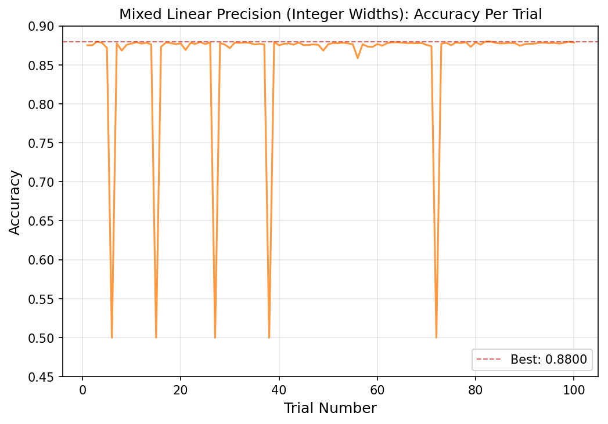

Figure 2: Accuracy per trial for mixed integer widths (1 training epoch per trial)


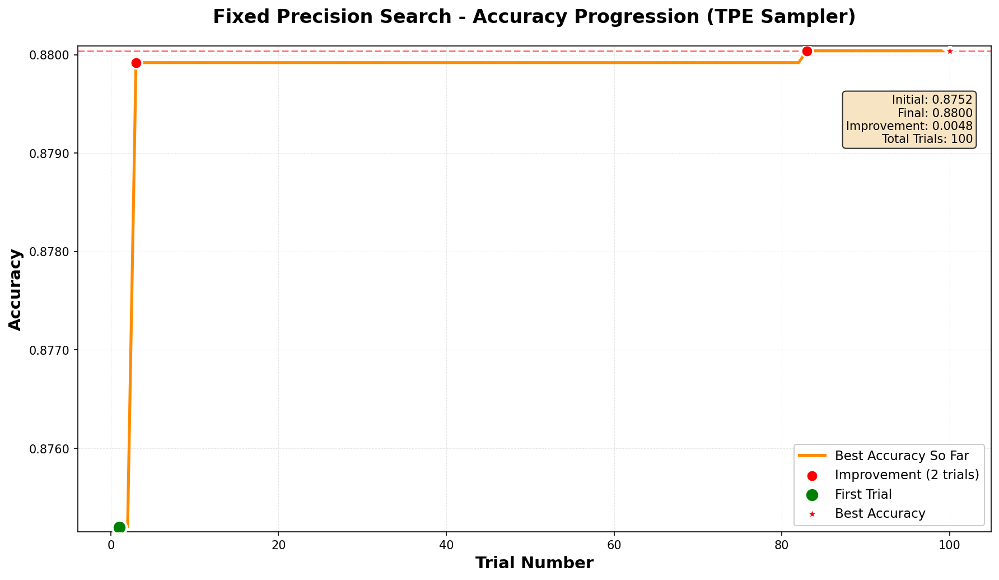

Figure 3: Maximum accuracy achieved for mixed integer widths (1 training epoch per trial)

As illustrated in Figure 3, the search process identified a high-performing configuration almost immediately. Trial 1 achieved an initial accuracy of 87.52%, which quickly improved to 87.99% by Trial 3. Following this rapid early gain, the cumulative best performance entered a significant plateau for 80 iterations until Trial 83 yielded a marginal increase to `88.00%`.

While this extended plateau was initially unexpected, it can likely be attributed to two key factors:

- __Model Capacity Constraints:__ Given that BERT-tiny is a highly compressed architecture, there is probably an inherent performance ceiling. It is probable that the model has reached its maximum representative capacity for the IMDB dataset, regardless of the quantization strategy applied.

- __Search Space:__ the search space appears to be characterized by a high density of near-optimal solutions rather than a sparse global maximum. This indicates that the objective function is relatively "flat", where diverse quantization configurations yield statistically insignificant differences in model performance.

#### 50% Accuracy Drops: ####
A notable phenomenon in Figure 2 is the presence of five specific iterations (Trials 6, 15, 27, 38, and 72) where performance regressed to exactly 50% accuracy. In the context of the binary IMDB sentiment task, this represents random guessing.

This behavior is likely a result of over-aggressive quantization on high-sensitivity layers. An analysis of the optimal configuration (in `section 5`) supports this hypothesis: the `attention.output.dense` layers and the `classification head` were consistently maintained in `full precision (FP32)`. This suggests these components are critical for maintaining numerical stability and information flow of the network's forward pass.

We can also note the temporal distribution of these failing trials. The frequency of "crashed" trials dropped from 10% in the first 40 iterations to just 1.6% in the final 60. This confirms that the TPE effectively modeled the high-loss regions of the search space and learned to prioritize more robust configuration candidates as the optimization progressed.


### 4. Discussion: TPE Dynamics and Limitations ###

- __TPE Dynamics:__ The search behavior reflects the TPE sampler's transition from exploration to exploitation. The initial 10 startup trials (random baseline `n_startup_trials`=10 [1]) established a probability density, after which the sampler successfully identified and clustered around the high-performing configuration (87.7%–87.9%).

- __Limitations:__ The rapid performance plateau suggests that TPE's underlying independence assumption might be a contributing bottleneck. [2] explicitly categorize TPE as an independent sampling method, noting that such algorithms are "known to perform well even without using the parameter correlations." However, in the context of deep quantization, this independence may hinder the discovery of complex, inter-layer dependencies (e.g., a quantized Key layer may require a high-precision Query layer). While TPE is effective generally, it is probable that its inability to explicitly model these joint relationships limits efficiency in this specific high-dimensional space. Additionally, the `1-epoch` training budget likely constrained the model's ability to adapt to aggressive quantization, further limiting the viability of lower-precision configurations.

### 5. Best Configuration: ###

The optimal configuration found by the search (Trial 83) reveals a highly selective quantization strategy. The optimal model includes `8 quantized layers out of the 23 layers (34.8%)`.

#### Quantization Distribution ####

The distribution of bit-widths among the quantized layers shows a strong preference for lower precision, with 62.5% of the quantized layers utilizing 8-bit widths. This confirms that significant compression is possible in specific parts of the network.


| Width (bits) | Count | Percentage |
|--------------|-------|------------|
| 8            | 5     | 62.5%      |
| 16           | 2     | 25.0%      |
| 32           | 1     | 12.5%      |


#### Layer-Wise Configuration Detail ####

We have saved the best model in `.pt` format so that we can extract per-layer information and perform our analysis. The table below details exactly which layers were quantized. A key observation is the asymmetry in the attention mechanism: Query and Value projections were quantized more frequently than Key projections, suggesting the model is more sensitive to precision loss in the Key vectors.

| Layer Name                                   | Type          | Width | Frac Width |
|----------------------------------------------|---------------|------:|-----------:|
| bert.encoder.layer.0.intermediate.dense       | LinearInteger |     8 |          8 |
| bert.encoder.layer.0.output.dense             | LinearInteger |    16 |          4 |
| bert.encoder.layer.1.attention.self.key       | LinearInteger |     8 |          4 |
| bert.encoder.layer.1.attention.self.value     | LinearInteger |     8 |          2 |
| bert.encoder.layer.2.attention.self.query     | LinearInteger |     8 |          2 |
| bert.encoder.layer.2.output.dense             | LinearInteger |    32 |          8 |
| bert.encoder.layer.3.attention.self.query     | LinearInteger |    16 |          4 |
| bert.encoder.layer.3.attention.self.value     | LinearInteger |     8 |          2 |


#### Critical Full Precision Layers ####

A crucial finding is the set of layers the search algorithm "chose" to keep in Full Precision (`nn.Linear`). The Attention Output layers (`attention.output.dense` ) and the `Classifier head` were universally protected. This aligns with the hypothesis that these layers act as information bottlenecks where higher precision is necessary to aggregate features correctly.

| Protected Layer Group   | Count | Specific Layers                                      |
|--------------------------|------:|------------------------------------------------------|
| Attention Output         |     4 | layer.0, layer.1, layer.2, layer.3 attention outputs |
| Classifier Head          |     1 | classifier                                           |
| Intermediate Dense       |     2 | layer.1, layer.2                                     |
| Output Dense             |     2 | layer.1, layer.3                                     |
| Attention Projections    |     6 | layer.0 (Q, V), layer.1 (Q), layer.2 (K, V)          |


### 4. Comparison between Fixed Widths (Tutorial 6) and Mixed Integer Widths (Task 1): ###


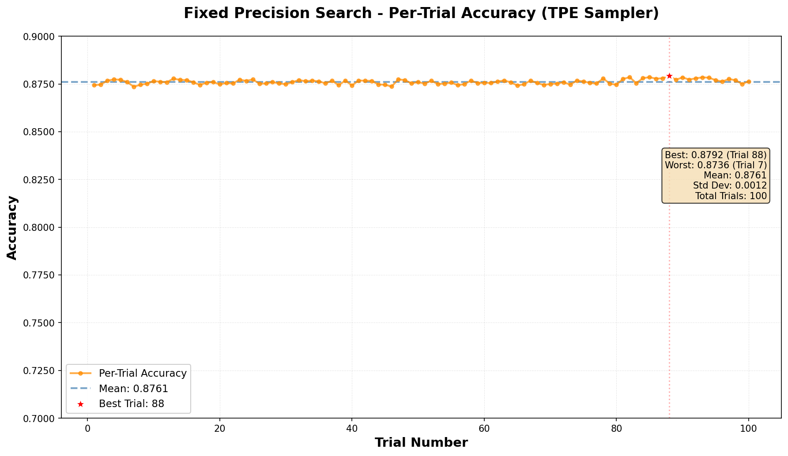

Figure 4:  Accuracy per trial for fixed integer widths (1 epoch per trial)


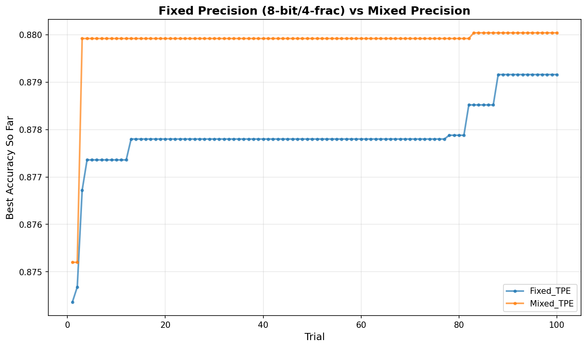

Figure 5: Max accuracy comparison between Fixed and Mixed Integer Widths (1 epoch per trial)

We compared the mixed-precision search against a simpler fixed-precision search (in `tutorial 6`). The mixed-precision approach yielded only a marginal improvement of +0.08% (88.00% vs 87.92%) despite operating over an exponentially larger search space. However, the stability between fixed (figure 4) and mixed (figure 2) precisions showed clear difference: while the fixed-precision search was robust with zero failures, the mixed-precision search was unstable, with several trials collapsing to random guessing (50%) when sensitive layers were aggressively quantized. This suggests that for BERT-tiny on IMDb, a well-chosen uniform precision (`8-bit`) captures nearly all the performance benefits without the optimization risk and complexity of per-layer search.

## Task 2: Mixed Precision Analysis ##

### 1. Experiment Overview ###

For this task, we extended the search space to include all quantization formats supported by MASE's linear layer implementations:

`nn.Linear`
`LinearInteger`
`LinearMinifloat`
`LinearMinifloatDenorm`
`LinearLog`
`LinearBlockFP`
`LinearBlockMinifloat`
`LinearBlockLog`
`LinearBinary`

The search space also expanded to include precision-specific parameters: `exponent_width [3, 4, 5]`, `exponent_bias [3, 7, 15]`, and `block_size [8, 16, 32]` for formats that require them. We explored the quantizers implementation in `/src/chop/nn/quantizers/` to identify the precision-specific parameters required for each precision type. We note that all these parameters now even dramatically increases the configuration space compared to Task 1. 

```python
QUANTIZED_LAYER_CLASSES = [
    LinearInteger,
    LinearMinifloatIEEE,
    LinearMinifloatDenorm,
    LinearLog,
    LinearBlockFP,
    LinearBlockMinifloat,
    LinearBlockLog,
    LinearBinary,
]

# Full search space: full precision + all quantized types
LINEAR_LAYER_CHOICES = [nn.Linear] + QUANTIZED_LAYER_CLASSES

# Search space choices for different precision types
WIDTH_CHOICES = [8, 16, 32]
FRAC_WIDTH_CHOICES = [2, 4, 8]
EXPONENT_WIDTH_CHOICES = [3, 4, 5]
EXPONENT_BIAS_CHOICES = [3, 7, 15]
BLOCK_SIZE_CHOICES = [8, 16, 32]

```

#### Summary Results ####

- Best accuracy: 88.02% at Trial 53
- Best configuration: 18 of 23 layers quantized (78.3%%)
- Multiple failure modes observed (50%, 63%, 75% accuracy drops)

### 2. Implementation Approach & Source Code Modifications: ###

To handle the complexity of the expanded search space, we refactored the `construct_model` function to use a `Dictionary of Config Builders`. Unlike Task 1, where every layer shared the same parameter structure (`width` and `frac_width`), Task 2 required distinct logic for each precision type (e.g., `LinearBlockFP` requires `block_size` and `exponent_width`, while `LinearBinary` requires `stochastic` and `bipolar` flags).

Example on Config Builders:

```python
def build_log_config(trial: optuna.Trial, name: str) -> dict:
    """
    Build config for LinearLog.
    Required keys: data_in_width, data_in_exponent_bias,
                   weight_width, weight_exponent_bias,
                   bias_width, bias_exponent_bias
    """
    w = trial.suggest_categorical(f"{name}_width", WIDTH_CHOICES)
    eb = trial.suggest_categorical(f"{name}_exponent_bias", EXPONENT_BIAS_CHOICES)

    return {
        "data_in_width": w,
        "data_in_exponent_bias": eb,
        "weight_width": w,
        "weight_exponent_bias": eb,
        "bias_width": w,
        "bias_exponent_bias": eb,
    }
```

#### Source Code Debugging & Fixes ####

Upon initially running the search, we encountered critical failures rooted in the `mase` library's source code. We identified and patched three specific bugs to enable the search to run:

1. __Dimension Mismatch in Binary Quantizers:__ The initial runs crashed with an `IndexError: tuple index out of range` in `LinearBinary` layers.

Error: 
```bash
File "/rds/general/user/aah25/home/mase/src/chop/nn/quantizers/utils.py", line 163, in forward
    alpha = BinaryZeroScaled.alpha(input)
File "/rds/general/user/aah25/home/mase/src/chop/nn/quantizers/utils.py", line 158, in alpha
    alpha = absvalue.mean(dim=(1, 2, 3), keepdims=True)
IndexError: Dimension out of range (expected to be in range of [-2, 1], but got 2)
```

```bash
File "/Users/alihaidar/mase/src/chop/nn/quantizers/binary.py", line 48, in binary_quantizer
    else binarised_zeroScaled_op(x_sig, x_rand)
File "/Users/alihaidar/mase/src/chop/nn/quantizers/utils.py", line 189, in forward
    -1, input.size()[1], input.size()[2], input.size()[3]
IndexError: tuple index out of range
```

__Cause:__ The library implementation of `BinaryZeroScaled` and `BinaryBipolarScaled` hardcoded an assumption that inputs would be `4-dimensional` (Batch, Channel, Height, Width), typical for CNNs. BERT linear layers produce `2-dimensional tensors` (Batch*Seq, Hidden), causing the code to crash when accessing dimension indices 2 and 3.

__Fix:__ We patched `src/chop/nn/quantizers/utils.py` to dynamically detect the input dimension and adjust the mean calculation (alpha) and broadcasting logic accordingly.

```Python
# Patch applied to src/chop/nn/quantizers/utils.py
@staticmethod
def alpha(input):
    # Dynamic dimension handling for Linear (2D) and Conv (4D) layers
    absvalue = input.abs()
    if input.dim() == 4:
        alpha = absvalue.mean(dim=(1, 2, 3), keepdims=True)
    elif input.dim() == 2:
        alpha = absvalue.mean(dim=(1,), keepdims=True)  # Added support for 2D
```

2. __Broken Backward Pass in Block Minifloat:__ After fixing the binary layers, the search crashed with a `TypeError` in `LinearBlockMinifloat` during backpropagation.

Error:
```bash
File "/rds/general/user/aah25/home/mase/.venv/lib/python3.11/site-packages/torch/autograd/function.py", line 307, in apply
    return user_fn(self, *args)
TypeError: BlockMinifloatQuantize.backward() missing 3 required positional arguments: 'width', 'exponent_width', and 'exponent_bias_width'
```

__Cause:__ The `backward` method in `BlockMinifloatQuantize` was defined to expect configuration arguments (e.g., `width`, `exponent_width`) that were passed to `forward`. However, PyTorch's autograd engine does not pass these arguments to `backward` automatically; it only passes the context (ctx) and the gradient. We confirmed this is the case by looking into the custom `backward` functions in `block_fp`, `block_log`, etc. in `src/chop/nn/quantizers/`

__Fix:__ We modified `src/chop/nn/quantizers/block_minifloat.py` to remove the extra arguments from the `backward` signature.

```python
# Patch applied to src/chop/nn/quantizers/block_minifloat.py
@staticmethod
def backward(ctx, grad_output): # Removed: width, exponent_width, etc.
    # Return gradient for input 'x', and None for the 5 configuration args
    return grad_output, None, None, None, None, None

```
### 3. Accuracy Progression Analysis ###


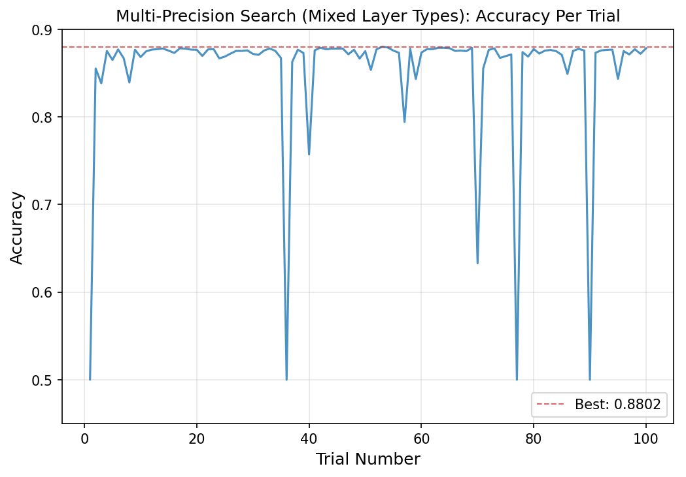

Figure 6: Accuracy per trial for mixed precision search (1 training epoch per trial)

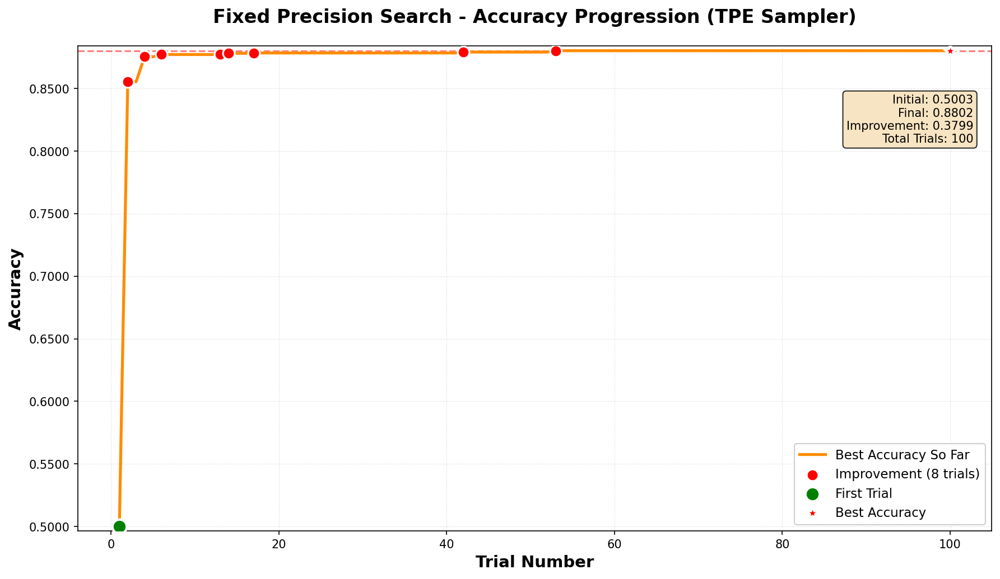

Figure 7: Maximum accuracy achieved for mixed precision search (1 training epoch per trial)


The progression shows a more turbulent search compared to Task 1. Trial 1 immediately failed (50.03%), likely due to aggressive mixed-precision assignment across all the new formats. The search recovered quickly, reaching 85.54% by Trial 2 and steady improvements through Trials 4 (87.53%), 6 (87.71%), 13 (87.75%), 14 (87.81%), 17 (87.84%), 42 (87.91%), until the best of 88.02% at Trial 53.

Compared to Task 1, we observe more variance in accuracy. Beyond the 50% catastrophic failures (Trials 1, 36, 77, 90), there were partial degradations: Trial 40 dropped to 75.72%, Trial 57 to 79.43%, and Trial 70 to 63.29%. This suggests some precision combinations cause partial rather than complete model collaps

### 4. Comparison with Task 1 ###

| Metric                         | Task 1 (Integer Only) | Task 2 (Multi-Precision) |
|--------------------------------|----------------------|--------------------------|
| Best Accuracy                 | 88.00%               | 88.02%                   |
| Best Trial                    | 83                   | 53                       |
| Layers Quantized              | 8/23 (34.8%)         | 18/23 (78.3%)            |
| Full Precision Layers         | 15                   | 5                        |
| Catastrophic Failures (50%)   | 5                    | 4                        |
| Partial Failures (< 80%)      | 0                    | 3                        |
| Runtime                       | ~2.5 hours           | ~11 hours                |


The multi-precision search found a marginally better configuration (+0.02%) and did so faster (Trial 53 vs Trial 83). Interestingly, while Task 1's best model was conservative (65% full precision), Task 2's best model was aggressive, as it quantized 78% of layers using a diverse mix of formats.

### 5. Best and Worst Model Configurations ###

#### Best Configurations ####

The best configuration used 7 different precision types:

| Precision Type        | Layers | Percentage |
|----------------------|--------|------------|
| Linear (FP32)        | 5      | 21.7%      |
| LinearMinifloatIEEE  | 4      | 17.4%      |
| LinearBlockFP        | 4      | 17.4%      |
| LinearMinifloatDenorm| 3      | 13.0%      |
| LinearBlockLog       | 3      | 13.0%      |
| LinearInteger        | 3      | 13.0%      |
| LinearLog            | 1      | 4.3%       |
| **Total**            | **23** | **100%**   |

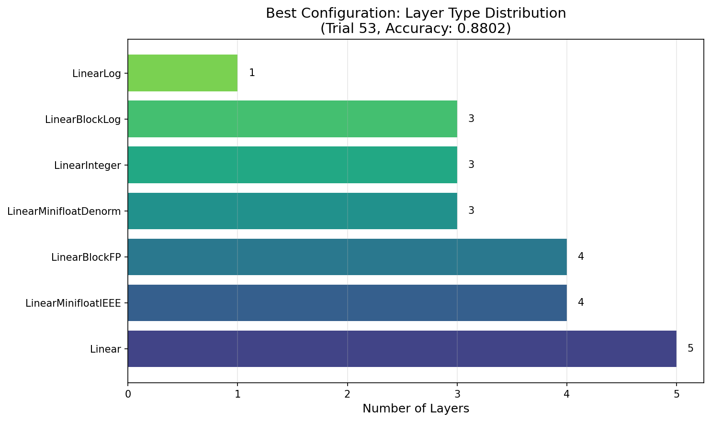

Figure 8: Precision distribution for the best performing model.


This is notably different from Task 1's best model, which used only LinearInteger for quantized layers. The diversity of formats suggests that different layers may indeed benefit from different quantization schemes. For instance, minifloat formats preserve dynamic range better for some layers, while block formats share exponents efficiently for others.

### 6. Precision Performance Analysis ###

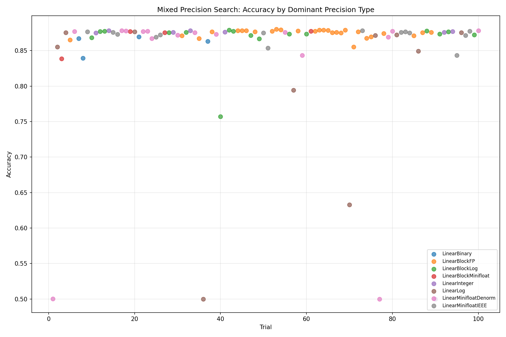

Figure 9: Accuracy curves grouped by dominant precision type in each trial.

1. __High-Performance Cluster (Stable):__ Trials dominated by Block Floating Point (`LinearBlockFP`) and IEEE Minifloats (`LinearMinifloatIEEE`) consistently clustered in the top accuracy band ($>87.8\%$). Their structural similarity to FP32 allows pre-trained weights to map with minimal distortion, ensuring reliable convergence even with limited 1-epoch fine-tuning.


2. __High-Variance Cluster:__ Unlike the stable formats, Logarithmic (`LinearLog`) and Binary (`LinearBinary`) quantizers exhibited extreme performance variance, succeeding in some trials while collapsing in others.

Evidence of Instability:

__Success:__ In Trial 2, a model dominated by `5 LinearLog and 4 LinearBinary` layers achieved a competitive 85.54% accuracy.

__Failure:__ In Trial 36, a remarkably similar configuration (also `5 LinearLog layers`) collapsed to 50.00% (random guessing).

__Implication:__ The fact that aggressive formats like LinearLog and LinearBinary succeeded in Trial 2 but failed in Trial 36 suggests that performance is not determined by the precision type alone, but by inter-layer dependencies. It appears that certain layers are highly sensitive to aggressive quantization; if these specific layers are assigned Binary/Log formats (as likely happened in Trial 36), the model collapses. Conversely, applying these same formats to robust layers (as in Trial 2) preserves accuracy. This indicates that a quantized layer's success is not isolated—it depends heavily on whether its neighboring layers retain enough precision to correct the error.


### 7. Conclusion: ###

The mixed-precision search demonstrates that combining different quantization formats can match or slightly exceed integer-only quantization, while being more aggressive with the number of quantized layers (78% vs 35%). The 4x longer runtime reflects the expanded hyperparameter space and the computational overhead of different quantization kernels.

However, it's worth noting that we only trained for 1 epoch per trial to keep the search tractable. This limited training budget likely disadvantages the more exotic formats like `LinearBinary` and `LinearLog`, which require the model to learn fundamentally different weight representations. With more training epochs, these formats might adapt better and achieve competitive accuracy. Consequently, the high failure rate we observed may partly reflect insufficient training rather than inherent limitations of the formats themselves. Conversely, the formats that performed well (`LinearMinifloatIEEE`, `LinearBlockFP`) are closer to standard floating-point behaviour, making them easier for the model to adapt to quickly.

# Lab 4: #

## Task 1: torch.compile ##

### In the first part of Lab 4 (torch.compile), we did not really observe real run-time speedups with torch.compile. ###

**Question a: Modify the code and investigate why this is the case?**

All experiments were conducted on Google Colab with NVIDIA L4 GPU runtime. The test model was ResNet18 (pretrained = False) from torchvision, evaluated in inference mode. Default test configuration used batch size 128 with 224×224×3 RGB inputs. For each device (CPU and GPU), we compared original PyTorch models against torch.compile optimized versions.

To accurately measure performance, we implemented proper warmup procedures and measured 10 consecutive runs. We varied iteration counts (1, 5, 10, 20, 50) to determine the breakeven point where compilation overhead is amortized, and tested different batch sizes (1, 32, 128, 256) to examine scaling behaviour. We modified the code to separate compilation overhead from execution time by implementing proper warmup runs.

The lab notebook’s timing methodology masks torch.compile's actual speedup by including compilation overhead in the measurements. The notebook runs only 5 iterations and averages all of them together, which includes the expensive first compilation/warmup run (our tests showed this takes 7.47s on CPU compared to ~0.89s for subsequent runs—an 8.4× overhead).

**Question b: If you change the device to cuda, do you observe the same thing?**

Most results follow a similar trend, albeit with different values. More results on changing the device to cuda (or, GPU PyTorch vs torch.compile comparison and CPU vs GPU comparison):

**CPU Performance:**
* First run (with compilation): 7.47s
* Subsequent runs (actual performance): ~0.89s average
* Original model average: 1.69s
* Speedup after warmup: 1.91×

**GPU (cuda) Performance:**
* First run (with compilation): 1.29s
* Subsequent runs: ~0.039s average
* Original model average: 0.052s
* Speedup after warmup: 1.33×

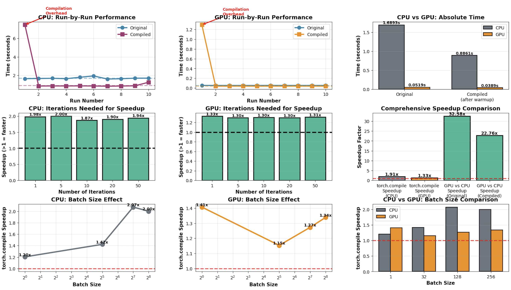

Figure 1: Graphs from the experiments

**Some conclusions from our code runs:**

* CPU has better speedup from torch.compile (1.91×) than GPU from torch.compile (1.33×), because GPU is already highly optimised (less room for improvement).
* Both showed positive speedup at 5 iterations:
    * CPU: 2.00× speedup
    * GPU: 1.30× speedup
* Although iterations do not seem to impact speedup much.
* GPU is 32.5× faster than CPU (original PyTorch version).
* GPU is 22.76x faster than CPU (torch.compile version).
* Compilation overhead is significant:
    * CPU: 8.4× slower on first run
    * GPU: 33.2× slower on first run
* Warmup is clearly very important.

## Task 2: Kernel Fusion (SDPA) ##

### In the second part of Lab 4 (kernel fusion), we looked at a fused SDPA kernel. ###

**Part A: CPU Profiling - Naive vs Fused SDPA**

**Results:**
Under default configuration (batch = 32, heads = 8, seq = 128, dim = 64), CPU profiling reveals:
* Naive implementation: 0.4414s
* Fused implementation: 0.0038s
* Speedup: 117.29 times

**Analysis:**
The exceptional CPU speedup stems from multiple compounding factors:
* **Memory Access Patterns:** Naive implementation performs four separate operations ($QK^T$, scaling, softmax, attention x V), each requiring memory writes to intermediate tensors. The fused kernel eliminates these intermediate writes, drastically reducing memory bandwidth requirements, critical on CPU where memory is a primary bottleneck.
* **Cache Utilization:** Fused kernel keeps intermediate results in L1/L2 cache, while naive implementation repeatedly loads/stores from main memory. On CPU with limited cache (vs GPU's faster memory hierarchy), this creates dramatic performance degradation.

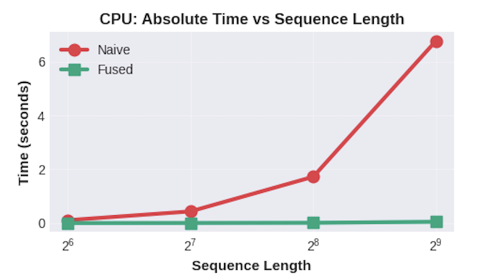

Figure 2: PLOT (CPU): Shows divergence between naive (red) and fused (green) implementations as sequence length increases. Naive implementation exhibits near-quadratic scaling, reaching 6.7s at seq = 512, while fused kernel remains flat at ~0.1s across all lengths.

**Part B: GPU Profiling - Naive vs Fused SDPA**

**Results:**
Under default configuration, GPU profiling shows:
* Naive implementation: 0.000173s
* Fused implementation: 0.000055s
* Speedup: 3.14 times

**Analysis:**
The GPU speedup is more representative of pure kernel fusion benefits:
* **Kernel Launch Overhead Elimination:** Naive implementation launches 4 separate CUDA kernels (matmul, scale, softmax, matmul), each with ~5-10μs overhead. Fused kernel performs all operations in a single launch (all operations fused into a single kernel).
* **Memory Bandwidth Reduction:** GPU's primary bottleneck is memory bandwidth. Naive implementation writes intermediate tensors ($QK^T$ scores, attention weights) to global memory, then reads them back. Fused kernel keeps these in faster on-chip memory (shared memory/registers).
* **Tiled Computation:** The fused kernel (using FlashAttention-style algorithms) processes attention in tiles, maximising data reuse within streaming multiprocessors. This is impossible with separate operations.

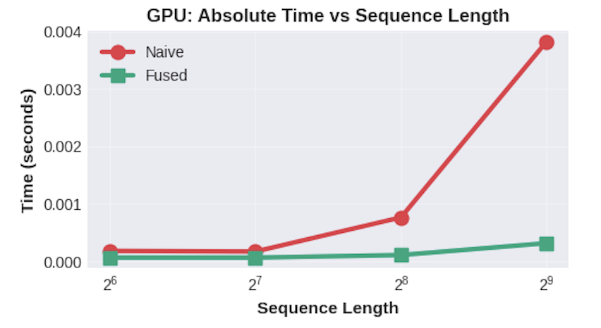

Figure 3: PLOT (GPU): Both implementations scale well, but naive (red) shows clear quadratic growth (0.0001s to 0.0038s), while fused (green) maintains nearly constant time (~0.0003s). The fused kernel's flat profile indicates successful memory optimisation. Hence, both CPU and GPU plots reveal that sequence length is the critical parameter for fusion effectiveness. The fused kernel's $O(1)$-like scaling versus naive's $O(n^2)$ scaling demonstrates why kernel fusion is essential for long-context attention mechanisms.

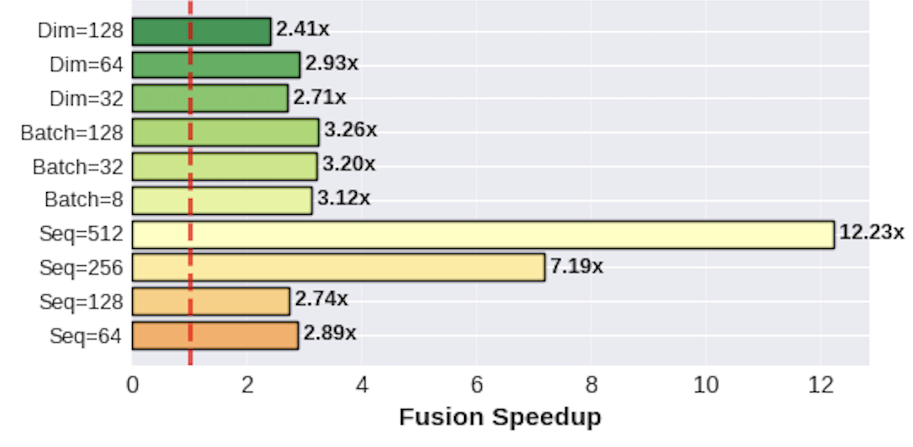

Figure 4: GPU Speedup Across All Configurations. This horizontal bar chart reveals sequence length as the dominant factor in fusion effectiveness. Speedup ranges from 2.41× (Dim = 128) to 12.23× (Seq = 512), with clear stratification. The red dashed line at 1.0× serves as baseline.

**Final conclusions:**
When the device is set to CUDA, the same qualitative behaviour is observed, but with the performance benefits of kernel fusion becoming clearly visible.
* On CUDA-enabled hardware, PyTorch dispatches the SDPA operation to an optimised fused backend (FlashAttention), enabling execution as a single kernel.
* In contrast, the naive SDPA implementation continues to execute as multiple independent kernels even on CUDA.
* As confirmed by profiling, this results in higher runtime and increased global memory accesses.

Therefore, yes when the device is changed to CUDA, the same behaviour is observed: the fused SDPA implementation consistently outperforms the naive implementation due to kernel fusion and improved memory efficiency.

## Task 3: In the third part of lab4 (Custom kernel), we go through how to write MXINT8 dequantization kernel and bind it to Python. ##

### 1. MXINT8 Benefits for Custom Hardware ###

**Question a: How does MXINT8 benefit custom hardware if both the activation and weights in a linear layer are quantized to MXINT8?**

**Answer:**
Quantizing both activations and weights to MXINT8 enables custom hardware to achieve 50x throughput improvement and 133x energy efficiency gains through systematic optimization across the entire compute pipeline.

1.  **Memory Bandwidth Reduction: 22.6%**
    * FP32: 69.0 MB total data transfer
    * MXINT8: 53.4 MB total data transfer
    * **Impact:** Reduced memory bottleneck by 1.3x
    * **Note:** Output remains FP32 for accuracy, limiting memory savings to inputs/weights only

2.  **Compute Density: 12.5x Higher**
    * Hardware difference: INT8 multipliers occupy 12.5x less silicon area than FP32
    * Practical result: Same chip fits 1,250 INT8 units vs 100 FP32 units
    * **Impact:** Massive parallelism increase enables higher throughput

3.  **Throughput: 50x Improvement**
    * FP32: 25 GOPS (100 units ÷ 4 cycles/op)
    * MXINT8: 1,250 GOPS (1,250 units ÷ 1 cycle/op)
    * **Impact:** Can process 50x more inference requests per second
    * **Key insight:** Combines both density (12.5x) and latency (4x) advantages

4.  **Energy Efficiency: 133x Better**
    * FP32: 0.25 GOPS/Watt
    * MXINT8: 33.33 GOPS/Watt
    * **Impact:** 133x more operations per watt of power
    * **Real-world benefit:**
        * Edge devices: 133x longer battery life
        * Data centers: 133x lower energy costs per inference

5.  **End-to-End Latency: 49.6x Faster**
    * Breakdown:
        * Memory transfer: 1.29x faster (22.6% less data)
        * Computation: 50x faster (dominant factor)
    * Overall: 49.6x faster execution
    * **Impact:** Near real-time inference for complex models

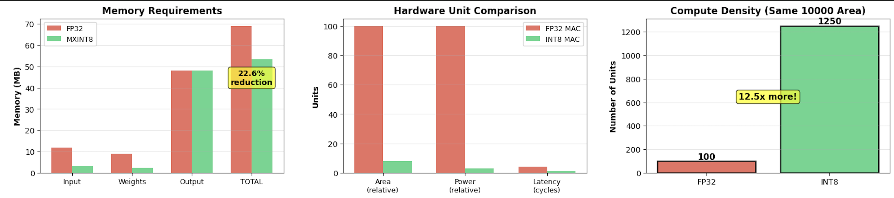
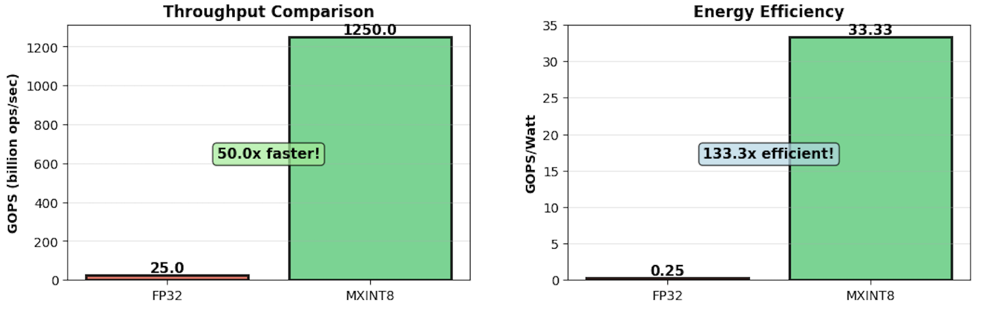

Figure 5: Comparison of Memory, Hardware Units, Compute Density, Throughput, and Energy Efficiency between FP32 and MXINT8.

### 2. Purpose of `dont_need_abs` and `bias` in the C++ For Loop ###

**Question b: What is the purpose of the variable `dont_need_abs` and `bias` in the C++ for loop?**

After the code line:
```cpp
auto out = cutlass::bfloat16_t::bitcast(sign | exp | frac)
```

We formed an `out` variable and the bits look like this (BF16 layout):

`[ sign | exponent (8 bits) | fraction (7 bits) ]`

During the conversion, an implicit/leading 1 is included.

For example, if BF16 fraction bits are: `fraction bits = 0100000`

Then the real mantissa value is: `1.0100000₂ = 1.125`

But the challenge is that MXINT mantissas are not like floating-point mantissas. They can take values such as 0.25, 0.5, 1.25, 1.5, etc., with possible values under 1.

Thus, the following line of code is required (and also why we need the `dont_need_abs` variable and the `bias` variable):
```cpp
auto dont_need_abs = bool(mantissa_abs & 0x40);
```

This allows the kernel to check if the implicit 1 should be removed or not.

`0x40 = 0100 0000` which corresponds to the range bit in the mantissa.

- `mantissa_abs & 0x40` → checks that bit
- `bool(...)` → converts it to true or false

Thus, we have the following:

| Bit 6 | Mantissa Value |
|-------|----------------|
| 1     | ≥ 1.0          |
| 0     | < 1.0          |
```cpp
auto bias = cutlass::bfloat16_t::bitcast(sign | exp | uint16_t(0));
```

This constructs: `bias = ± (1.0 × 2^exp)`, which is __exactly the "implicit leading 1"__ that BF16 always adds.
```cpp
y[i] = dont_need_abs ? out : out - bias;
```

This means that if the mantissa was ≥ 1, keep `out`. Otherwise, subtract 1 to correct `out` value.


### 3. `cta_tiler` and `layout_sX` Partitioning (Challenge) ###

**Question c: How does `cta_tiler` partition data for copying to shared memory in CUDA kernel? How does `layout_sX` partition threads in a threadblock for computation?**

This part of the notebook explains the same dequantization logic on GPU that was earlier run on CPU.

#### `cta_tiler`: Partitioning Global Memory into Thread Block Tiles ####

__Concept:__ `cta_tiler` (CTA = Cooperative Thread Array, or Thread Block) defines the "window" of data that a single Block copies from the massive Global Memory into its local Shared Memory. It does *not* yet decide which individual thread copies what; rather, it divides the global input tensor into large puzzle pieces, assigning one piece to each Block.

__Code Analysis:__ In `mase_cuda::mxint8::dequantize:dequantize1d_device`, the code defines this tile shape that one single Thread Block will work on:
```cpp
auto BLK_M = Int<8>{};    // Height of the tile
auto BLK_K = Int<128>{};  // Width of the tile
auto cta_tiler = make_shape(BLK_M, BLK_K);  // Shape: (8, 128)
```

__How partitioning works:__ The function `local_tile` uses this shape to slice the global tensor:
```cpp
Tensor gX = local_tile(mX, cta_tiler, cta_coord);
```

Here:

1. __Input:__ `mX` is the huge global input array (viewed as a grid).
2. __Tiler:__ `cta_tiler` provides the dimensions ($8 \times 128$).
3. __Coordinate:__ `cta_coord` (based on `blockIdx.x`, `blockIdx.y`) tells the GPU *which* specific $8 \times 128$ chunk this particular block is responsible for.

__Summary:__ `cta_tiler` partitions the __Global Memory__ data by defining a fixed grid size ($8 \times 128$). It ensures that every Thread Block works on a unique, non-overlapping rectangle of the input data.

#### `layout_sX`: Mapping Threads to Shared Memory Elements ####

__Concept:__ As clarified by the professor, in CuTe/CUTLASS, __'s'__ stands for __Shared Memory__ layout, and __'t'__ stands for __Thread__ layout.

- `layout_sX` defines the logical shape and physical arrangement of data inside the Shared Memory (the "workbench").
- To compute, we need to assign specific pieces of this data to specific threads. This is done by `local_partition`.

__Code Analysis:__ In the code (specifically for `group_size <= 8`), we see:
```cpp
// 1. Define the layout of data in Shared Memory
auto layout_sX = make_layout(make_shape(BLK_M, BLK_K));

// 2. Partition the Shared Memory tile among threads
Tensor tXsX = local_partition(sX, layout_sX, threadIdx.x);
```

__How partitioning works:__

The function `local_partition` answers the question: *"Which element does Thread $i$ work on?"*

1. __The "Map" (`layout_sX`):__ `layout_sX` is an $8 \times 128$ layout. It contains $8 \times 128 = 1024$ logical positions. Since the thread block also has 1024 threads (calculated as `size(layout_tX)`), there is a 1-to-1 match between threads and data elements.

2. __The Assignment (`local_partition`):__ The line `local_partition(sX, layout_sX, threadIdx.x)` performs a mapping operation. It takes the linear __Thread ID__ (`threadIdx.x`, ranging from 0 to 1023) and maps it to a specific coordinate $(m, k)$ in the 2D shared memory tile, following the pattern defined by `layout_sX`.

__Visualising the Result:__

If `layout_sX` is column-major (standard in CuTe), the partitioning assigns threads to data like this:

| Shared Memory Data (`sX`) | Thread Assigned (`threadIdx.x`) |
|----------------------------|---------------------------------|
| Element at (0,0)           | Thread 0                        |
| Element at (1,0)           | Thread 1                        |
| ...                        | ...                             |
| Element at (7,0)           | Thread 7                        |
| Element at (0,1)           | Thread 8                        |

__Summary:__ `layout_sX` partitions the threads by serving as a __coordinate map__. When passed to `local_partition` along with `threadIdx.x`, it translates the linear thread index into a specific 2D coordinate on the shared memory tile. This ensures that every thread knows exactly which unique data element to load into its registers (`tXsX`) for the dequantization computation.


### 4. GPU Memory Savings Analysis ###

**Question d: Why the saved GPU memory is not exactly (32 - (8+8/32))/32 = 74.2% of the FP32 model?**

This activity demonstrates __model quantization__ — converting a neural network from high-precision (FP32) to low-precision (MXINT8) to:

1. __Reduce memory usage__ (from 2906 MB → 976 MB, a 3x reduction)
2. __Speed up inference__ (faster matrix multiplication on GPU)
3. __Maintain accuracy__ (the model still predicts correctly)

We are comparing:

- __FP32 DeBERTa__ (original, full precision)
- __MXINT8 DeBERTa__ (quantized, compressed)

__During Quantization (One-time, on model setup):__

`FP32 Model → [Quantization] → MXINT8 Model`

This involves grouping weights, finding scales, and converting to INT8. It happens once when: `layer_q = QLinearPacked.build_from_linear(layer)`.

__This is slow__ (happens once):
- CPU-based (not using GPU yet)
- Iterates through all weight groups
- Computes scale factors
- Converts to INT8

__Where:__ Python code in `mase_cuda/mxint8/quantize.py`

__During Inference (Every forward pass):__

`Input → [Dequantize Weights] → [Matrix Multiply] → Output`

__This is fast__ (our custom CUDA kernel):
- GPU-based parallelisation
- Converts INT8 → FP32 on the fly
- Thousands of threads working simultaneously

__Where:__ CUDA kernel in `src/csrc/mxint/dequantize.cu`

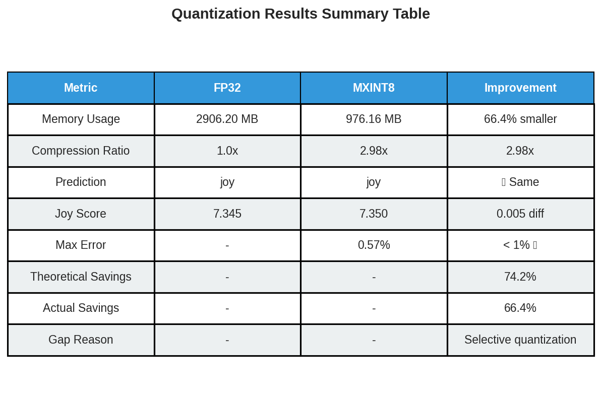
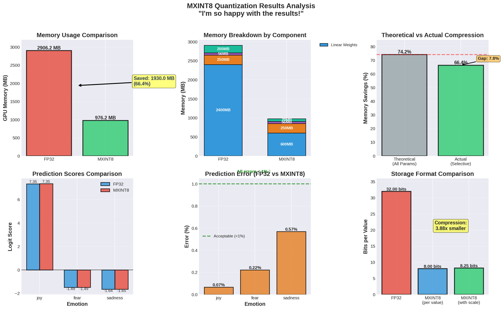

Figure 6: Memory usage and inference comparison between FP32 and MXINT8 DeBERTa.

#### Why Not 74.2%? ####

The formula $(32 - (8 + 8/32))/32 = 74.2\%$ means:

- __32__ = FP32 uses 32 bits per number
- __8__ = INT8 uses 8 bits per number
- $8/32 = 0.25$ = Scale factor overhead (8 bits shared across 32 values)
- Total: $8 + 0.25 = 8.25$ bits per MXINT8 value
- Theoretical savings: $(32 - 8.25) / 32 = 74.2\%$

This assumes every layer and all weights, activations, etc. get quantized. But, the actual saving is only __66.4%__ because only ~80% of the model (Linear layer weights) gets quantized.

What stays FP32 (uncompressed):

1. Embedding layers (word vectors)
2. Layer normalisation parameters
3. Classifier output layer
4. Bias terms
5. Activations during inference

__Calculation:__

- 80% of model compressed by 75% = 60% baseline savings
- 20% of model not compressed = 0% savings
- Reduced activation memory = ~6% bonus
- __Total: 66.4%__


# References: #

[1] “Optuna.samplers.tpesampler,” optuna.samplers.TPESampler - Optuna 4.7.0 documentation, https://optuna.readthedocs.io/en/stable/reference/samplers/generated/optuna.samplers.TPESampler.html (accessed Feb. 4, 2026). 

[2] T. Akiba, S. Sano, T. Yanase, T. Ohta, and M. Koyama, “Optuna: A Next-generation Hyperparameter Optimization Framework,” arXiv preprint arXiv:1907.10902, 2019.

[3] B. Rouhani, R. Zhao, V. Elango, R. Shafipour, M. Hall, M. Mesmakhosroshahi, A. More, L. Melnick, M. Golub, G. Varatkar, L. Shao, G. Kolhe, D. Melts, J. Klar, R. L’Heureux, M. Perry, D. Burger, E. Chung and S. Naghshineh, “With Shared Microexponents, A Little Shifting Goes a Long Way,” arXiv preprint arXiv:2302.08007, Feb. 2023. DOI: 10.48550/arXiv.2302.08007.

[4] T. Dao, D. Y. Fu, S. Ermon, A. Rudra and C. Ré, “FlashAttention: Fast and Memory-Efficient Exact Attention with IO-Awareness,” arXiv preprint arXiv:2205.14135, May 2022. DOI: 10.48550/arXiv.2205.14135.

[5] NVIDIA, “CUDA Templates and Python DSLs for High-Performance Linear Algebra (CUTLASS) — GitHub Repository,” GitHub. [Online]. Available: https://github.com/NVIDIA/cutlass