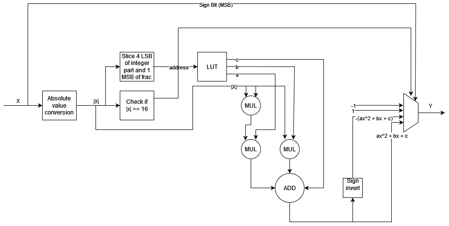
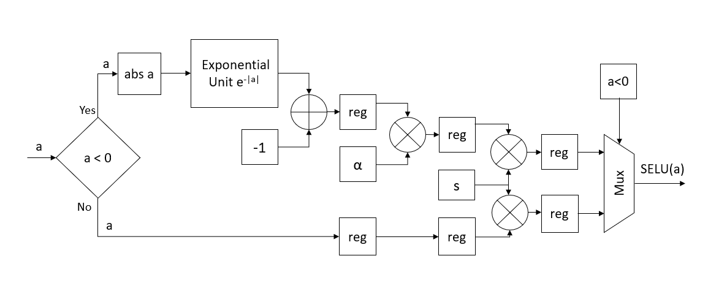
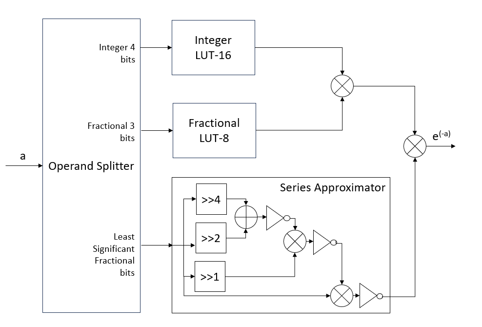
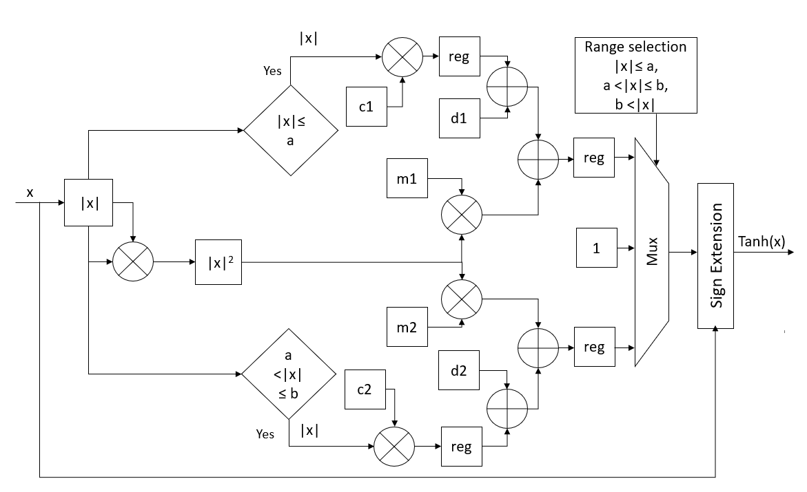
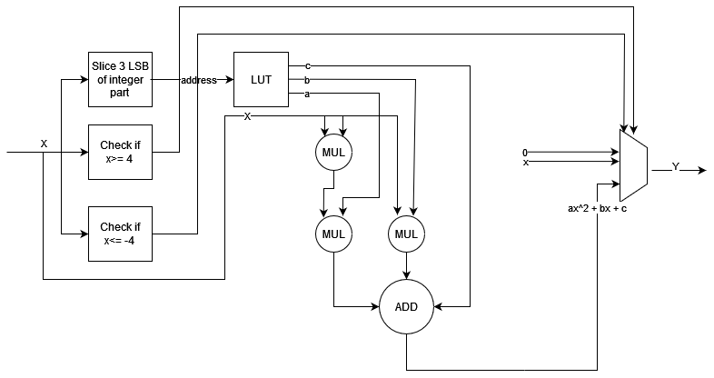
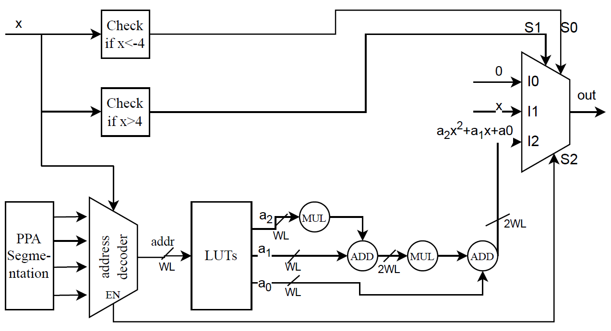

# GROUP 8 : Streaming activation integration for MASE

**Date:** 28/03/2024

---

# Introduction 

Five activation functions, namely SoftSign, SELU, Tanh, GELU, and SoftPlus have been implemented in system verilog and added as part of mase activation functions. The definitions of the activation functions according to pytorch 2.2 documentation [1] are given below:

## [SoftSign](https://pytorch.org/docs/stable/generated/torch.nn.Softsign.html)
torch.nn.Softsign(*args, **kwargs)

Applies the element-wise function:

`SoftSign(x) = x / (1 + |x|)`

## [Scaled Exponential Linear Unit](https://pytorch.org/docs/stable/generated/torch.nn.SELU.html)
torch.nn.SELU(inplace=False)

Applied element-wise, as:

`SELU(x) = scale * (max(0, x) + min(0, α * (exp(x) - 1)))`

where:
- α = 1.6732632423543772848170429916717
- scale = 1.0507009873554804934193349852946

### Parameters

- `inplace` (bool, optional): Can optionally do the operation in-place. Default: False.

## [Hyperbolic Tangent (Tanh) Function](https://pytorch.org/docs/stable/generated/torch.nn.Tanh.html)
torch.nn.Tanh(*args, **kwargs)

Tanh is defined as:

`Tanh(x) = (exp(x) - exp(-x)) / (exp(x) + exp(-x))`

This function is applied element-wise.

## [Gaussian Exponential Linear Unit](https://pytorch.org/docs/stable/generated/torch.nn.GELU.html)
torch.nn.GELU(approximate='none')

The GELU function is defined as follows:

`GELU(x) = x * Φ(x)`

where:
- Φ(x) is the Cumulative Distribution Function for the Gaussian Distribution.

When the approximate argument is set to 'tanh', GELU is estimated with:

`GELU(x) = 0.5 * x * (1 + Tanh(2/π * (x + 0.044715 * x^3)))`

### Parameters:

- `approximate` (str, optional): The GELU approximation algorithm to use: 'none' | 'tanh'. Default: 'none'.

## [SoftPlus](https://pytorch.org/docs/stable/generated/torch.nn.Softplus.html)
torch.nn.Softplus(beta=1, threshold=20)

The Softplus function is defined as: 

`Softplus(x) = β * log(1 + exp(β * x))`

where:

- Softplus is a smooth approximation to the ReLU function and can be used to constrain the output of a machine to always be positive.
- For numerical stability, the implementation reverts to the linear function when `input * β > threshold`.

### Parameters:

- `beta` (int): The β value for the Softplus formulation. Default: 1.
- `threshold` (int): Values above this revert to a linear function. Default: 20.

# File Locations 

## SoftSign

- **Top Source File .sv:** [`machop/mase_components/activations/rtl/fixed_softsign.sv`](https://github.com/DeepWok/mase/tree/main/machop/mase_components/activations/rtl/fixed_softsign.sv)

- **Testbench:** [`machop/mase_components/activations/verilog_testbench/tb_softsign.sv`](https://github.com/DeepWok/mase/tree/main/machop/mase_components/activations/verilog_testbench/tb_softsign.sv)

- **Emit Verilog example:** [`machop/softsign_emit.py`](https://github.com/DeepWok/mase/tree/main/machop/softsign_emit.py)

## SELU

- **Top Source File .sv:** [machop/mase_components/activations/rtl/fixed_selu.sv](https://github.com/DeepWok/mase/tree/main/machop/mase_components/activations/rtl/fixed_selu.sv)

- **Testbench:** [machop/mase_components/activations/verilog_testbench/tb_selu.sv](https://github.com/DeepWok/mase/tree/main/machop/mase_components/activations/verilog_testbench/tb_selu.sv)

- **Emit Verilog example:** [machop/selu_emit.py](https://github.com/DeepWok/mase/tree/main/machop/selu_emit.py)

## Tanh

- **Top Source File .sv:** [machop/mase_components/activations/rtl/fixed_tanh.sv](https://github.com/DeepWok/mase/tree/main/machop/mase_components/activations/rtl/fixed_tanh.sv)

- **Testbench:** [machop/mase_components/activations/verilog_testbench/tb_tanh.sv](https://github.com/DeepWok/mase/tree/main/machop/mase_components/activations/verilog_testbench/tb_tanh.sv)

- **Emit Verilog example:** [machop/tanh_emit.py](https://github.com/DeepWok/mase/tree/main/machop/tanh_emit.py)

## GELU

- **Top Source File .sv:** [machop/mase_components/activations/rtl/fixed_gelu.sv](https://github.com/DeepWok/mase/tree/main/machop/mase_components/activations/rtl/fixed_gelu.sv)

- **Testbench:** [machop/mase_components/activations/verilog_testbench/tb_gelu.sv](https://github.com/DeepWok/mase/tree/main/machop/mase_components/activations/verilog_testbench/tb_gelu.sv)

- **Emit Verilog example:** [machop/gelu_emit.py](https://github.com/DeepWok/mase/tree/main/machop/gelu_emit.py)

## SoftPlus

- **Top Source File .sv:** [machop/mase_components/activations/rtl/fixed_softplus.sv](https://github.com/DeepWok/mase/tree/main/machop/mase_components/activations/rtl/fixed_softplus.sv)

- **Testbench:** [machop/mase_components/activations/verilog_testbench/softplus_tb.sv](https://github.com/DeepWok/mase/tree/main/machop/mase_components/activations/verilog_testbench/softplus_tb.sv)

- **Emit Verilog example:** [machop/softplus_emit.py](https://github.com/DeepWok/mase/tree/main/machop/softplus_emit.py)

# Implementation Details

## Softsign

In order to avoid the hardware cost associated with division, softsign function was approximated with piecewise quadratic functions. It should be noted that softsign function is odd. Furthermore, limx→∞ = 1 and limx→−∞ = −1. 

Those properties allow us to only approximate the range of inputs (0,16)- negative inputs are sign inverted for calculation and then converted back to negative, while numbers larger than 16 are approximated to 1. For values that need piecewise approximation, a 32 word LUT is used, to approximate the function in intervals of 0.5. The precision was chosen to be 12 bits, with 11 fractional bits.

 The number of approximations, values of coefficients and quantisation were determined using a custom Python script. The code calculated the optimal coefficients for a given number of approximations and simulated approximating the function for a given quantisation choice.

 
High-Level Flow Diagram of Softsign AF

## SELU

SELU can be represented as per following equation where s is the scale of the exponential linear unit. For the implementation of SELU, initially, exponential function is implemented. Exponential function for a negative real domain ($\mathbb{R}^-$), i.e., the function $e^{-|x|}$ provides a wider scope of optimization as compared to exponential function for the full real domain [2].

$y = \begin{cases}
s \cdot x & \text{if } x \geq 0 \\
s \cdot \alpha(e^x - 1) & \text{if } x < 0
\end{cases}
= \begin{cases}
s \cdot x & \text{if } x \geq 0 \\
s \cdot \alpha(e^{-|x|} - 1) & \text{if } x < 0
\end{cases}$

A hybrid approach is used for implementing exponential function $e^{-|x|}$ for an N-bit binary number as detailed in [2]. Key steps and equations involved are as follows:

1. **Exponential Function Property**:
  Exponential of the sum of two numbers can be written as the product of exponentials of the individual numbers: 
  $e^{x+y} = e^x \times e^y$

2. **Representation of Binary Number**:
  The N-bit binary number $a = b_{N-1}b_{N-2}...b_1b_0$ is represented, where $b_0$ is the least significant bit, and each bit $b_i$ has a place value $p_i$ given by $p_i = 2^{-P} \times 2^i$.
  
3. **Exponential Computation**:
    $e^{-a} = \prod e^{-p_i \times b_i}$

4. **Saturation and Non-Saturation Regions**:
   - For $a \geq 16$, the output is saturated to the exponential of $(2^{-P}-16)$.
   - For the non-saturation region, a hybrid approach is adopted. Input $a$ is further divided into two ranges:
     - For values $> \frac{1}{8}$, Look-Up Tables (LUTs) are used: a 16-word deep LUT for the integer part and an 8-word LUT for the fractional part.
     - Taylor series expansion is used for values $\leq \frac{1}{8}$, which is simplified for hardware implementation as in the following equation.
    
      $e^{-x} = \sim(x \cdot \sim((x \gg 1) \cdot (\sim(x \gg 4 + x \gg 2)))))$

The implementation consists of three main blocks:
- Operand splitter: Divides the input operand into saturation part, integer LUT part, fractional LUT part, and residual part.
- Exponential computation for individual parts.
- Final stage of multipliers to multiply the computed exponential values of individual parts.

Once exponential has been calculated, SELU is calculated by subtraction and constant multiplications. Flow diagrams for exponential calculation and SELU are given in following figures.

 
High-Level Flow Diagram of SELU AF

 
High-Level Flow Diagram of Exponential Unit

## Tanh

Hyperbolic tangent is an odd function:

$
\tanh(-x) = -\tanh(x)
$

Using this property, only the absolute value of the input needs to be processed, and the input sign can be directly passed to the output.

Piecewise quadratic approximation is used for tanh activation function as detailed in [3]. In order to preserve the continuity property of the first-order derivative, [3] approximates the first-order derivative of tanh function using piecewise linear approximations. The approximation of the tanh function is then obtained by integrating the approximation of the first-order derivative. The resulting approximation is provided in the following equation, where $m_1$, $m_2$, $c_1$, $c_2$, $a$, $b$, $d_1$ and $d_2$ are $-0.54324$, $-0.16957$, $1$, $0.42654$, $1.52$, $2.57$, $0.016$ and $0.4519$ respectively.

$
\tanh(x) = \begin{cases}
\operatorname{sign}(x) \cdot \left[0.5 m_1  |x|^2 + c_1 |x| + d_1\right], & 0 \leq |x| \leq a ; \\
\operatorname{sign}(x) \cdot \left[0.5 m_2  |x|^2 + c_2  |x| + d_2\right], & a \leq |x| \leq b ; \\
\operatorname{sign}(x), & \text{otherwise.}
\end{cases}
$

The high-level flow diagram for tanh AF implementation is given in the following figure.

 
High-Level Flow Diagram of Tanh AF

## GELU

Similarly to Softsign, due to the complexity of the computation, piecewise quadratic approximation was used. Analysis of function plot carries the following observations. For all negative values up to approximately -4, the function takes the value of 0. Furthermore, for values larger than 4, the output is equal to the input.

Those properties allow us to only do piecewise approximations for the range of (-4,4). The function was approximated in intervals of 1, thus an 8-word LUT was used, with a precision of 16 bits.

 
High-Level Flow Diagram of GELU AF

## SoftPlus

Piecewise Polynomial approximation (PPA) stands as a computational method for approximating functions, offering a balanced compromise between latency and memory utilization. It involves dividing the input range into K segments, taking into account the $x_i$ samples within the interval [$x_L , x_H$] and the corresponding function values $f(x_i)$. Within PPA, each of these segments is approximated using a polynomial expression as expressed in following equation:

$
    p_k(x_i) = a_n x_i^n + \ldots + a_1 x_i + a_0 
$

where $p_k()$ denotes the polynomials corresponding to each segment (k= 1,...K,), $a_n$ represents the polynomial coefficients, and n denotes the polynomial degree. This approach enables efficient approximation of complex functions by representing them as a combination of simpler polynomial expressions, facilitating adjustable optimization tailored to specific hardware constraints. 

More specifically, for the implementation of the Softplus activation function [4] methodology was followed. In [4], a PPA with a wordlength-efficient decoder was employed, which is more improved compared to Simple Canonical Piecewise Linear (SCPWL) and Piecewise Linear Approximation Computation (PLAC) because it optimizes the polynomial indexation. 

This approach incorporates adaptive segmentation, polynomial approximation, quantization, and optimization processes which entail to the decrease of hardware resources. Its methodology automatically establishes segment limits based on function slope and user-defined parameters, while it also employs quantization to determine the Fixed-point (FxP) format necessary for achieving the desired accuracy in Signal-to-Quantization Noise Ratio (SQNR). 

The evaluation range for this specific AF is [-4,4]. The polynomial coefficients that were calculated using the Vandermonde Matrix [4] are presented in the following table in both float and fixed-point format. It is worth mentioning that the quantization applied to these coefficients is a wordlength of 16 bits, with 15 of those bits representing the fractional part of the number. 

| **Segment Number** | **Segment Boundaries** | **Format** | **a2**  | **a1**  | **a0**  |
|---------------------|-------------------------|------------|---------|---------|---------|
| 1                   | [-4, -2)                | Float      | 0.0238  | 0.1948  | 0.4184  |
|                     |                         | Fixed      | 0x030b  | 0x18ef  | 0x358e  |
| 2                   | [-2, 0)                 | Float      | 0.0969  | 0.472   | 0.68844 |
|                     |                         | Fixed      | 0x0c67  | 0x3c68  | 0x581e  |
| 3                   | [0, 2)                  | Float      | 0.0969  | 0.528   | 0.68844 |
|                     |                         | Fixed      | 0x0c67  | 0x4397  | 0x581e  |
| 4                   | [2, 4]                  | Float      | 0.0238  | 0.8052  | 0.4184  |
|                     |                         | Fixed      | 0x030b  | 0x6710  | 0x358e  |

When it comes to the hardware architecture, the High-Level Flow Diagram of Softplus can be seen in the following figure. It initially checks whether the input is in the evaluation boundaries. If it is over the boundaries, then the output will be the input itself, and if it is under the minimum boundary, the result will be 0. When the input is in the region [-4,4], then the PPA has already segmented the boundaries into 4 regions. Depending on the boundary the input lies, the address decoder selects from the LUTs which coefficients will be used. Finally, the output will be a 2nd order polynomial based on the following equation with 15bits of fractional part:

$p_k(x_i) = a_2 x^2 + a_1 x + a_0$

 
High-Level Flow Diagram of SoftPlus AF

# Changes to already existing RTL
During evaluation, it was found that fixed_round file in \machop\mase_components\cast\rtl does not work properly for output widths of 32 and above. This was rectified and updated in the corresponding location.

# References

1. [PyTorch Documentation](https://pytorch.org/docs/stable/index.html)
2. Chandra, M., 2021. On the Implementation of Fixed-Point Exponential Function for Machine Learning and Signal-Processing Accelerators. IEEE Design & Test, 39(4), pp.64-70.
3. Lin, C.W. and Wang, J.S., 2008, May. A digital circuit design of hyperbolic tangent sigmoid function for neural networks. In 2008 IEEE International Symposium on Circuits and Systems (ISCAS) (pp. 856-859). IEEE.
4. González-Díaz_Conti, G., Vázquez-Castillo, J., Longoria-Gandara, O., Castillo-Atoche, A., Carrasco-Alvarez, R., Espinoza-Ruiz, A. and Ruiz-Ibarra, E., 2021. Hardware-based activation function-core for neural network implementations. Electronics, 11(1), p.14.
