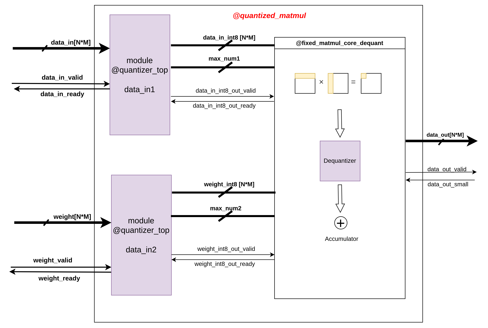
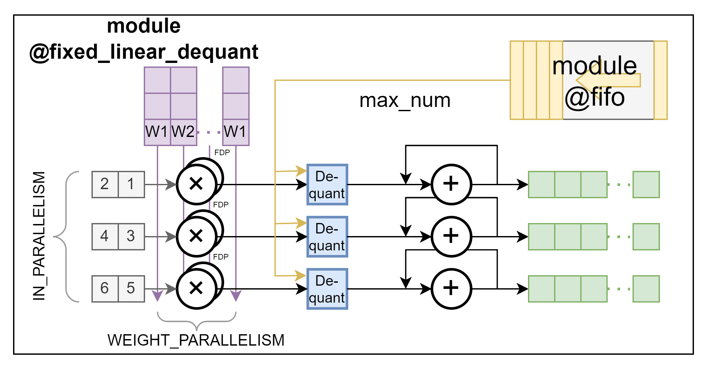

# quantized_matmul.sv

## Design Overview

This module constructs the low-precision processing unit in [`llm_int8_top`](../rtl/llm_int8_top.sv). It consists of two sub-moduels: `quantizer_top`, which implements 8-bit quantization, and `fixed_matmul_core_dequant`, which implements Int8 matmul as well as dequantization.

#### 1. Quantization: `quantizer_top`
This sub-module takes FP16 activations $X_{f16}$ and weight matrix $W_{f16}$ as input, and quantize them to matrices $X_{i8}$ and $W_{i8}$ of Int8 precision:

$$ X_{i8} = \left\lfloor \frac{127 \cdot X_{f16}}{c_x}\right\rceil$$

$$ W_{i8} = \left\lfloor \frac{127 \cdot W_{f16}}{c_w}\right\rceil$$

where 

$$ c_x = \max\left(\left|X_{f16_{i, j}}\right|\right), c_w = \max\left(\left|W_{f16_{i, j}}\right|\right) $$

and $\left\lfloor\right\rceil$ indicates rounding to the nearest integer.

Details of this component design is demonstrated in [quantizer_top.md](./quantizer_top.md)

#### 2. Matmul & Dequantization: `fixed_matmul_core_dequant`
This performs Int8 matrix multiplication, and de-quantize the output matrix back to FP16 precision:

$$ Out_{i32} = X_{i8}W_{i8}$$

$$ Out_{f16} = \frac{Out_{i32} \cdot (c_x \cdot c_w)}{127 \cdot 127}$$

This module is designed based on the existing `fixed_matmul-core` module but integrates dequantization for the following readon. The output matrix $Out_{i32}$ accumulates several matmul results for `IN_DEPTH` beats of input vector $X_{i8}^i$ and $W_{i8}^i$, which are sub-matrices from the entire matrix $X_{i8}$ and $W_{i8}$. Each pair of input beat $X_{i8}^i$ and $W_{i8}^i$ is quantized and has its dedicated quantization constant pair $(c_x^i, c_w^i)$. Therefore, the quantization operation must be performed before the matrix accumulator:

$$ Out_{i32}^i = X_{i8}^iW_{i8}^i$$

$$ Out_{f16}^i = \frac{{Out_{i32}}^i \cdot (c_x^i \cdot c_w^i)}{127 \cdot 127}$$

$$ Out_{f16} = \sum_{i=1}^{IN\_DEPTH}Out_{f16}^i$$

The diagram below shows the micro-architecture of the `fixed_linear_dequant` module, which is the fundamental component of `fixed_matmul_core_dequant`. It first dequantizes the output of dot-product block back to FP16 and then accumulates.

## Module Specifications
### Ports
1. Input Ports:
    * `clk` & `rst`
    * `data_in1`: input vectors (or equivalently flattened matrices) $X_{f16}$ with default precision FP16.
    * `data_in2`: input vectors (or equivalently flattened matrices) $W_{f16}$ with default precision FP16.
    * `data_in_valid` & `data_in_ready`: handshake signals.
2. Output Ports:
    * `data_out`: de-quantized vector (or equivalently a flattened matrix) $Out_{f16}$ with default precision Int8.
    * `data_out_valid` & `data_out_ready`: handshake signals.

### Parameters

| Parameter | Default Value | Definition |
| :---: | :---: | :---:|
| IN1_WIDTH | 16 | Data width of input matrix $X_{f16}$|
| IN2_WIDTH | 16 | Data width of input matrix $W_{f16}$|
| IN1_PARALLELISM | 5 | Row size of $X_{f16}$|
| IN2_PARALLELISM | 5 | Row size of $W_{f16}$|
| IN_SIZE | 4 | Column (Row) size of $X_{f16}$ ($W_{f16}$)|
| IN_DEPTH | 3 | Number of matmul result accumulations|
| HAS_BIAS | 0 | Must be zero as bias term is not supported |
| MAX_NUM_WIDTH | IN_WIDTH | Data width of the max number $c_x$ and $c_w$|
| QUANTIZATION_WIDTH | 8 | Data width of the quantized matrix $X_{i8}$ and $W_{i8}$|

