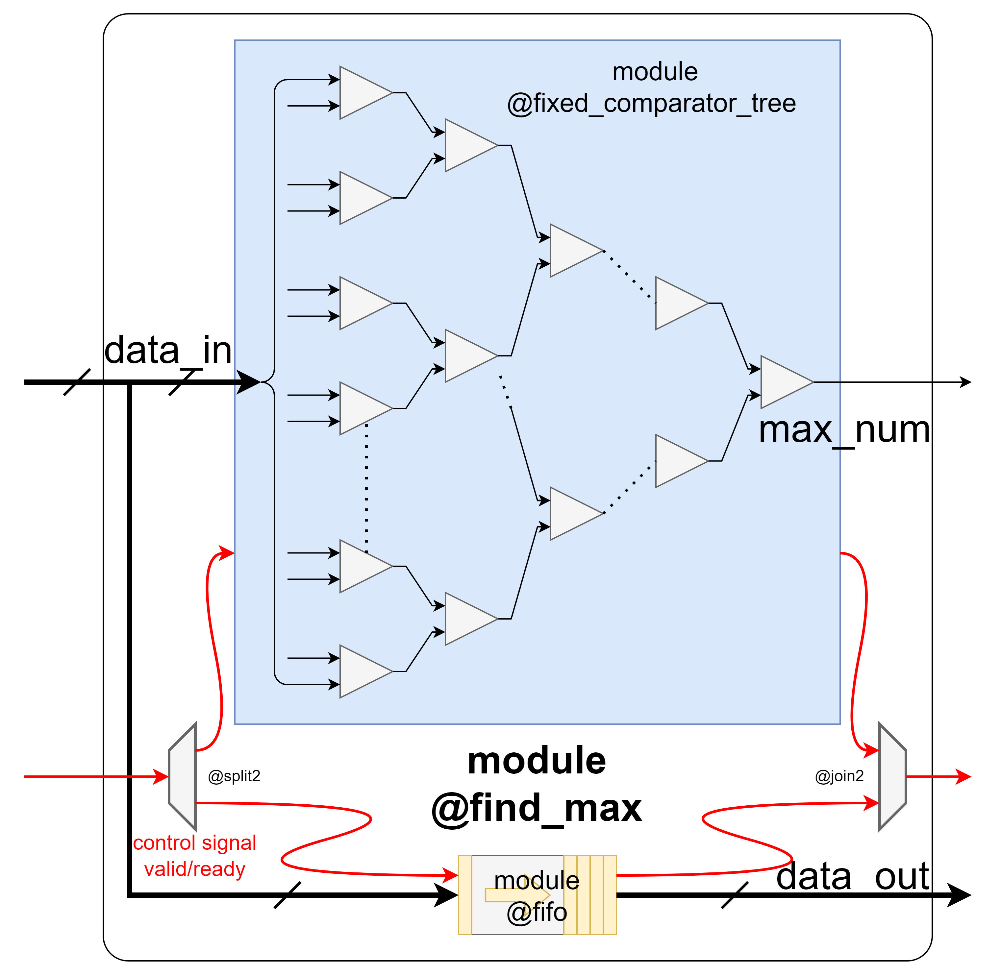

# find_max.sv

This module is an important part of the absmax quantization process used in the [LLM.int paper](https://arxiv.org/abs/2208.07339). It finds the maximum absolute value $c_x$ (a.k.a quantization constant) of a given input matrix, which will be used for later procedures including scaling and quantization.

## Structure Overview

Once the input vector `data_in` is streamed into the module, it is fed to a `comparator_tree` module for a recursive process of comparing and finally output the maximum absolute value. For a input vector `data_in` with $N$ elements, this comparator tree contains $log_2(N)$ layers. Thus, it takes at least $log_2(N)$ cycles for the component to find the corresponding `max_num`. 

The module also output the input vector where `max_num` comes from. However, the latency of the comparator tree component is $log_2(N)$, which may cause `max_num` and `data_in` to be unsynchronized. A fifo is therefore inserted to buffer `data_in` untill `max_num` is valid. Depth of the fifo is at least the latency of the `comparator_tree` module.

## Module Specifications
### Ports
1. Key Input Ports:
    * `clk` & `rst`
    * `data_in`: input vector (or equivalently a flattened matrix)

2. Key Output Ports:
    * `max_num`: maximum absolute value obtained from `data_in`
    * data_out: delayed copy of `data_in`. It is synchronized with `max_num`
    * handshake signals

### Parameters

| Parameter | Default Value | Definition |
| :---: | :---: | :---:|
| IN_WIDTH | 16 | Data width of input matrix |
| IN_SIZE | 4 | Column size of input matrix |
| IN_PARALLELISM | 1 | Row size of input matrix |
| MAX_NUM_WIDTH | IN_WIDTH | Data width of the max number |

