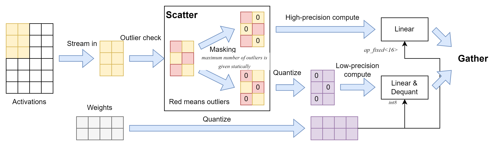
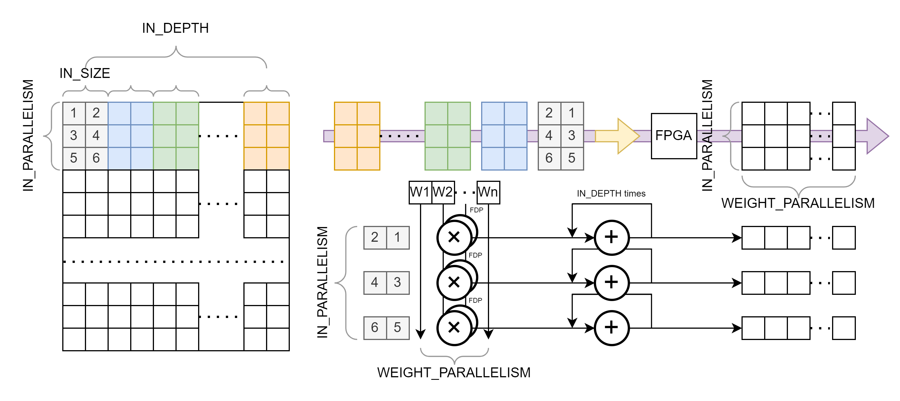
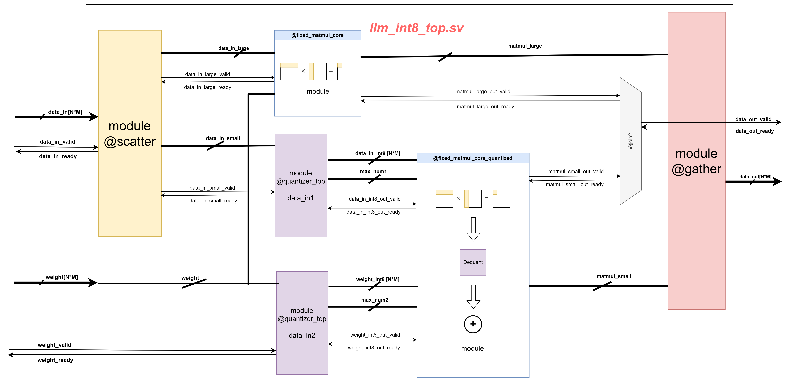

# Group7: LLM.int Hardware Integration for MASE

## Overview
[LLM.int()](https://arxiv.org/abs/2208.07339) is the state-of-art GPU implementation for large language model inference. It scatters a matrix to two groups, low-precision and high-precision matrices, and compute them separately using efficient hardware. This project implements LLM.int() algorithm on FPGA using existing linear layer components in MASE.



## File Hierarchy
Most of the design files and testbenches are under the folder `MASE_RTL/llm`, where `MASE_RTL = ROOT/machop/mase_components/`, and `ROOT` is the root directory of MASE project.

`MASE_RTL/llm`
* `rtl`: This contains all System Verilog design files.
    - `llm_int8_top.sv`: This is the top-level .sv file of the LLM.int8() implementation.
    - `quantized_matmul.sv`: This is the most important component of `llm_int8_top`. It implements 8-bit quantization, matrix multiplication and de-quantization.
    - Other design files

* `test`: This contains testbench files that check functionalities of selected important modules in `rtl`
    - `llm_int8_top_tb.py`
    - `quantized_matmul_tb.py`
    - Other testbench files

* `docs`: documentations for important .sv modules.

* `aborted`: discarded design/testbench files that are no longer used.


## Testbench Settings

### 1. How to Run
Please ensure that you have installed all environment required for [MASE](). Specifically, make sure Cocotb and Verilator has been successfully installed.

To test a .sv design file `example.sv`, just locate to the testbench folder `ROOT/machop/mase_components/llm/test` and run the corresponding .py files:

```bash
Python ./example_tb.py
```

### 2. Generating Input Data for DUT
The testbench file (e.g., `llm_int8_top_tb.py`) uses `RandomSource` defined in `ROOT/machop/mase_cocotb/random_test.py` to generate random input tensors to the SV module `llm_int8_top.sv`. It can generate two patterns of data, depending on the argument `arithmetic` passed to it:
* If `arithmetic=llm-fp16-weight`: it generates random integers in the range `[-5, 5]`. This simulates the LLM weight matrix where most of the entries have small magnitude
* If `arithmetic=llm-fp16-datain`: it generates integers of a specific distribution:
With probability `large_num_prob`, generate large numbers in the range `+-[large_num_thres, large_num_limit]`.
With probability `1-large_num_prob`, generate small numbers in the range `[-large_num_thres, large_num_thres]`.
This simulates the LLM input activation matrix which contains both large-magnitude and small-magnitude entries.

You can for sure tune parameters of the random number generator to produce tensors of different distributions. However, please keep in mind that the magnitude of generated data must be carefully controlled to avoid DUT computation overflow.  

### 3. Sample Simulation Result
Here is an example test result for running the testbench `llm_int8_top_tb.py`.
```shell
--------------------- Error Analysis --------------------
Sample Num=100
No. Samples above Error Thres(10)=0
Absolute Error: max=10, avg=4
Relative Error: max=1.12%, avg=0.35%
--------------------- End of Error Analysis --------------------

  3718.00ns INFO     cocotb.regression                  test_llm_int8_quant_tb passed
  3718.00ns INFO     cocotb.regression                          
    ************************************************************************************************
    ** TEST                                    STATUS  SIM TIME (ns)  REAL TIME (s)  RATIO (ns/s) **
    ************************************************************************************************
    ** llm_int8_top_tb.test_llm_int8_quant_tb   PASS        3718.00           0.24      15345.27  **
    ************************************************************************************************
    ** TESTS=1 PASS=1 FAIL=0 SKIP=0                         3718.00           1.10       3366.91  **
    ************************************************************************************************                                          
- :0: Verilog $finish
INFO: Results file: /home/ic/MYWORKSPACE/Mase-DeepWok/machop/mase_components/llm/test/build/llm_int8_top/test_0/results.xml
TEST RESULTS
    PASSED: 1
    FAILED: 0
    NUM TESTS: 1
```
The test report contains two test sections:
* Analysis of DUT output error compared with theoretical output value calculated through software. This analysis is generated by the function `analyse_results_signed` that is defined in `ROOT/machop/mase_cocotb/random_test.py`. It checks every output vector from the DUT `llm_int8_top` and reports information for both absolute and relative error, which is caused due to Int8 quantization.

* Cocotb test report, which contains the Verilator simulation time.


## Implementation Details
Since FPGA has limited I/O ports and memory units, the LLM matrix is partitioned into small sub-matrices with identical size `N*M`. These matrices are flattened as a 1-d vector and are streamed into FPGA for computation.


Inside `llm_int8_top` the input activations $X_{f16}$ with FP16 precision is passed through a `scatter` module. 
    
The module detects large-magnitude element (a.k.a emergent outliers mentioned in the paper) in $X_{f16}$ and places them to the high-precision matrix $X_{HP, f16}$. This matrix is then passed to the module `fixed_matmul_core` for FP16 matrix multiplication.

The rest of the elements in $X_{f16}$ have small magnitude so they go into the low-precision matrix $X_{LP, f16}$. It is then passed to the module `quantized_matmul` for Int8 quantization, Int8 matrix multiplication and de-quantization. 

The outputs of the two matmul components both have FP16 precision, and are gathered as the final output matrix.

`llm_int8_top` takes a dataflow architecture and is deeply pipelined. Each stage in the pipeline communicates with up-stream and down-stream stages with handshake protocols.

Details of each sub-modules can be found in the [docs](./docs/) folder.

## References

1. Tim Dettmers, Mike Lewis, Younes Belkada, and Luke Zettlemoyer.
Llm.int8(): 8-bit matrix multiplication for transformers at scale, 2022
2. Jianyi Cheng, Cheng Zhang, Zhewen Yu, Alex Montgomerie-Corcoran,
Can Xiao, Christos-Savvas Bouganis, and Yiren Zhao. Fast prototyping
next-generation accelerators for new ml models using mase: Ml accel-
erator system exploration, 2023
3. [Machine-Learning Accelerator System Exploration Tools](https://github.com/DeepWok/mase)
