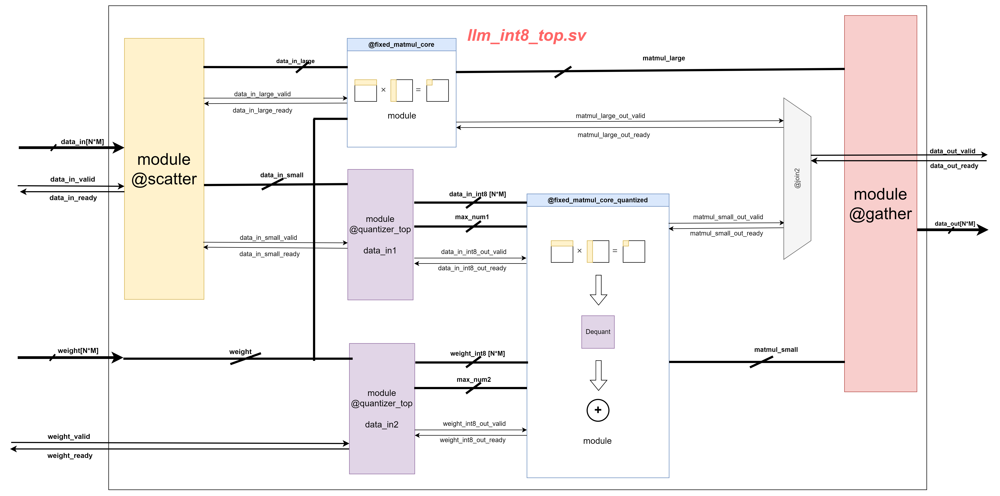

# llm_int8_top.sv

This module implements a mixed-precision matrix multiplication algorithm based on the [LLM.int paper](https://arxiv.org/abs/2208.07339). It scatters a matrix to two groups, low-precision and high-precision matrices, and compute them separately using efficient hardware. 

## Design Overview

The module consists of the following components: 
##### 1. Scatter
This is implemented as the `scatter` module, which decompose the input activations $X_{fp16}$ as two matrices $X_{HP,fp16}$ $X_{LP,fp16}$.

##### 2. High-Precision Processing Unit
This is implemented by the existing module `fixed_matmul_core`. It performs FP16-precision matrix multiplication over the two matrices $X_{HP,fp16}$ and $W_{fp16}$. The output is also a FP16-precision matrix $Out_{HP,fp16}$

##### 2. Low-Precision Processing Unit
This is implemented as the module `quantized_matmul`. It quantize the input matrix $X_{LP,f16}$ and $W_{f16}$ as two low-precision matrices $X_{i8}$ and $W_{i8}$. Then it performs Int8 matrix multiplication over the two quantized matrix and dequantize the result $Out_{LP,i32}$ back to $Out_{LP,f16}$.

Design details of this module is illustrated in [quantized_matmul.md](./quantized_matmul.md)

##### 3. Gather
This is implemented as an element-wise parallel matrix addition.

## Module Specifications
### Ports
1. Input Ports:
    * `clk` & `rst`
    * `data_in`: input vectors (or equivalently flattened matrices) $X_{f16}$ with default precision FP16.
    * `weight`: input vectors (or equivalently flattened matrices) $W_{f16}$ with default precision FP16.
    * `data_in_valid` & `data_in_ready`: handshake signals.
2. Output Ports:
    * `data_out`: matmul result (or equivalently a flattened matrix) $Out_{f16}$.
    * `data_out_valid` & `data_out_ready`: handshake signals.

### Parameters

| Parameter | Default Value | Definition |
| :---: | :---: | :---:|
| IN_WIDTH | 16 | Data width of input matrix $X_{f16}$|
| WEIGHT_WIDTH | 16 | Data width of input matrix $W_{f16}$|
| IN_PARALLELISM | 5 | Row size of $X_{f16}$|
| WEIGHT_PARALLELISM | 5 | Row size of $W_{f16}$|
| IN_SIZE | 4 | Column (Row) size of $X_{f16}$ ($W_{f16}$)|
| IN_DEPTH | 3 | Number of matmul result accumulations|
| HAS_BIAS | 0 | Must be zero as bias term is not supported |
| MAX_NUM_WIDTH | IN_WIDTH | Data width of the max number $c_x$ and $c_w$|
| QUANTIZATION_WIDTH | 8 | Data width of $X_{i8}$ and $W_{i8}$ in the LP processing unit|
| MAX_LARGE_NUMBERS | 4 | Max number of outliers to be placed in the HP matrix $X_{HP,f16}$|
| LARGE_NUM_THRES | 127 | Threshold for identifying an elements as outliers|

### Performance Analysis

* **Throughput:** `llm_int8_top` takes a dataflow architecture and is deeply pipelined. Each stage in the pipeline communicates with up-stream and down-stream stages with handshake protocols. This module achives maximum throughput of one output beat per `IN_DEPTH` cycles, where `IN_DEPTH` is the module parameter and denotes the times for matrix accumulation.
* **Accuracy:** 
For input activations $X_{f16}$ with entry magnitude $\in[-500,500]$ and weight matrix $W_{f16}$ with entry magnitude $\in[-3,3]$, the simulated matrix multiplication error is roughly 1%.