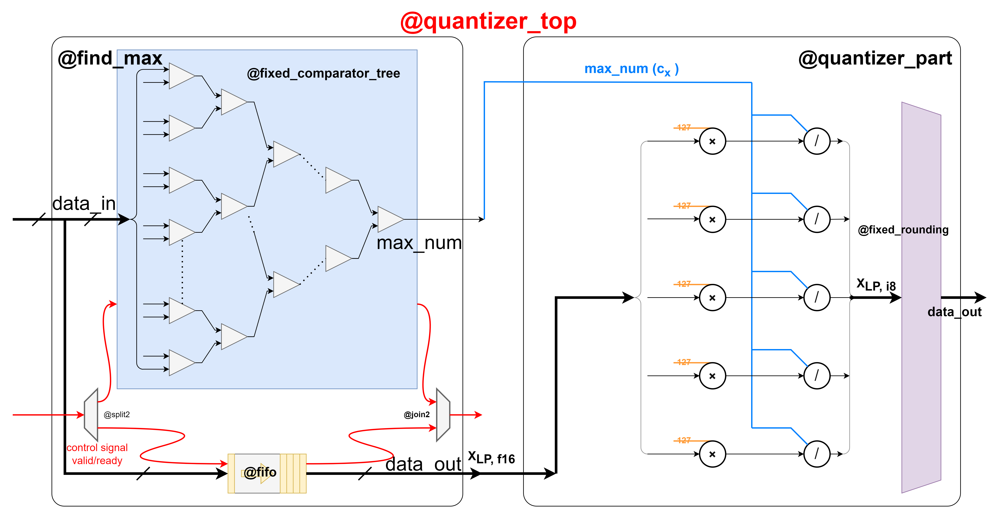

# find_max.sv

This module implements the 8-bit absmax quantization process used in the [LLM.int paper](https://arxiv.org/abs/2208.07339). It finds the maximum absolute value $c_x$ (a.k.a quantization constant) of a given FP16 input matrix $X_{f16}$, scale the matrix with the constant, and quantize it to a Int8 matrix $X_{i8}$:

$$ X_{i8} = \left\lfloor \frac{127 \cdot X_{f16}}{c_x}\right\rceil$$

where 

$$ c_x = \max\left(\left|X_{f16_{i, j}}\right|\right) $$

and  $\left\lfloor\right\rceil$ indicates rounding to nearest integer.

## Structure Overview

The component consists of two sub-modules: 
* `find_max`, which searches the maximum absolute number $c_x$ of the input matrix.
* `quantizer_part`, which scales the FP16 matrix $X_{f16}$ with $c_x$ obtained from `find_max` and rounds the matrix to $X_{i8}$.

These two submodules all both pipelined and communite with each other via hand-shake protocol.

### 1. `find_max`
Once the input vector `data_in` is streamed in, it is fed to a `comparator_tree` module for a recursive process of comparing and finally output the maximum absolute value. For a input vector `data_in` with $N$ elements, this comparator tree contains $log_2(N)$ layers. Thus, it takes at least $log_2(N)$ cycles for the component to find the corresponding `max_num`. 

The module also outputs the vector `data_in` where `max_num` is obtained from. However, the latency of the comparator tree component is $log_2(N)$, which may cause `max_num` and `data_in` to be unsynchronized. A fifo is therefore inserted to buffer `data_in` untill `max_num` is valid. Depth of the fifo is at least the latency of the `comparator_tree` module.

### 2. `quantizer_part`
This is a fully combinational circuit which multiplies all elements of `data_in` in parallel with the common scaling constant $127/c_x$. The `fixed_rounding` component rounds all scaled data to Int8 precision.

Theoretical latency of this component is 1 cycle.

## Module Specifications
### Ports
1. Input Ports:
    * `clk` & `rst`
    * `data_in`: input vector (or equivalently a flattened matrix) with default precision FP16.
    * `data_in_valid` & `data_in_ready`: handshake signals.
2. Output Ports:
    * `data_out`: quantized vector (or equivalently a flattened matrix) with default precision Int8.
    * `data_out_valid` & `data_out_ready`: handshake signals.

### Parameters

| Parameter | Default Value | Definition |
| :---: | :---: | :---:|
| IN_WIDTH | 16 | Data width of input matrix $X_{f16}$|
| IN_SIZE | 4 | Column size of input (output) matrix |
| IN_PARALLELISM | 1 | Row size of input (output) matrix |
| MAX_NUM_WIDTH | IN_WIDTH | Data width of the max number $c_x$|
| QUANTIZATION_WIDTH | 8 | Data width of output quantized matrix $X_{i8}$|

