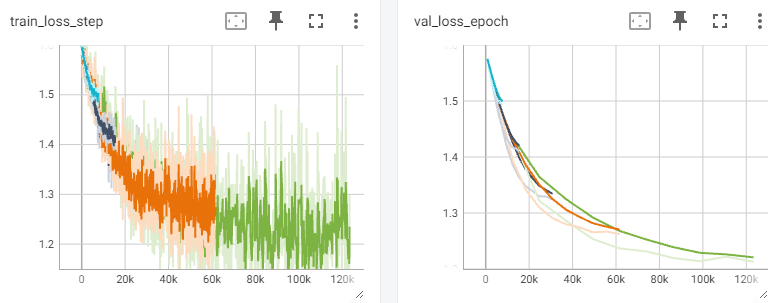
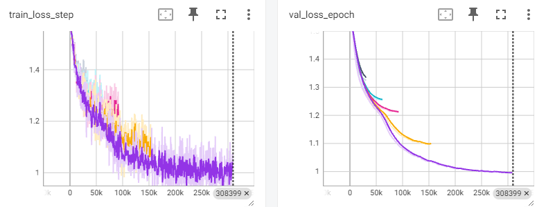
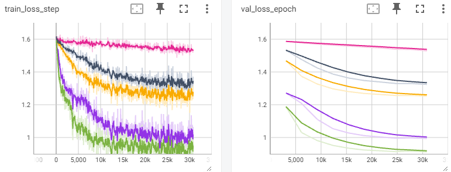
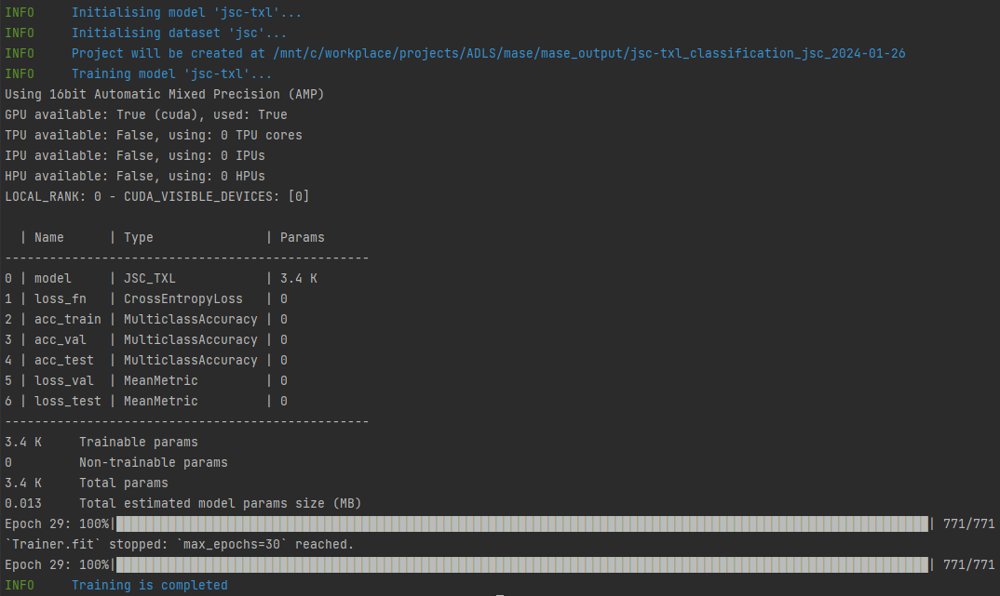
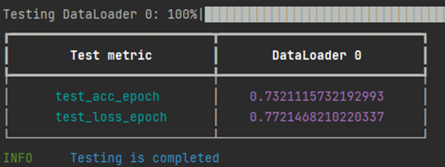

# Lab 1
### Q1. What is the impact of varying batch sizes and why?
|                      | Large batch sizes                                         | Small batch sizes                                                      |
|----------------------|-----------------------------------------------------------|------------------------------------------------------------------------|
| GPU/CPU Memory cost  | More memory usage<br/>More powerful hardware required     | Less memory usage                                                      |
| Training efficiency  | Less time required to go through one epoch                | More time consuming for every epoch                                    |
| Converging stability | Loss curve would decrease more smoothly, less oscillation | More noise within each gradient calculation                            |
| Generalization       | More stability means less generalization ability          | More noise in each bach propagation brings more generalization ability |
<br>
* batch sizes increase from 64 to 1024. The figure above demonstrates that, in this case, with smaller batch sizes the parameters update more frequently which leads to a better outcome.
### Q2. Why is the impact of varying maximum epoch number
* More maximum epoch number refers to more time spent during training process. 
* Too small maximum epoch number will lead to underfitting, which means the model has not been able to achieve its best performance, but the training has already been stopped.
* Too large maximum epoch number is meaningless as when overfitting the performance of model will keep decreasing. We will never choose the checkpoint for results in too many epochs. Thus, the computation resources might be wasted. But thanks to ‘early stop’, this waste can be easily prevented.
* So the best maximum epoch number should be as large as current computation resources allowed and always with well configured ‘early stop’ to be switched on.
<br>
### Q3. What is happening with a large learning and what is happening with a small learning rate and why? What is the relationship between learning rates and batch sizes?
* For large learning rate, the converging speed might be faster. But it would also lead to intensive oscillation in loss curve in the final stage of training or even divergence. Because there are high chances of overshooting when the updates to weights are too large.
* With a small learning rate, the convergence would be more stable but smaller. So the final result would be better but more time consuming to achieve it. It is said that there would be risk of falling into local minima when choosing small learning rate. But from my perspective, when it comes to extremely high dimensional parameters space, there is little chance to have local minima exist, which should not be a concern.
* As both large learning rate and small batch sizes are suffered from instability in update, it might be better choice to choose larger learning rates when there are also large batch sizes, and smaller learning rates for smaller batch sizes.
<br>
* pink for lr=1e-6, black for lr=1e-5, yellow for lr=2e-5, purple for lr=1e-4, green for lr=2e-4
* Larger lr is more suitable for this case. 
### Q4. Implement a network that has in total around 10x more parameters than the toy network.
* Define the model in <u>machop/chop/models/physical/jet_substructure/\_\_init__.py</u>
```python
class JSC_TXL(nn.Module):
    def __init__(self, info):
        super(JSC_TXL, self).__init__()
        self.seq_blocks = nn.Sequential(
            # 1st LogicNets Layer
            nn.BatchNorm1d(16),  # input_quant       # 0
            nn.ReLU(16),  # 1
            nn.Linear(16, 120),  # linear              # 2
            nn.BatchNorm1d(120),  # output_quant       # 3
            nn.ReLU(120),  # 4
            # 2nd LogicNets Layer
            nn.Linear(120, 8),  # 5
            nn.BatchNorm1d(8),  # 6
            nn.ReLU(8),  # 7
            # 3rd LogicNets Layer
            nn.Linear(8, 5),  # 8
            nn.BatchNorm1d(5),  # 9
            nn.ReLU(5),
        )

    def forward(self, x):
        return self.seq_blocks(x)
```
* Add entrance key to PHYSICAL_MODEL in <u>machop/chop/models/physical/\_\_init__.py</u>
```python
"jsc-txl": {
    "model": get_jsc_txl,
    "info": MaseModelInfo(
        "jsc-s",
        model_source="physical",
        task_type="physical",
        physical_data_point_classification=True,
        is_fx_traceable=True,
    ),
},
```

### Q5. Test your implementation and evaluate its performance.
* Training process
<br>
* Test result
<br>