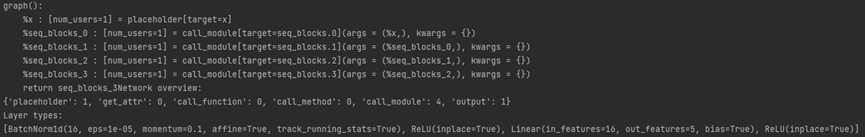
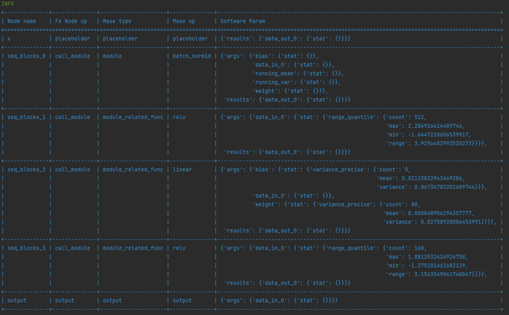
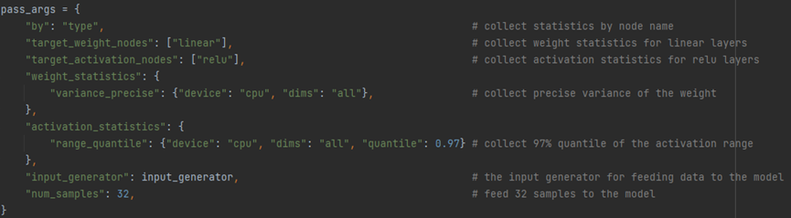
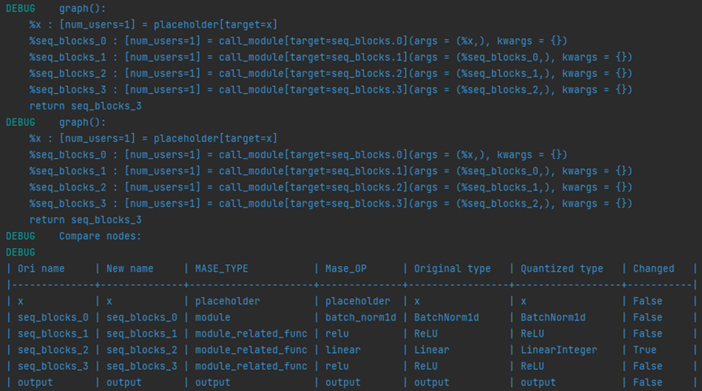
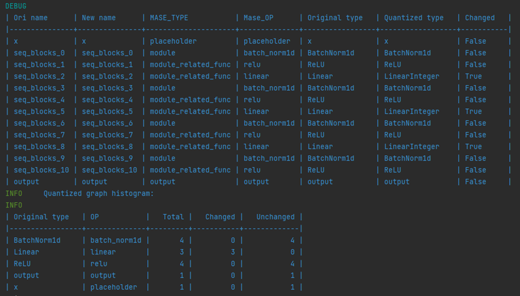
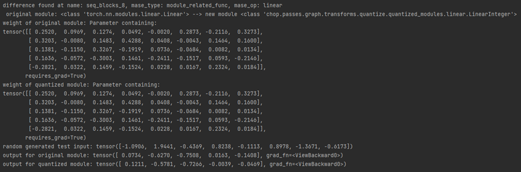
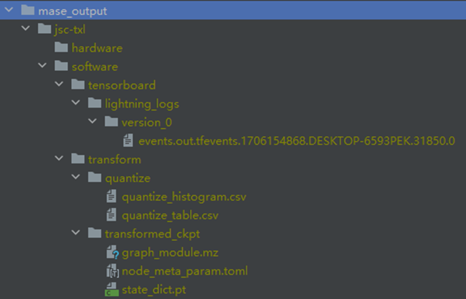

# Lab 2
### Q1. Explain the functionality of <u>report_graph_analysis_pass</u> and its printed jargons such as <u>placeholder</u>, <u>get_attr</u> … You might find the doc of <u>torch.fx</u> useful.
- The function **report_graph_analysis_pass** print out information for the **MaseGraph** object which is generated as formatted dictionary by **init_metadata_analysis_pass**, **add_common_metadata_analysis_pass** and **add_software_metadata_analysis_pass**.
<br><br>
- For the FX node operation map:
  - **placeholder** represents a function input;
  - **get_attr** retrieves a parameter from the module hierarchy;
  - **call_function** applies a free function to some values;
  - **call_module** applies a module in the module hierarchy’s forward() method to given arguments;
  - **call_method** calls a method on a value; output contains the output of the traced function in its args[0] attribute. This corresponds to the “return” statement in the Graph printout.
### Q2. What are the functionalities of profile_statistics_analysis_pass and report_node_meta_param_analysis_pass respectively?
- In **profile_statistics_analysis_pass**, passes configured in **pass_args** will first be parsed and registered to specific nodes according to configuration. Then all passed would be computed and its generated result would be recorded in metadata of **MaseGraph** object.

- In **report_node_meta_param_analysis_pass**, metadata including results of analysis passes generated by **profile_statistics_analysis_pass** will be well organized in a table format and output to terminal, also can be save in file if **save_path** is configured in **pass_args**.
<br>
<br>
- In given **pass_args** configuration example, **variance_precise** was registered to linear layers and collect the number of parameters of them, mean and variance of those parameters; **range_quantile** was registered to relu layers and collect the number of input elements and two certain quantiles of the input elements and its difference (named max, min and range).

### Q3. Explain why only 1 OP is changed after the quantize_transform_pass .
- According to the **pass_args** configuration, only module with type **linear** is affected, others are ignored by quantization transformation. And there is only 1 OP matched to that configuration.

### Q4. Write some code to traverse both mg and ori_mg, check and comment on the nodes in these two graphs. You might find the source code for the implementation of summarize_quantization_analysis_pass useful.
- **Linear** module is transformed into **LinearInteger**
- Other nodes remains unchanged
<br>

### Q5. Perform the same quantization flow to the bigger JSC network that you have trained in lab1. You must be aware that now the pass_args for your custom network might be different if you have used more than the Linear layer in your network.


### Q6. Write code to show and verify that the weights of these layers are indeed quantised. You might need to go through the source code of the implementation of the quantisation pass and also the implementation of the Quantized Layers .
```python
for ori_n, n in zip(ori_mg.fx_graph.nodes, mg.fx_graph.nodes):
    if (type(get_node_actual_target(n)) != type(get_node_actual_target(ori_n))):
        print(f'difference found at name: {n.name}, mase_type: {get_mase_type(n)}, mase_op: {get_mase_op(n)}\n original module: {type(get_node_actual_target(ori_n))} --> new module {type(get_node_actual_target(n))}')
        print(f'weight of original module: {get_node_actual_target(ori_n).weight}')
        print(f'weight of quantized module: {get_node_actual_target(n).weight}')
        test_input = torch.randn(get_node_actual_target(n).in_features)
        print(f'random generated test input: {test_input}')
        print(f'output for original module: {get_node_actual_target(ori_n)(test_input)}')
        print(f'output for quantized module: {get_node_actual_target(n)(test_input)}')
```

- In the new **LinearInteger** module, the weight remains unchanged but the **x_quantizer** in the module has already been registered. Thus, when call the two modules with given input, there are different outputs.
```python
class _LinearBase(torch.nn.Linear):
    def __init__(
        self,
        in_features: int,
        out_features: int,
        bias: bool = False,
        device=None,
        dtype=None,
    ) -> None:
        super().__init__(in_features, out_features, bias, device, dtype)
        self.bypass = False
        self.x_quantizer = None
        self.w_quantizer = None
        self.b_quantizer = None
        self.pruning_masks = None

    def forward(self, x: Tensor) -> Tensor:
        if self.bypass:
            # if bypss, there is no quantization
            return F.linear(x, self.weight, self.bias)
        else:
            x = self.x_quantizer(x)
            w = self.w_quantizer(self.weight)
            bias = self.b_quantizer(self.bias) if self.bias is not None else None
```

### Q7. Load your own pre-trained JSC network, and perform the quantisation using the command line interface.
```shell
CUDA_VISIBLE_DEVICES=-1 ./machop/ch transform --config ./machop/cache/jsc_txl_quantized_by_type.toml --task cls --cpu=0
```
```toml
# jsc_txl_quantized_by_type.toml
# self-defined configuration
model = "jsc-txl"
dataset = "jsc"
task = "cls"

max_epochs = 300
batch_size = 1024
learning_rate = 1e-2
accelerator = "cpu"
project = "jsc-txl"
seed = 42
log_every_n_steps = 5
 load_name = "/mnt/c/workplace/projects/ADLS/mase/mase_output/jsc-txl_classification_jsc_2024-01-25/software/training_ckpts/best-v2.ckpt"
 load_type = "pl"

[passes.quantize]
by = "type"
[passes.quantize.default.config]
name = "NA"
[passes.quantize.linear.config]
name = "integer"
"data_in_width" = 8
"data_in_frac_width" = 4
"weight_width" = 8
"weight_frac_width" = 4
"bias_width" = 8
"bias_frac_width" = 4
```
