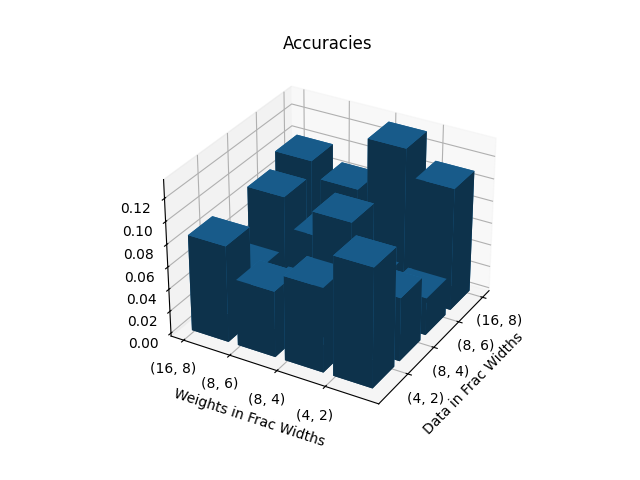
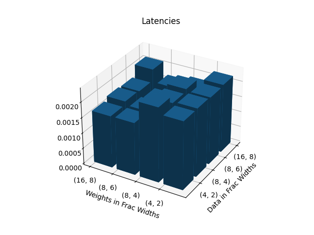
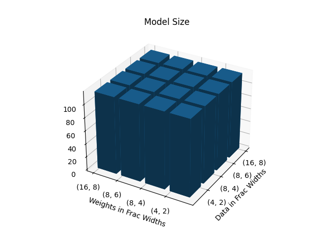
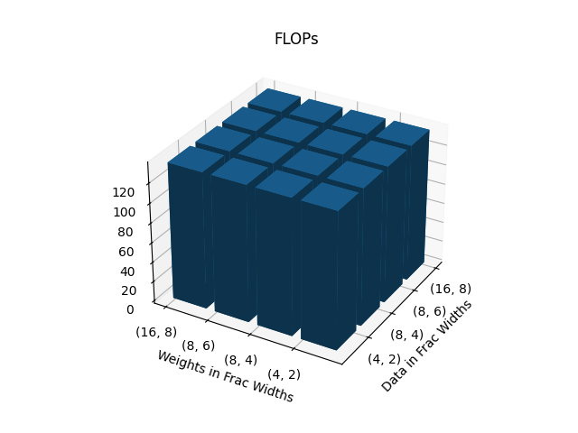

# Lab 3
### Q1. Explore additional metrics that can serve as quality metrics for the search process. For example, you can consider metrics such as latency, model size, or the number of FLOPs (floating-point operations) involved in the model.
- **Latency** refers to the accumulated time consumption for model to go through all input data.
- **Model size** refers to the number of parameters within.
- The number of **FLOPs** is calculated by the pre-defined function applied to each type of nn.module.
### Q2. Implement some of these additional metrics and attempt to combine them with the accuracy or loss quality metric. It’s important to note that in this particular case, accuracy and loss actually serve as the same quality metric (do you know why?).

SThe model size and FLOPs of the different configuration is the same, as the configuration only change the quantize operation but not change the model architecture. 
### Q3. Implement the brute-force search as an additional search method within the system, this would be a new search strategy in MASE.

### Q4. Compare the brute-force search with the TPE based search, in terms of sample efficiency. Comment on the performance difference between the two search methods.

