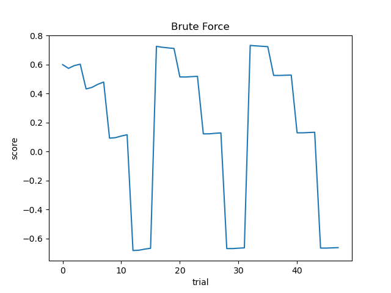

# Lab 3
### Q1. Explore additional metrics that can serve as quality metrics for the search process. For example, you can consider metrics such as latency, model size, or the number of FLOPs (floating-point operations) involved in the model.
- **Latency** refers to the accumulated time consumption for model to go through all input data.
- **Model size** refers to the number of parameters within.
- The number of **FLOPs** is calculated by the pre-defined function applied to each type of nn.module.
### Q2. Implement some of these additional metrics and attempt to combine them with the accuracy or loss quality metric. It’s important to note that in this particular case, accuracy and loss actually serve as the same quality metric (do you know why?).


- The model size and FLOPs of the different configuration is the same, as the configuration only change the quantize operation but not change the model architecture. 
### Q3. Implement the brute-force search as an additional search method within the system, this would be a new search strategy in MASE.
- key code block for self defined brute-force search which is inherited form **SearchStrategyBase**
```python
    def search(self, search_space):
        sampled_indexes = {}
        name_list = list(search_space.choice_lengths_flattened.keys())
        # Complexity of Bruce-Force is Cartesian product of the numbers of possible choices of each component
        # using recursion to implement dynamic components Bruce-Force
        def dynamic_bf(index = 0):
            if index == len(name_list):
                score = self.run_trial(search_space, sampled_indexes)
                self.counter += 1
                # print(f'For proposal-{self.counter}, score: {score}')
                print(score)
                self.bf_result[str(sampled_indexes)] = score
                if self.highest_score is None or score > self.highest_score:
                    self.highest_score = score
                    self.best_config = sampled_indexes
                return
            for i in range(search_space.choice_lengths_flattened[name_list[index]]):
                # set config
                sampled_indexes[name_list[index]] = i
                # traverse for next component
                dynamic_bf(index + 1)
        dynamic_bf()
        self.counter = 0
        # print(self.bf_result)
        print("best config: ", self.best_config)
        print("highest score: ", self.highest_score)

    def run_trial(self, search_space, sampled_indexes):
        sampled_config = search_space.flattened_indexes_to_config(sampled_indexes)

        is_eval_mode = self.config.get("eval_mode", True)
        model = search_space.rebuild_model(sampled_config, is_eval_mode)
        software_metrics = self.compute_software_metrics(
            model, sampled_config, is_eval_mode
        )
        hardware_metrics = self.compute_hardware_metrics(
            model, sampled_config, is_eval_mode
        )
        metrics = software_metrics | hardware_metrics
        scaled_metrics = {}
        for metric_name in self.metric_names:
            scaled_metrics[metric_name] = (
                    self.config["metrics"][metric_name]["scale"] * metrics[metric_name]
            )
        return sum(scaled_metrics.values())
```
- Modification in <u>machop/chop/actions/search/strategies/__init__.py</u> to register the self defined search strategy to the system.
```python
    SEARCH_STRATEGY_MAP = {
        # "rl": StrategyRL,
        "optuna": SearchStrategyOptuna,
        "txl_bf": SearchStrategyBruteForce,
    }
```
- The field <u>search.strategy.name</u> in .toml configuration file should also adjust to the key above.
- The output of using self defined brute-force search


### Q4. Compare the brute-force search with the TPE based search, in terms of sample efficiency. Comment on the performance difference between the two search methods.
- Part of settings about the experiment
```toml
[search.search_space.seed.seq_blocks_2.config]
name = ["integer"]
data_in_width = [4, 8, 16]
data_in_frac_width = ["NA"]
weight_width = [2, 4, 8, 16]
weight_frac_width = ["NA"]
bias_width = [2, 4, 8, 16]
bias_frac_width = ["NA"]

[search.strategy.setup]
n_jobs = 1
n_trials = 48
timeout = 20000
sampler = "tpe"
sum_scaled_metrics = true
direction = "maximize"

[search.strategy.metrics]
accuracy.scale = 2.0
accuracy.direction = "maximize"
average_bitwidth.scale = -0.1
average_bitwidth.direction = "minimize"
```
- Experiment results
<br>

- From figures above, it is demonstrated that the 'TPE' strategy tends to try more possible better choice after the initial stage but might get poor result in final stage of searching. However, 'Brute Force' strategy is aimless by trying all possible choices one by one.
- When the search space goes larger, TPE strategy would outperform the simple Brute Force. Because TPE might get an acceptable good result with very limited number of trials.


