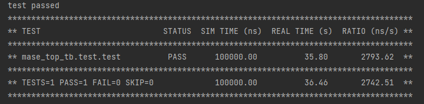

# Lab4
### Q1. Read [this page](https://jianyicheng.github.io/mase-tools/modules/analysis/add_metadata.html#add-hardware-metadata-analysis-pass) for more information on the hardware metadata pass. Why we have such a metadata setup? How is this different from the software metadata?
The hardware metadata is set up for auto verilog code generation and analysis passes. Key information required for verilog code generation is recorded.

    - software: dict
      - args: dict
        - $name (dict): name of the arg, e.g. data_in_0
          - "stat": {"record": {"data": ..., "count": ...},
                     "variance_online": {"variance": ..., "mean": ..., "count": ...}},
                     "variance_precise": {"variance": ..., "mean": ..., "count": ...},
                     "range_n_sigma": {"min": ..., "max": ..., "count": ...},
                     "range_quantile": {"min": ..., "max": ..., "count": ...},
                     "range_min_max": {"min": ..., "max": ..., "count": ...},
                    }.
      - results: dict
        - $name (dict): name of the result, e.g. data_out_0
          - "stat": {"stat_name": { # stat_values } }
    - hardware
      - is_implicit -> bool : whether the node is mapped on hardware or software annotation only
      - verilog_param -> {} : parameters need for customise the hardware module
      - device_id -> int : the ID of the device where the node is mapped, default = -1
      - toolchain -> str : tool chain for code generation, must be INTERNAL, EXTERNAL or HLS
      - module -> str : the name of the used hardware module
      - interface -> {}
         - name : name of the parameters
           - storage : the hardware interface implemented, must be BRAM
           - transpose : whether the data needs to be transposed before emitting
      - dependence_files -> [] : the dependent files for the generated module

From description of software and hardware metadata above, it is clear that software metadata focus more on collecting analysis data but hardware metadata focus more on configuration about code generation. 
### Q2. Read through <u>top/hardware/rtl/top.sv</u> and make sure you understand how our MLP model maps to this hardware design. Explain what each part is doing in the <u>.sv</u> file.
- This is a verilog file
  1.  Parameters, inputs and outputs of the model are defined
  2.  Signals, registers of parameters and feature maps and declared as **logic**
  3.  component modules corresponding to the pre-defined model architecture are instantiation. Sources files of these modules can be found in <u>./components/</u>
  4.  Signals connected components and shared feature maps are linked by **assign** 
### Q3. Launch the simulation, log and show the simulation results.

