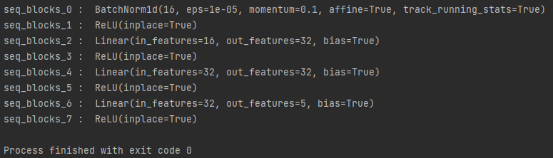
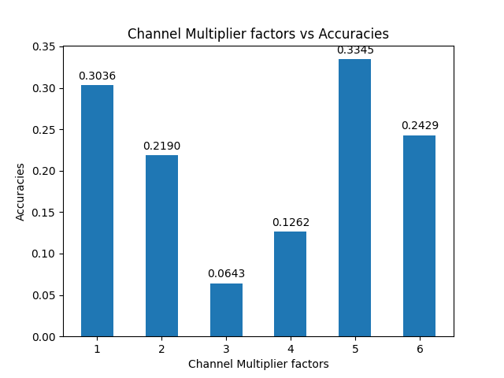
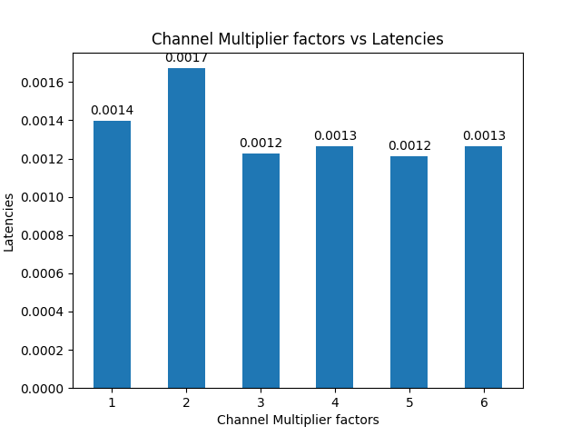
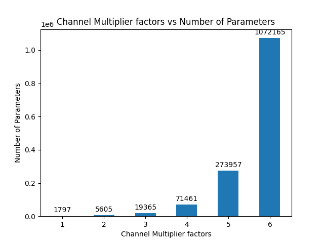
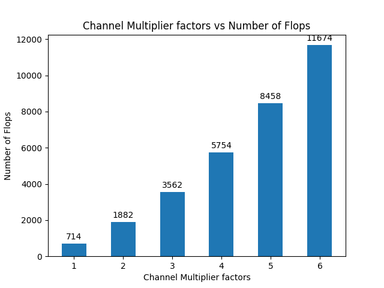
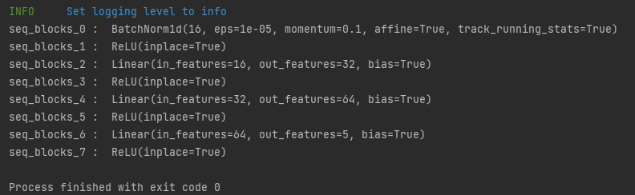
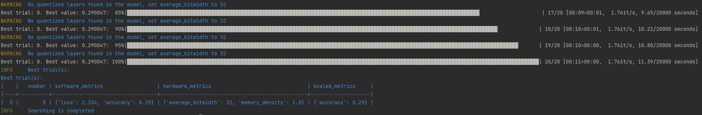

# Lab4
### Q1. Can you edit your code, so that we can modify the above network to have layers expanded to double their sizes? Note: you will have to change the <u>ReLU</u> also.
- **nn.ReLU** could fit to the size of input automatically, thus no extra modification is required except adjusting the node name of **nn.Linear** in configuration
<br>
### Q2. In [lab3](lab3.md), we have implemented a grid search, can we use the grid search to search for the best channel multiplier value?
- Grid search can be applied by building a search space of channel multipliers
    ```python
    # build a search space
    channel_multipliers = [1,2,3,4,5,6]
    search_spaces = []
    for cm_config in channel_multipliers:
        pass_config['seq_blocks_2']['input_channel_multiplier'] = cm_config
        pass_config['seq_blocks_2']['output_channel_multiplier'] = cm_config
        pass_config['seq_blocks_4']['input_channel_multiplier'] = cm_config
        pass_config['seq_blocks_4']['output_channel_multiplier'] = cm_config
        pass_config['seq_blocks_6']['input_channel_multiplier'] = cm_config
        pass_config['seq_blocks_6']['output_channel_multiplier'] = cm_config
        # dict.copy() and dict(dict) only perform shallow copies
        # in fact, only primitive data types in python are doing implicit copy when a = b happens
        search_spaces.append(copy.deepcopy(pass_config))
    ```
- Same metrics in [Lab3.Q2](lab3.md) is applied. Best choice could be elected according to the collected metrics if rules of comparing is defined.
  
  
  
  
### Q3. You may have noticed, one problem with the channel multiplier is that it scales all layers uniformly, ideally, we would like to be able to construct networks like the following:
```python
# define a new model
class JSC_Three_Linear_Layers(nn.Module):
    def __init__(self):
        super(JSC_Three_Linear_Layers, self).__init__()
        self.seq_blocks = nn.Sequential(
            nn.BatchNorm1d(16),
            nn.ReLU(16),
            nn.Linear(16, 32),  # output scaled by 2
            nn.ReLU(32),  # scaled by 2
            nn.Linear(32, 64),  # input scaled by 2 but output scaled by 4
            nn.ReLU(64),  # scaled by 4
            nn.Linear(64, 5),  # scaled by 4
            nn.ReLU(5),
        )

    def forward(self, x):
        return self.seq_blocks(x)
```
### Can you then design a search so that it can reach a network that can have this kind of structure?
- Instead of applying **channel_multiplier** to both **in_features** and **out_features**, we only applying it to **out_features** and set **prev_link** to get correct **in_features** from previous layer
- **nn.BatchNorm1d** is also supported by setting **prev_link** 
    ```python
      def redefine_linear_transform_pass(ori_graph, pass_args=None):
          # return a copy of origin graph, otherwise the number of channels will keep growing
          graph = deepcopy(ori_graph)
          main_config = pass_args.pop('config')
          default = main_config.pop('default', None)
          if default is None:
              raise ValueError(f"default value must be provided.")
          for node in graph.fx_graph.nodes:
              # if node name is not matched, it won't be tracked
              config = main_config.get(node.name, default)['config']
              if isinstance(get_node_actual_target(node), nn.Linear):
                  name = config.get("name", None)
                  if name is not None:
                      ori_module = graph.modules[node.target]
                      in_features = ori_module.in_features
                      out_features = ori_module.out_features
                      bias = ori_module.bias
                      if name == "output_only":
                          out_features = out_features * config["channel_multiplier"]
                      elif name == "both":
                          in_features = in_features * main_config.get(config['prev_link'], default)['config']["channel_multiplier"]
                          out_features = out_features * config["channel_multiplier"]
                      elif name == "input_only":
                          in_features = in_features * main_config.get(config['prev_link'], default)['config']["channel_multiplier"]
                      new_module = instantiate_linear(in_features, out_features, bias)
                      parent_name, name = get_parent_name(node.target)
                      setattr(graph.modules[parent_name], name, new_module)
              elif isinstance(get_node_actual_target(node), nn.BatchNorm1d):
                  prev_link = config.get("prev_link", None)
                  if prev_link is not None:
                      ori_module = graph.modules[node.target]
                      num_features, eps, momentum, affine = ori_module.num_features, ori_module.eps, ori_module.momentum, ori_module.affine
                      num_features = num_features * main_config.get(prev_link, default)['config']["channel_multiplier"]
                      new_module = nn.BatchNorm1d(num_features, eps, momentum, affine)
                      parent_name, name = get_parent_name(node.target)
                      setattr(graph.modules[parent_name], name, new_module)
          return graph, {}
    ```
    ```python
      pass_config = {
      "by": "name",
      "default": {"config": {"name": None}},
      "seq_blocks_2": {
          "config": {
              "name": "output_only",
              # weight
              "channel_multiplier": 2,
              }
          },
      "seq_blocks_4": {
          "config": {
              "name": "both",
              "prev_link": "seq_blocks_2",
              "channel_multiplier": 2,
              }
          },
      "seq_blocks_6": {
          "config": {
              "name": "input_only",
              "prev_link": "seq_blocks_4",
              }
          },
      }
    ```
    

### Q4. Integrate the search to the <u>chop</u> flow, so we can run it from the command line.
- Self defined [TXLSearchSpaceChannelMultiplier](../../machop/chop/actions/search/search_space/channel_multiplier/graph.py) is inherited form **SearchSpaceBase**
- [.toml](../lab4_search_channel_multiplier.toml) file is configured
- Both self defined BF search implemented in [Lab3](lab3.md) and optuna engine in mase can be applied to this channel multiplier search space
