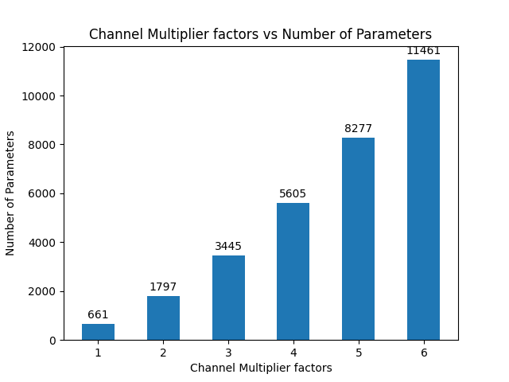

# Lab4
### Q1. Can you edit your code, so that we can modify the above network to have layers expanded to double their sizes? Note: you will have to change the <u>ReLU</u> also.
- **nn.ReLU** could fit to the size of input automatically, thus no extra modification is required except adjusting the node name of **nn.Linear** in configuration
<br>
### Q2. In [lab3](lab3.md), we have implemented a grid search, can we use the grid search to search for the best channel multiplier value?
- Grid search can be applied by building a search space of channel multipliers
    ```python
    # build a search space
    channel_multipliers = [1,2,3,4,5,6]
    search_spaces = []
    for cm_config in channel_multipliers:
        pass_config['seq_blocks_2']['input_channel_multiplier'] = cm_config
        pass_config['seq_blocks_2']['output_channel_multiplier'] = cm_config
        pass_config['seq_blocks_4']['input_channel_multiplier'] = cm_config
        pass_config['seq_blocks_4']['output_channel_multiplier'] = cm_config
        pass_config['seq_blocks_6']['input_channel_multiplier'] = cm_config
        pass_config['seq_blocks_6']['output_channel_multiplier'] = cm_config
        # dict.copy() and dict(dict) only perform shallow copies
        # in fact, only primitive data types in python are doing implicit copy when a = b happens
        search_spaces.append(copy.deepcopy(pass_config))
    ```
- Same metrics in [Lab3.Q2](lab3.md) is applied. Best choice could be elected according to the collected metrics if rules of comparing is defined.
  
  
  
  
### Q3. You may have noticed, one problem with the channel multiplier is that it scales all layers uniformly, ideally, we would like to be able to construct networks like the following:
```python
# define a new model
class JSC_Three_Linear_Layers(nn.Module):
    def __init__(self):
        super(JSC_Three_Linear_Layers, self).__init__()
        self.seq_blocks = nn.Sequential(
            nn.BatchNorm1d(16),
            nn.ReLU(16),
            nn.Linear(16, 32),  # output scaled by 2
            nn.ReLU(32),  # scaled by 2
            nn.Linear(32, 64),  # input scaled by 2 but output scaled by 4
            nn.ReLU(64),  # scaled by 4
            nn.Linear(64, 5),  # scaled by 4
            nn.ReLU(5),
        )

    def forward(self, x):
        return self.seq_blocks(x)
```
### Can you then design a search so that it can reach a network that can have this kind of structure?
- Instead of using **channel_multiplier**, by decoupling the **input_channel_multiplier** and **output_channel_multiplier**, we could assign different scaling factors to each layer. 
    ```python
        if name == "output_only":
            out_features = out_features * config["output_channel_multiplier"]
        elif name == "both":
            in_features = in_features * config["input_channel_multiplier"]
            out_features = out_features * config["output_channel_multiplier"]
        elif name == "input_only":
            in_features = in_features * config["input_channel_multiplier"]
    ```
    ```python
    pass_config = {
    "by": "name",
    "default": {"config": {"name": None}},
    "seq_blocks_2": {
        "config": {
            "name": "output_only",
            # weight
            "output_channel_multiplier": 2,
            }
        },
    "seq_blocks_4": {
        "config": {
            "name": "both",
            "input_channel_multiplier": 2,
            "output_channel_multiplier": 2,
            }
        },
    "seq_blocks_6": {
        "config": {
            "name": "input_only",
            "input_channel_multiplier": 2,
            }
        },
    }
    ```
    

### Q4. Integrate the search to the <u>chop</u> flow, so we can run it from the command line.
